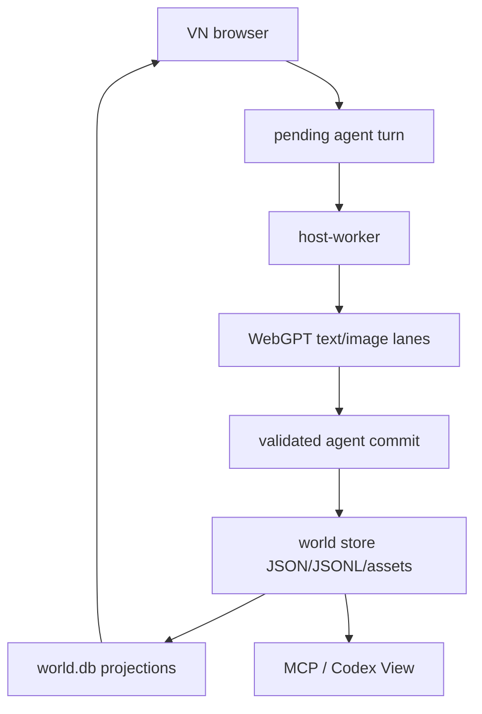
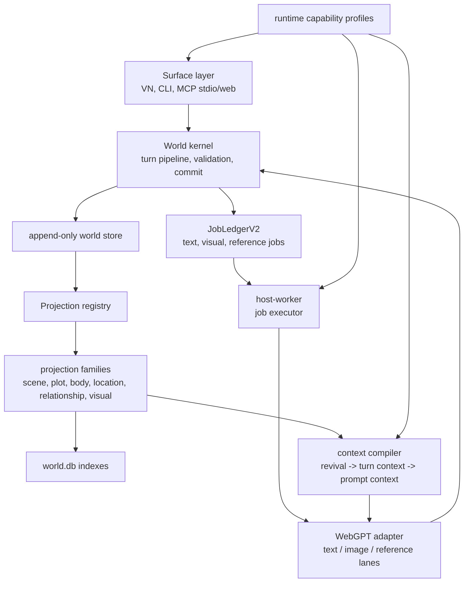

# Singulari World Architecture V2

This document is the migration target for the public-alpha runtime. It keeps the
current file-backed world kernel and VN app contract, but reduces direct coupling
between CLI/runtime adapters, projection families, and prompt assembly.

## Current Shape



This loop is the correct core. The architectural risk is not the loop itself; it
is the number of places that currently need to know every state family and every
backend dispatch detail.

## Target Shape



## Boundary Rules

- The VN app remains the only player-facing frontend.
- WebGPT remains a backend adapter, never a second play client.
- Browser-visible packets are player-visible only.
- Hidden adjudication is available only through trusted-local capability
  profiles.
- Image generation stays host-owned and closes through visual job completion.
- `PromptContextPacket` is the only backend-facing context packet.
- `SourceRevivalPacket` is evidence input, not a backend prompt contract.

## Resolution Authority

The next simulation step should be
[LLM-led, Rust-audited resolution](llm-led-rust-audited-resolution.md), not a
scripted Rust GM. The LLM should interpret intent, propose socially and
narratively intelligent outcomes, and draft Korean VN prose. Rust should audit
that proposal against hard laws, evidence refs, visibility, gates, causality,
and rebuildable event projections before committing it as world truth.

## Scene Direction

After resolution authority, the next quality layer should be
[Scene Director / Dramatic Pacing](scene-director-dramatic-pacing.md). The
runtime should track what dramatic job each turn performs for the current scene:
probe, escalation, complication, reveal, cost, decompression, transition, or
cliffhanger. The LLM still writes the Korean VN prose and chooses expressive
execution; Rust tracks beat history, repetition budgets, tension streaks,
scene exit pressure, and safe player-visible pacing hints.

## Runtime Capability Profiles

Runtime surfaces should describe their authority through
`RuntimeCapabilityProfile`:

- `vn_player`: player-visible reads and player input writes.
- `mcp_web_read_only`: player-visible reads only.
- `mcp_web_play`: player-visible reads, player input, narrow visual completion.
- `trusted_local`: hidden reads, agent commits, repair and local paths.
- `webgpt_text`: backend text adapter with player-visible prompt context only.
- `webgpt_image`: backend image adapter with visual-job completion authority.

These profiles are not a replacement for validation. They are the top-level
contract that makes accidental surface expansion visible in code review.

## Job Ledger V2

The durable runtime should treat text turns, turn CG, reference assets, and UI
assets as jobs with one lifecycle vocabulary:

```text
pending -> claimed -> running -> completed
                   -> failed_retryable
                   -> failed_terminal
                   -> cancelled
```

The current `read_world_jobs` view is now shaped for this lifecycle, including
claim owner/path metadata where it exists. The next step is to make text dispatch
records and visual claims write through the same ledger rather than assembling a
read-only view from separate files.

## Projection Registry

Each projection family should eventually implement one lifecycle contract:

```rust
trait ProjectionFamily {
    type Packet;

    fn rebuild(world: &WorldStore) -> Result<()>;
    fn preflight(response: &AgentTurnResponse, ctx: &TurnContext) -> Result<()>;
    fn commit_events(batch: &mut CommitBatch, response: &AgentTurnResponse) -> Result<()>;
    fn prompt_packet(world: &WorldStore, turn: &TurnSnapshot) -> Result<Self::Packet>;
    fn index_db(world: &WorldStore, db: &mut WorldDb) -> Result<()>;
}
```

`agent_bridge`, prompt assembly, and `world_db` should call the registry instead
of importing every family directly.

## Migration Order

1. Extract `runtime::webgpt`, `runtime::host_worker`, and `surface::cli` from
   `src/main.rs` without behavior changes.
2. Move one projection family behind a `ProjectionFamily` registry as a pilot.
   Pilot started with `BodyResourceProjectionFamily`.
3. Promote `JobLedgerV2` from read-only view to write path for text dispatches.
   Text dispatch now writes `world_jobs/text_turns/*.json`.
4. Move visual claims/completions onto the same job ledger. Visual claims,
   completions, and releases now write `world_jobs/visual/*.json`.
5. Make `PromptContextPacket` the only WebGPT adapter input and keep revival
   packets as internal evidence. The text prompt renderer now accepts a
   compiled `PromptContextPacket`; source revival is consumed only by the
   prompt-context compiler.
6. Split `world_db` indexing into family-owned index providers. Search rebuild
   now dispatches through named providers, which gives each projection family a
   migration target instead of keeping one long hard-coded call chain.
7. Keep fresh-clone end-to-end smoke as the public-alpha release proof.

Current implementation note: the first extraction step now lives under
`src/runtime/` and `src/surface/`. `runtime::host_worker` owns the loop, lane
dispatch, events, and visual job claiming; `runtime::webgpt` owns WebGPT MCP
runtime isolation, conversation bindings, prompt construction, dispatch records,
and adapter tests. The WebGPT adapter is now split into focused submodules:
`webgpt::prompt` builds the backend prompt contract, `webgpt::image` owns visual
job dispatch and session-kind validation, and `webgpt::json_extract` keeps
answer parsing separate from transport. `surface::cli` owns clap parsing and
command handlers, leaving `src/main.rs` as a binary bootstrap only. The
projection registry pilot lives in `src/projection_registry.rs`; it routes
`active_body_resource_state` prompt packets through `BodyResourceProjectionFamily`
instead of composing compile/load calls inline in `agent_bridge`.
Text dispatch also writes durable `WorldJob` records through `job_ledger`, so
`read_world_jobs` now reads persisted text-turn lifecycle state before falling
back to the live pending-turn file. Visual job claim, completion, and release
paths write the same `WorldJob` ledger under `world_jobs/visual/`, while older
worlds without persisted visual records still get a synthetic read view from
the asset manifest and claim files. WebGPT text dispatch also writes the exact
compiled `*-webgpt-prompt-context.json` beside the human-readable prompt. The
prompt renderer accepts that packet as its input, so broad revival assembly
stays behind the prompt-context compiler boundary. `world_db` search rebuild now
routes through named index providers; the provider bodies still live in
`world_db`, but the call path is ready for moving projection-specific providers
next to their projection families.

## Non-Goals

- Do not add another player-facing chat UI.
- Do not add fallback local narration or image generation.
- Do not let WebGPT read hidden state or arbitrary store files.
- Do not split into multiple crates before module boundaries are stable.
