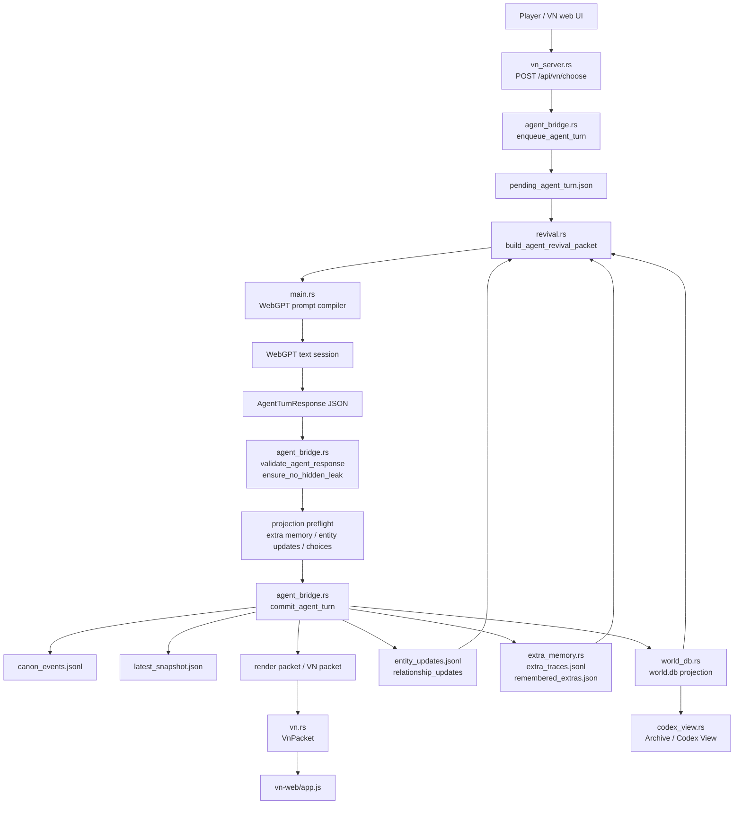
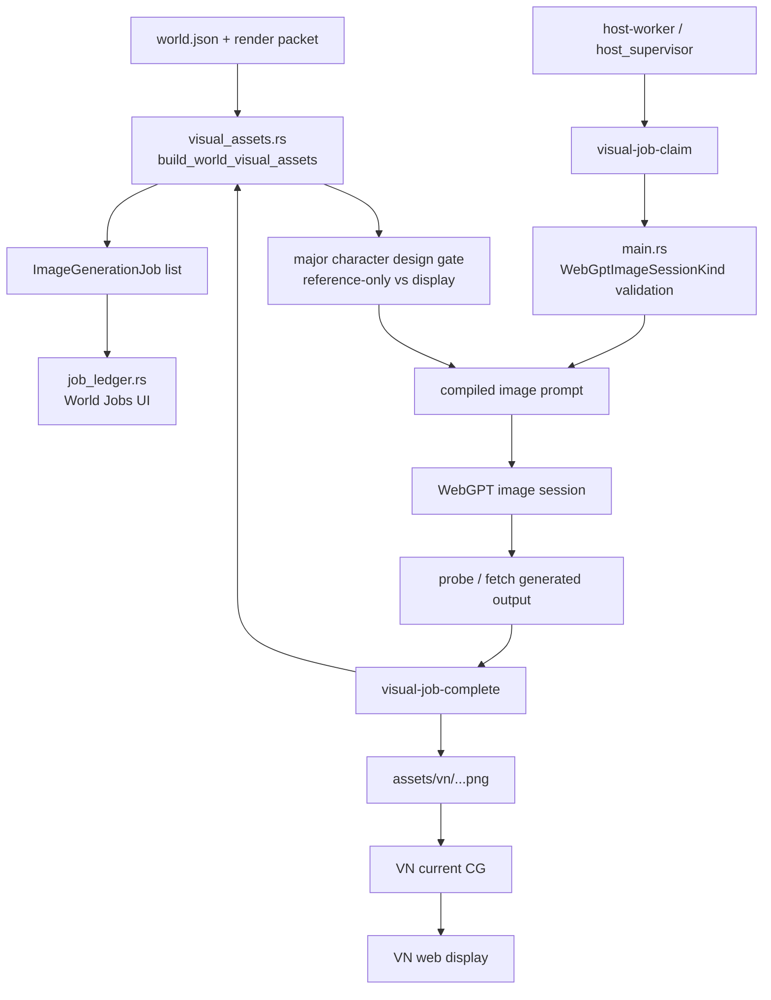
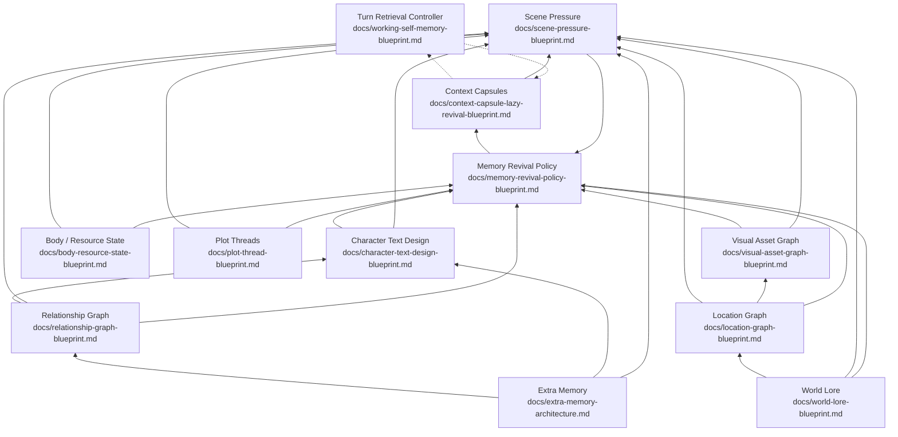
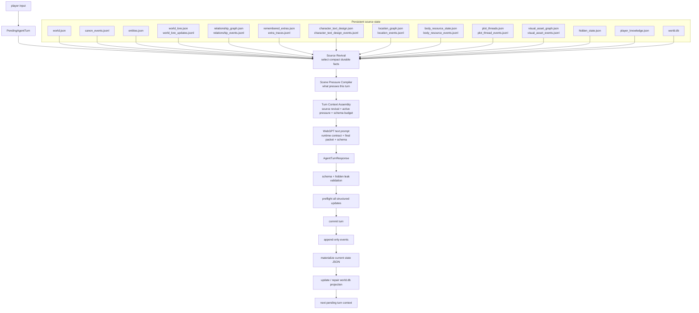
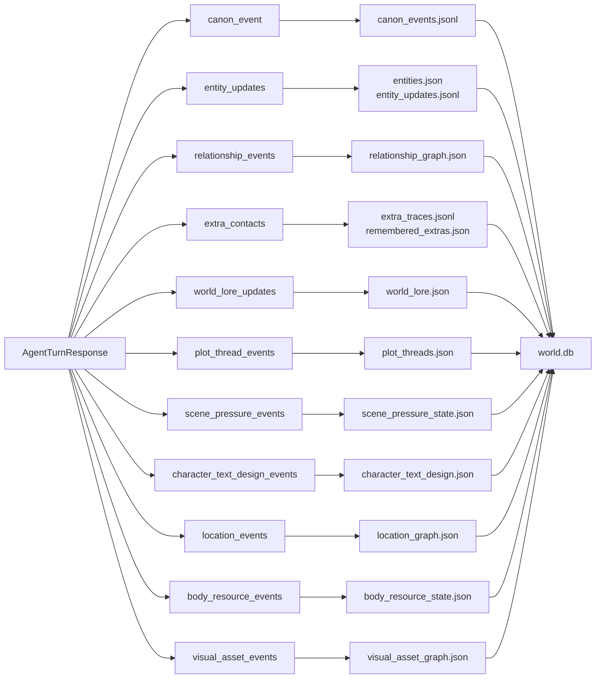
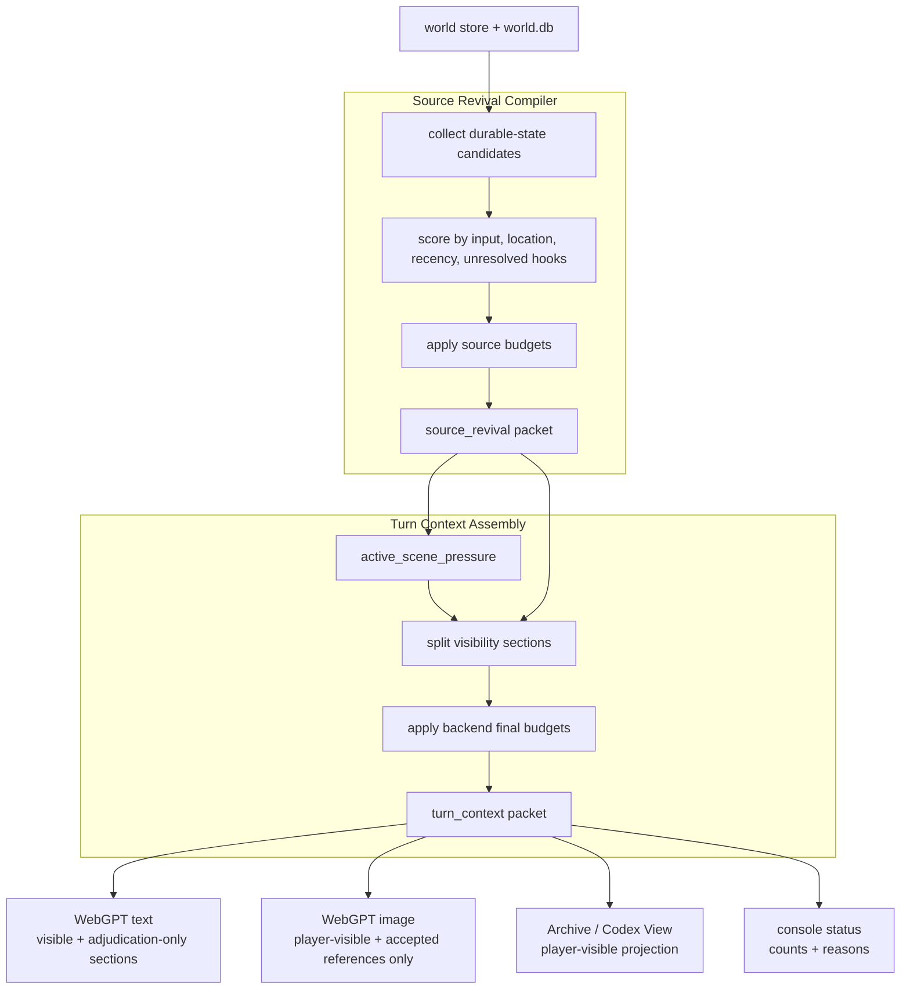
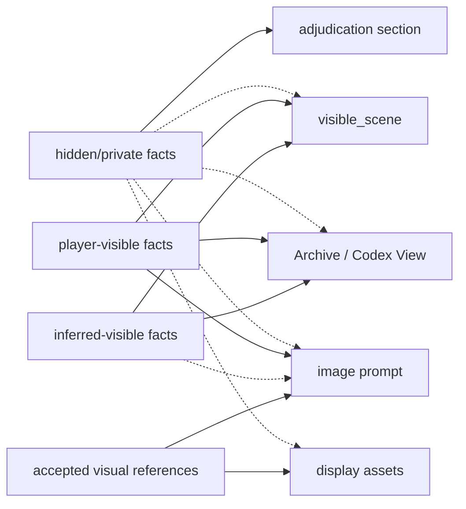
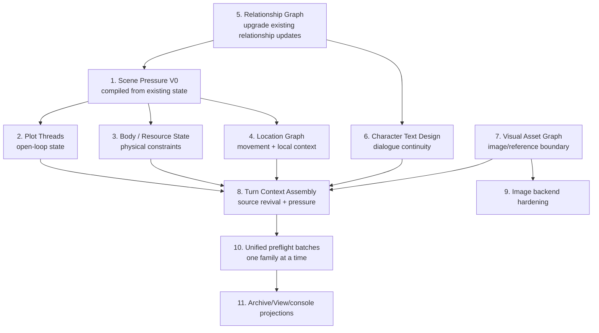
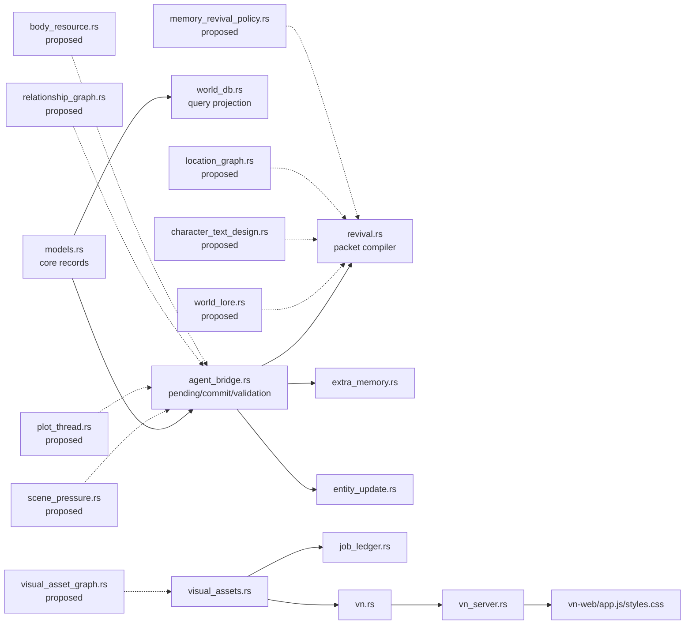

# Blueprint System Map

Status: architecture map

This document shows how the current implementation and proposed blueprints fit
together. The blueprints are not separate feature islands. They form one world
simulation loop:

1. persistent world state records what is true
2. revival selects what matters now
3. scene pressure compiles the current turn problem
4. WebGPT produces one structured response
5. preflight validates every projection
6. commit writes append-only evidence and materialized state
7. VN/web/MCP surfaces expose only player-visible projections

See [Causal Simulation Upgrade Set](causal-simulation-upgrade-set.md) for the
bounded implementation plan that adds a pre-turn simulation artifact,
mandatory resolution proposals, and deterministic soak tests to this map.

## Adjustment Verdict

The graph is directionally right, but it needs three cuts before
implementation.

1. Split revival into two stages.
   - `source revival` selects compact facts from durable state before scene
     pressure exists.
   - `turn context assembly` runs after pressure compilation and builds the
     final WebGPT packet.
   - This removes the circular edge where `memory_revival_policy` both selects
     pressure and depends on pressure.

2. Treat `scene_pressure` as a compiled turn artifact, not another large source
   model.
   - It should be recomputed for each pending turn from lore, relationships,
     plot threads, body/resource, location, extras, hidden timers, and player
     input.
   - Only pressure events and audit/projection state should persist.

3. Do not add every blueprint field to `AgentTurnResponse` at once.
   - The implementation should add projection families in phases.
   - Each phase adds one strict event family, validator, materializer, repair
     path, and tests.
   - A single broad response schema expansion would create a brittle mega-turn
     contract.

Keep:

- `scene_pressure` as the first implementation hub.
- append-only event logs plus materialized JSON.
- strict preflight before commit.
- separate text and image revival boundaries.

Change:

- Implement `relationship_graph` before full `character_text_design`, because
  relationship stance is needed for relation-specific speech overrides.
- Implement `memory_revival_policy` as a compiler/policy module, not as another
  source-of-truth state model.
- Move `visual_asset_graph` earlier if image ingestion/reference bugs continue
  to block testing.

## Current Implementation Spine

## Current Visual Spine

## Blueprint Layer Stack

## Proposed Unified Turn Loop

## Write Surfaces by Blueprint

## Read / Revival Surfaces

## Visibility Boundary

## Implementation Dependency Order

Recommended practical order:

1. `scene_pressure` V0: compile from existing state without new response fields.
2. `plot_threads`: make open loops durable.
3. `body_resource_state`: add physical constraints and event validation.
4. `location_graph`: make movement and local context concrete.
5. `relationship_graph`: replace loose relationship updates with edges/events.
6. `character_text_design`: add relationship-aware speech after edges exist.
7. `visual_asset_graph`: close reference/display/generated-output boundaries.
8. `turn_context_assembly`: replace ad hoc context packing with budgets.

## Module Mapping

## Closure Contract

The unified architecture should preserve the existing closed-loop rule:

- validate before writing
- append evidence before materialized projections claim state
- never complete a turn with only half the projections written
- never use fallback prose scraping to repair missing structured state
- keep hidden/private content physically separated from player-visible outputs
- make every revival item, pressure, thread, relationship, and visual asset
  traceable to source evidence
