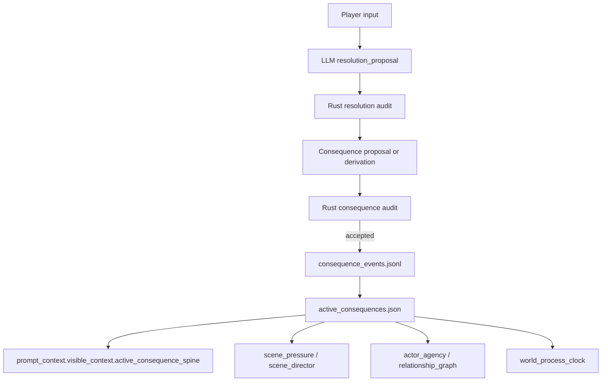

# Consequence Spine Blueprint

Status: design draft

Last updated: 2026-04-30

This document defines the next simulation quality layer after LLM-led,
Rust-audited resolution and Scene Director pacing.

Resolution answers:

```text
What did the player try, and what happened?
```

Scene Director answers:

```text
What job should this turn do for the current scene?
```

The Consequence Spine answers:

```text
What durable pressure did this choice leave behind, and how should it return?
```

It is not a plot graph and not a hidden route planner. It is a compact,
evidence-backed lifecycle for player-visible consequences so that important
choices do not vanish into prose after one turn.

## Problem

The current runtime can already keep many world surfaces grounded:

- `resolution_proposal` audits player intent, outcome, gates, and effects
- body/resource, relationship, lore, process, pressure, plot, and actor layers
  can materialize typed state
- Scene Director can track beat rhythm and push scenes away from repetition
- WebGPT can write nuanced Korean prose and choices from rich prompt context

The remaining long-play risk is consequence drift.

An LLM can understand that a choice should matter, but without a durable
contract it can forget, underuse, overuse, or re-invent the same consequence:

- a costly choice is mentioned once, then disappears
- an NPC insult affects one paragraph, then no relationship pressure follows
- a clue is revealed, but no future action is constrained by that knowledge
- a failed stealth move creates danger, but the danger is not carried as an
  active pressure
- repeated prose claims "there will be consequences" without an event that can
  be rebuilt, searched, or paid off

Rust should not become the GM brain. But Rust can require that important
consequences have evidence, lifecycle state, and integration points.

## Core Principle

The LLM decides what the consequence means.

Rust decides whether the consequence is grounded, durable, visible, and
connected to future turn context.

```text
LLM proposes meaningful fallout.
Rust records consequence lifecycle and feeds it back as pressure.
```

The spine is intentionally narrow:

- it tracks active consequences that should return
- it does not duplicate every typed state projection
- it does not decide optimal player routes
- it does not expose hidden adjudication as visible fate
- it does not let vague dramatic promises become canon

## Authority Split

| Surface | LLM owns | Rust owns |
| --- | --- | --- |
| Consequence meaning | Why this fallout is interesting now | Required kind, scope, severity, evidence |
| Visibility | How the player notices the fallout | Player-visible vs adjudication-only boundary |
| Lifecycle | Natural payoff, escalation, softening, transfer | Event append, active/inactive projection, decay rules |
| Integration | Scene-specific prose and choices | Prompt packet, pressure links, actor/process hooks |
| Memory | Which past choice matters dramatically | Source refs, anti-reinvention, search/revival projection |
| Payoff | How the consequence resolves in narrative | Payoff evidence and terminal event validity |

## Non-Goals

- Do not create a morality meter, karma meter, or global good/bad score.
- Do not replace `relationship_graph`, `body_resource`, `world_lore`, or
  `world_process_clock`; consequence records point to those surfaces.
- Do not infer hidden future truth from visible consequence labels.
- Do not force every minor action to become durable state.
- Do not turn consequences into quest objectives or optimal-route hints.
- Do not let the player-facing UI expose exact hidden timers or secret causes.

## Target Pipeline



The first implementation can derive obvious consequences from accepted
`ResolutionProposal` effects. The later implementation can let WebGPT add an
optional `consequence_proposal` beside `scene_director_proposal`.

## Consequence Spine Packet

Rust should compile a player-visible packet into prompt context and revival.

```rust
struct ConsequenceSpinePacket {
    schema_version: String,
    world_id: String,
    turn_id: String,
    active: Vec<ActiveConsequence>,
    recently_paid_off: Vec<ConsequenceMemory>,
    pressure_links: Vec<ConsequencePressureLink>,
    required_followups: Vec<ConsequenceFollowup>,
    compiler_policy: ConsequenceSpinePolicy,
}
```

The packet is not a prose dump. It is a compact set of "this still matters"
records.

### ActiveConsequence

```rust
struct ActiveConsequence {
    consequence_id: String,
    origin_turn_id: String,
    kind: ConsequenceKind,
    scope: ConsequenceScope,
    status: ConsequenceStatus,
    severity: ConsequenceSeverity,
    summary: String,
    player_visible_signal: String,
    source_refs: Vec<String>,
    linked_entity_refs: Vec<String>,
    linked_projection_refs: Vec<String>,
    expected_return: ConsequenceReturnWindow,
    decay: ConsequenceDecay,
}
```

The summary may be player-visible, but it must not reveal hidden causality. It
should say what the player can fairly know:

```text
The gate guard now remembers the protagonist as someone who resisted procedure.
```

It should not say:

```text
The hidden informant will report the protagonist to the northern faction.
```

unless that fact is already visible.

## Consequence Kinds

Use a small closed enum for V1.

```rust
enum ConsequenceKind {
    BodyCost,
    ResourceCost,
    SocialDebt,
    TrustShift,
    SuspicionRaised,
    AlarmRaised,
    KnowledgeOpened,
    KnowledgeResolved,
    LocationAccessChanged,
    ProcessAccelerated,
    ProcessDelayed,
    MoralDebt,
    OpportunityOpened,
    OpportunityLost,
}
```

Meaning:

- `body_cost`: pain, injury, fatigue, exposure, hunger
- `resource_cost`: spent, damaged, lost, or reserved material
- `social_debt`: promise, insult, obligation, embarrassment, favor owed
- `trust_shift`: relationship credibility changes
- `suspicion_raised`: someone now watches, doubts, or remembers
- `alarm_raised`: threat posture changed due to visible action
- `knowledge_opened`: a new actionable question exists
- `knowledge_resolved`: an uncertainty was closed and should stop repeating
- `location_access_changed`: door, route, permission, or taboo changed
- `process_accelerated`: a clock got closer because of the action
- `process_delayed`: a clock was slowed or interrupted
- `moral_debt`: collateral harm, oath pressure, betrayal, sacrifice
- `opportunity_opened`: new route or leverage appears
- `opportunity_lost`: a plausible route closes

## Scope And Severity

```rust
enum ConsequenceScope {
    Body,
    Inventory,
    Relationship,
    Location,
    Faction,
    Knowledge,
    WorldProcess,
    Scene,
}

enum ConsequenceSeverity {
    Trace,
    Minor,
    Moderate,
    Major,
    Critical,
}
```

Severity is not a moral judgment. It answers how aggressively the consequence
should return:

| Severity | Return behavior |
| --- | --- |
| `trace` | Searchable memory only unless directly relevant |
| `minor` | May appear when matching context returns |
| `moderate` | Should influence choices or pressure soon |
| `major` | Must create visible pressure until paid off |
| `critical` | Must shape the next turn or active scene |

## Lifecycle

```rust
enum ConsequenceStatus {
    Active,
    Escalated,
    Softened,
    Transferred,
    PaidOff,
    Decayed,
    Superseded,
}
```

Lifecycle events are append-only:

```rust
struct ConsequenceEventRecord {
    schema_version: String,
    world_id: String,
    turn_id: String,
    event_id: String,
    consequence_id: String,
    event_kind: ConsequenceEventKind,
    kind: ConsequenceKind,
    scope: ConsequenceScope,
    severity: ConsequenceSeverity,
    summary: String,
    player_visible_signal: String,
    source_refs: Vec<String>,
    linked_projection_refs: Vec<String>,
    recorded_at: String,
}

enum ConsequenceEventKind {
    Introduced,
    Escalated,
    Softened,
    Transferred,
    PaidOff,
    Decayed,
    Superseded,
}
```

Materialized state:

```text
consequence_events.jsonl
active_consequences.json
```

`active_consequences.json` is rebuilt from events and is safe to inject into
prompt context after visibility filtering.

## LLM Output Shape

Phase 1 should derive consequences from accepted resolution effects. Phase 2 may
add an optional field:

```rust
struct AgentTurnResponse {
    // existing fields...
    consequence_proposal: Option<ConsequenceProposal>,
}
```

Proposal:

```rust
struct ConsequenceProposal {
    schema_version: String,
    world_id: String,
    turn_id: String,
    introduced: Vec<ConsequenceMutation>,
    updated: Vec<ConsequenceMutation>,
    paid_off: Vec<ConsequencePayoff>,
    ephemeral_effects: Vec<EphemeralConsequenceReason>,
}
```

`ephemeral_effects` is important. It lets WebGPT say that a small sensory or
local color effect does not need a durable consequence record.

```rust
struct EphemeralConsequenceReason {
    effect_ref: String,
    reason: String,
    evidence_refs: Vec<String>,
}
```

Without this field, every tiny effect would either bloat the state or fail the
audit.

## Rust Audit Contract

Audit rules:

1. `world_id` and `turn_id` must match the prompt context.
2. Every introduced or updated consequence must have player-visible evidence
   refs or an allowed adjudication-only lane that does not enter visible text.
3. Any major `ResolutionProposal.proposed_effects` for body, resource,
   relationship, lore, process, location, or knowledge must either materialize
   as a consequence or be listed as ephemeral with evidence.
4. A payoff must reference an active consequence and explain what visible action
   or event paid it off.
5. A consequence cannot invent a typed projection delta. It must link to a
   typed projection event or to visible resolution evidence that will create
   one.
6. Hidden text from adjudication context cannot appear in player-visible
   consequence summaries or signals.
7. Consequences with `major` or `critical` severity must produce at least one
   integration link: scene pressure, actor agency, process clock, or scene
   director.
8. Repeated active consequences with no escalation, payoff, decay, or
   player-facing pressure should be marked stale and repaired.

Audit failure should enter the same repairable WebGPT commit loop as resolution
and scene-director failures.

## Derivation From ResolutionProposal

The first implementation does not need WebGPT to emit a new field. Rust can
derive candidate consequences from accepted resolution output:

| Resolution signal | Candidate consequence |
| --- | --- |
| `ResolutionOutcomeKind::CostlySuccess` | `body_cost`, `resource_cost`, `social_debt`, or `moral_debt` |
| `GateStatus::CostImposed` | consequence matching gate kind |
| player-visible `ProposedEffectKind::RelationshipDelta` | `trust_shift` or `social_debt` |
| player-visible `ProposedEffectKind::WorldLoreDelta` | `knowledge_opened` or `knowledge_resolved` |
| process tick proposal | `process_accelerated` or `process_delayed` |
| body/resource effect | `body_cost` or `resource_cost` |
| location effect | `location_access_changed` or `opportunity_opened/lost` |

The derived packet should be conservative. If the mapping is ambiguous, create a
`required_followup` hint instead of inventing a specific consequence.

## Integration Points

### Scene Pressure

Active consequences can compile into pressure refs:

```text
consequence:suspicion_raised:gate_guard
  -> pressure:social_permission
  -> observable signal: "the guard's questions now start from suspicion"
```

This is the most important feedback loop. Consequences must become pressure,
not just archive entries.

### Scene Director

Scene Director can use consequences to justify beats:

- `cost`: an active cost returns visibly
- `reveal`: a consequence clarifies what changed
- `complicate`: the old action creates a new constraint
- `transition`: a consequence moves the scene question
- `decompress`: an immediate consequence softens but remains active

### Actor Agency

Consequences involving NPCs or factions should become actor leverage:

```text
social_debt -> actor has reason to demand repayment
suspicion_raised -> actor has reason to watch or block
opportunity_lost -> actor changes plan or withdraws help
```

### World Process Clock

Consequences with time behavior should become or modify process clocks:

```text
alarm_raised -> patrol_search tempo immediate
process_delayed -> gate_closing delayed by one turn
```

### Revival And Search

`active_consequences` should be included in:

- `PromptContextPacket.visible_context`
- `memory_revival`
- `world.db` projection
- `world_docs`
- Archive View as player-visible summaries only

Paid-off consequences should remain searchable but should not keep driving
pressure unless directly recalled.

## UI Surface

VN can expose one safe status row:

```text
여파: 아직 따라오는 선택의 흔적
```

Possible phrases:

- `선택의 여파가 남아 있음`
- `방금 만든 빚이 장면을 밀고 있음`
- `이전 행동의 흔적이 돌아오는 중`
- `여파는 잠잠하지만 기록됨`

Do not show hidden causes, exact timers, or future route hints.

## Example

Player chooses:

```text
문지기를 밀치고 안쪽으로 들어간다.
```

Resolution may accept partial success with cost:

```json
{
  "outcome": {"kind": "costly_success"},
  "gate_results": [
    {"gate_kind": "social_permission", "status": "cost_imposed"}
  ],
  "proposed_effects": [
    {
      "effect_kind": "relationship_delta",
      "visibility": "player_visible",
      "summary": "문지기가 주인공을 절차를 무시한 사람으로 기억한다."
    }
  ]
}
```

Derived consequence:

```json
{
  "kind": "suspicion_raised",
  "scope": "relationship",
  "severity": "moderate",
  "summary": "문지기가 주인공을 절차를 무시한 사람으로 기억한다.",
  "player_visible_signal": "다음 문답은 호의가 아니라 의심에서 시작된다.",
  "source_refs": ["resolution:turn_0006:gate_results[0]"],
  "linked_projection_refs": ["relationship_graph:char:gate_guard->char:protagonist"]
}
```

Next turns can turn this into:

- social pressure at the gate
- actor agency for the guard
- scene director `cost` or `complicate` beat
- relationship graph evidence
- Archive View memory if the player asks why the guard is hostile

## Implementation Phases

### Phase 1: Compile Advisory Packet

Add `consequence_spine.rs` with a conservative compiler that derives active
consequence candidates from existing materialized projections and recent
resolution effects.

Acceptance:

- `PromptContextPacket.visible_context.active_consequence_spine` exists
- no hidden adjudication text enters the visible packet
- packet can be empty without changing behavior
- unit tests cover body/resource, relationship, process, and knowledge examples

### Phase 2: Append-Only Events And Materialization

Add:

```text
consequence_events.jsonl
active_consequences.json
```

Acceptance:

- event append happens only after resolution audit succeeds
- rebuild is deterministic
- paid-off/decayed consequences leave active state but remain searchable
- repair can rebuild materialized state from events

### Phase 3: Resolution Coupling

Require significant resolution effects to either create/update/pay off a
consequence or mark an effect ephemeral.

Acceptance:

- costly success cannot disappear as prose only
- relationship/process/body/resource effects have consequence handling
- minor sensory effects can be explicitly ephemeral
- repairable critique tells WebGPT what consequence is missing

### Phase 4: Optional LLM Consequence Proposal

Add `AgentTurnResponse.consequence_proposal`.

Acceptance:

- omitted proposal remains compatible
- supplied proposal is audited before mutation
- proposal evidence refs must exist in prompt context
- proposal cannot invent typed projection refs

### Phase 5: Integration With Pressure And Actor Agency

Compile active consequences into downstream advisory inputs.

Acceptance:

- moderate+ consequences can produce `scene_pressure` hints
- NPC/faction consequences can become actor leverage
- process consequences can tick or modify world process clocks
- Scene Director can cite active consequence refs for cost/complicate/reveal

### Phase 6: UI, Archive, And QA

Expose safe consequence state.

Acceptance:

- VN status drawer has a player-safe `여파` phrase
- Archive View can answer "why does this matter?" without hidden leakage
- runtime status includes consequence packet for QA
- world.db/docs projection lists active and recently paid-off consequences

### Phase 7: Browser E2E Tuning

Use real play sessions to tune severity, decay, and return windows.

Metrics:

- average active consequence count
- stale active consequence count
- ratio of costly outcomes with durable consequence
- payoff frequency
- repeated consequence mention without state change
- player-visible confusion around why pressure returned
- WebGPT repair rate for missing consequence proposals

## What To Avoid

- Do not create an all-purpose "memory but important" bucket.
- Do not make every choice permanent.
- Do not make consequence severity player-facing.
- Do not let consequence labels replace scene-specific prose.
- Do not use hidden adjudication as a visible threat.
- Do not create a second plot-thread system.
- Do not let Rust choose narrative meaning from enum tables alone.

## Minimal First Cut

The smallest useful implementation is:

1. `ConsequenceSpinePacket` in visible prompt context.
2. `consequence_events.jsonl` plus `active_consequences.json`.
3. Conservative derivation from accepted `ResolutionProposal`.
4. Search/world-doc projection.
5. VN `여파` status phrase.

Optional LLM-authored `consequence_proposal` should come after the derived path
works in browser E2E, because the first risk is not expressive richness. The
first risk is letting important costs evaporate.
