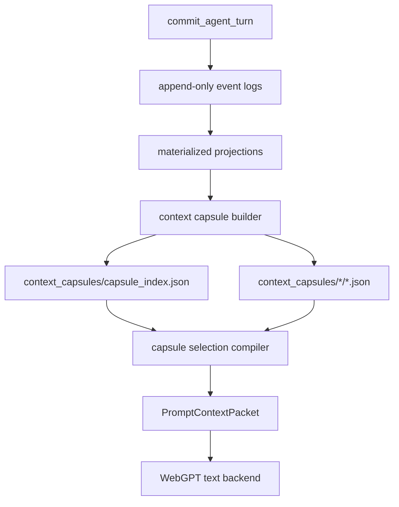

# Context Capsule Lazy Revival Blueprint

Status: design draft

## Problem

Long-running WebGPT play cannot keep sending every useful prompt rule, memory
surface, and materialized projection in full. The current revival system already
selects bounded memory items, but it still sends several active projections
directly into the prompt context. As world complexity grows, this creates three
risks:

1. prompt bloat from repeatedly sending broad but only partly relevant state
2. stale context bias from old summaries that remain physically present
3. hidden seed leakage when style or schema examples are treated as content

The proposal is to make prompt context behave like a thin skill entrypoint:
small routing metadata is loaded first, and heavier knowledge is loaded only
when the compiler proves it is needed.

The simulator should accept the idea, but not copy the exact `skill.md`
pattern. World continuity is not a preference file. It must stay in typed world
state, event logs, materialized projections, and world.db.

## Verdict

Accept with modification.

Keep:

- thin entrypoint metadata
- lazy loading of detailed knowledge
- per-turn budget accounting
- reusable context blocks that do not require full prompt reinjection

Reject:

- markdown knowledge blobs as source of truth
- ChatGPT memory or project memory as continuity source
- WebGPT freely browsing files or asking for arbitrary repo/world reads
- generic fallback summaries when typed projections exist
- style examples or prompt examples becoming scene content

The accepted shape is a typed `ContextCapsule` registry compiled from durable
world state. The text backend receives selected capsule bodies only after the
local compiler resolves visibility, relevance, and budget.

Follow-up selector layer: `docs/working-self-memory-blueprint.md`. Context
Capsules define what can be loaded; `TurnRetrievalController` defines why a
turn needs a capsule. That controller is intentionally deferred until the basic
capsule builder and selector are stable.

## Goals

1. Keep prompt context physically small for long play.
2. Let mature worlds accumulate large structured knowledge without reinjecting
   all of it every turn.
3. Preserve source-of-truth boundaries: canon stays in world state; capsules are
   prompt transport units.
4. Make each included capsule traceable to evidence, reason, visibility, and
   token budget.
5. Keep image, visible prose, and adjudication context separated.
6. Allow future context-miss repair without opening arbitrary runtime reads.

## Non-Goals

- Do not replace `world.db`, event logs, or materialized JSON projections.
- Do not let WebGPT decide what local files to read.
- Do not add a general plugin/skill system.
- Do not store real Hesperides memories or user preferences in world capsules.
- Do not use capsules to smuggle hidden facts into visible text or image prompts.

## Relationship To Existing Revival

Current flow:

```text
world state -> revival.rs -> turn_context -> prompt_context -> WebGPT
```

Proposed flow:

```text
world state
  -> materialized projections
  -> context capsule index
  -> deterministic capsule selection
  -> prompt_context.selected_capsules
  -> WebGPT
```

`memory_revival` remains the source selector. Capsules become the transport
format for selected context. They are not a new truth layer.

## Capsule Registry

Add a per-world registry under the world directory:

```text
context_capsules/
  capsule_index.json
  world_lore/
  relationship/
  character_text/
  location/
  plot_thread/
  scene_history/
  style/
  visual/
```

The index is small and can be loaded every turn. Capsule bodies are loaded only
after selection.

### Capsule Index Entry

```json
{
  "schema_version": "singulari.context_capsule_index_entry.v1",
  "world_id": "stw_...",
  "capsule_id": "relationship:char:porter->char:protagonist",
  "kind": "relationship_graph",
  "visibility": "player_visible",
  "summary": "The porter treats the protagonist as a suspicious but useful stranger.",
  "triggers": ["porter", "gate", "suspicion", "debt"],
  "evidence_refs": [
    {
      "source": "relationship_graph.json",
      "id": "rel:char:porter->char:protagonist"
    }
  ],
  "content_ref": "context_capsules/relationship/porter_protagonist.json",
  "token_estimate": 180,
  "last_used_turn": "turn_0011",
  "recent_use_count": 2,
  "updated_at": "2026-04-29T08:20:00Z"
}
```

### Capsule Body

```json
{
  "schema_version": "singulari.context_capsule.v1",
  "world_id": "stw_...",
  "capsule_id": "relationship:char:porter->char:protagonist",
  "kind": "relationship_graph",
  "visibility": "player_visible",
  "payload": {
    "current_stance": "procedural_suspicion",
    "visible_history": [
      "The porter saw the protagonist arrive without a local token.",
      "The protagonist avoided giving a full name."
    ],
    "simulation_effect": {
      "dialogue_distance": "formal_suspicious",
      "cooperation_gate": "requires concrete reason"
    }
  },
  "use_rules": [
    "Use this only when the porter, gate, suspicion, debt, or local authority matters.",
    "Do not introduce new events from this capsule.",
    "Do not expose hidden motives."
  ],
  "evidence_refs": [
    {
      "source": "relationship_events.jsonl",
      "id": "relationship_event:turn_0007:00"
    }
  ]
}
```

## Capsule Kinds

Closed kinds for the first implementation:

- `world_lore`
- `relationship_graph`
- `character_text_design`
- `location_graph`
- `plot_thread`
- `body_resource_state`
- `remembered_extra`
- `scene_history`
- `narrative_style_state`
- `visual_asset_reference`

Do not add generic `note`, `preference`, or `misc` kinds. If a detail cannot be
typed, it should not become a capsule yet.

## Visibility Gates

| Consumer | Allowed capsule visibility |
| --- | --- |
| visible prose | `player_visible`, `inferred_visible` |
| text adjudication | `player_visible`, `inferred_visible`, `private`, `hidden` |
| choice generation | `player_visible`, `inferred_visible`; hidden only through adjudication gates |
| image prompt | `player_visible` plus accepted visual reference assets |
| Codex View | `player_visible`, `inferred_visible` |
| debug console | all, with explicit labels |

The compiler emits separate selected capsule sections instead of asking WebGPT
to remember visibility boundaries.

## Selection Algorithm

The local compiler selects capsules before dispatch. V1 scores from the signals
below directly; the target design is to receive retrieval cues from
`TurnRetrievalController` after basic capsule selection is already tested.

1. Load `capsule_index.json`.
2. Build candidate triggers from:
   - current player input
   - current location
   - selected choice slot/tag
   - active scene pressure
   - active plot threads
   - relationship/entity mentions
   - world process ticks
   - `TurnRetrievalController.retrieval_cues` after the deferred controller
     exists
3. Score candidates with explicit reason labels.
4. Apply visibility gates for the target backend section.
5. Apply anti-repetition.
6. Load capsule bodies for selected entries only.
7. Emit a `ContextCapsuleSelectionEvent`.
8. Add selected bodies and a budget report to `PromptContextPacket`.

### Scoring Signals

| Signal | Weight |
| --- | ---: |
| direct player input trigger | 1.00 |
| current location match | 0.90 |
| active pressure source | 0.85 |
| selected choice intent match | 0.80 |
| open plot thread source | 0.75 |
| relationship edge involving present entity | 0.70 |
| recent turn participation | 0.60 |
| active world process source | 0.55 |
| style/prose correction match | 0.45 |
| stale unrelated | reject |

The weights can become constants, but reason labels must stay stable for tests
and audits.

## Anti-Repetition

Each selected capsule updates usage metadata:

```json
{
  "capsule_id": "relationship:char:porter->char:protagonist",
  "last_used_turn": "turn_0012",
  "recent_use_count": 3,
  "last_effect": "dialogue_distance"
}
```

Rules:

- repeat if the player directly references it
- repeat if it is still an active pressure or process source
- compress if it was recently included but did not affect output
- suppress if stale and unrelated

Anti-repetition must not hide active constraints. It only removes stale prompt
payload.

## Context Miss Repair

WebGPT should not fetch arbitrary capsules during generation. V1 dispatch is
single-pass.

Future V2 may allow structured context-miss repair:

```json
{
  "status": "needs_context",
  "requested_capsules": [
    {
      "kind": "relationship_graph",
      "trigger": "porter",
      "reason": "dialogue depends on prior debt"
    }
  ]
}
```

The server may then run one deterministic repair pass:

1. validate request shape
2. select matching capsules through the same compiler
3. resend with added capsules

If no matching capsule exists, fail loud or require the model to proceed only
with current facts. Do not invent a fallback capsule.

## Prompt Context Shape

`PromptVisibleContext` should eventually carry:

```json
{
  "selected_context_capsules": [
    {
      "capsule_id": "relationship:char:porter->char:protagonist",
      "kind": "relationship_graph",
      "visibility": "player_visible",
      "reason": "current_location_entity_match",
      "payload": {}
    }
  ],
  "capsule_budget_report": {
    "capsule_index_entries_seen": 42,
    "capsules_loaded": 6,
    "capsules_rejected": 36,
    "estimated_tokens": 1100
  }
}
```

Broad active projections can remain available to debug surfaces, but the text
prompt should prefer selected capsules over full projection dumps once the
capsule compiler is implemented.

## Write Path

Capsules are rebuilt from materialized source state after commit:



The capsule builder is deterministic. It does not call WebGPT and does not
interpret prose beyond typed source fields.

## Source Ownership

| Capsule kind | Source of truth |
| --- | --- |
| `world_lore` | `world_lore.json`, `world_lore_updates.jsonl` |
| `relationship_graph` | `relationship_graph.json`, `relationship_events.jsonl` |
| `character_text_design` | `character_text_design.json`, `character_text_design_events.jsonl` |
| `location_graph` | `location_graph.json`, `location_events.jsonl` |
| `plot_thread` | `plot_threads.json`, `plot_thread_events.jsonl` |
| `body_resource_state` | `body_resource_state.json`, `body_resource_events.jsonl` |
| `remembered_extra` | `remembered_extras.json`, `extra_traces.jsonl` |
| `scene_history` | `canon_events.jsonl`, chapter summaries |
| `narrative_style_state` | `narrative_style_state.json`, `narrative_style_events.jsonl` |
| `visual_asset_reference` | `visual_asset_graph.json`, accepted asset manifest |

## Implementation Plan

### P0: Document Contract

Create this blueprint and update the system map once accepted.

### P1: Capsule Types

Add:

```text
src/context_capsule.rs
context_capsules/capsule_index.json
context_capsules/*/*.json
```

Types:

- `ContextCapsuleIndex`
- `ContextCapsuleIndexEntry`
- `ContextCapsule`
- `ContextCapsuleKind`
- `ContextCapsuleVisibility`
- `ContextCapsuleSelection`
- `ContextCapsuleSelectionEvent`

### P2: Builder

Compile index entries and bodies from existing materialized projections. Start
with:

1. relationship graph
2. world lore
3. character text design
4. location graph
5. narrative style state

### P3: Selector

Add deterministic selection using current turn triggers, visibility gates,
anti-repetition, and budgets.

V1 selector must not depend on `TurnRetrievalController`. It should prove that
capsule transport and broad-projection reduction work before the goal-directed
controller is introduced.

### P4: Prompt Context Integration

Add selected capsule payloads to `PromptContextPacket`.

Then reduce broad projection injection only where capsule coverage is complete.
Do not remove active projections from debug/revival surfaces.

### P5: Audit And Search

Index capsule summaries and selection events in world.db. The search surface
should find capsule summaries, not dump full capsule bodies by default.

### P6: Optional Context Miss Repair

Only after the deterministic selector is stable, allow a bounded
`needs_context` response shape.

### P7: Turn Retrieval Controller Integration

Only after P1-P4 are working and tested, integrate
`docs/working-self-memory-blueprint.md` as a higher-level cue compiler. The
controller may change scoring reasons, but it must not change capsule source
ownership or visibility gates.

## Acceptance Criteria

- A prompt can include selected capsule bodies without including full broad
  source projections.
- Every selected capsule has source id, reason, visibility, evidence refs, and
  budget accounting.
- Hidden capsules never enter visible prose or image prompt sections.
- Capsule bodies contain no new canon not present in their source projection.
- Corrupt capsule index/body files fail loud during dispatch.
- Tests prove stale repeated capsules are suppressed unless directly triggered.
- Tests prove selected capsules can replace at least one broad projection in
  prompt context without losing required continuity.

## Risks

1. Duplicate state risk: capsules may drift from materialized projections.
   - Mitigation: rebuild deterministically from source projections after commit.
2. Over-compression risk: important details may be summarized away.
   - Mitigation: capsule body keeps structured payload, not only prose summary.
3. Selection blindness: the compiler may miss an important capsule.
   - Mitigation: audit rejected candidates and allow later context-miss repair.
4. Prompt seed leakage: style capsules may become content seeds.
   - Mitigation: style capsules carry correction pressure only, no objects,
     people, factions, symbols, or plot devices.
5. Latency risk: loading many capsule bodies can cost more than broad prompt
   context.
   - Mitigation: load index first, then body only for selected candidates.

## Open Questions

- Should capsule bodies be stored as separate files from day one, or should V1
  store them inline in one `context_capsules.json` until the selection contract
  stabilizes?
- Should `selected_memory_items` become a compatibility view over selected
  capsules, or should both coexist during migration?
- Should image backend get its own capsule index, or share the index with
  stricter visibility/kind gates?
- Which broad prompt projection should be replaced first after capsule coverage:
  relationship graph, world lore, or character text design?
