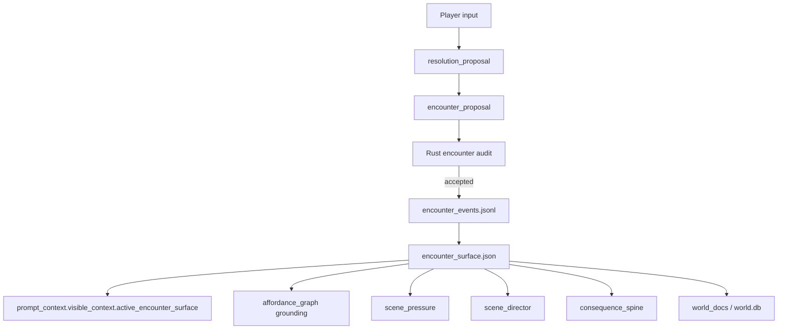

# Encounter Surface / Interaction Contract

Status: design draft

Last updated: 2026-04-30

This document defines the next simulation layer after Scene Director,
Consequence Spine, and Social Exchange.

Resolution answers:

```text
What did the player try, and what happened?
```

Scene Director answers:

```text
What dramatic job should the next turn do?
```

Social Exchange answers:

```text
What did this conversation exchange, withhold, promise, or leave unresolved?
```

Encounter Surface answers:

```text
What can the player actually interact with here, under what constraints,
and what could change if they touch it?
```

It is not a puzzle solver and not a full physics engine. It is a compact,
evidence-backed interaction contract for the current scene: objects, people,
barriers, traces, exits, tools, and social handles that can be inspected,
moved, spoken to, forced, traded over, followed, waited on, or avoided.

## Problem

The current runtime has strong pressure and memory layers:

- `resolution_proposal` audits the player action and outcome
- `scene_director` guides pacing and repetition control
- `consequence_spine` carries fallout forward
- `social_exchange` preserves dialogue stance and unresolved asks
- `actor_agency` keeps local NPC goals and visible moves
- `scene_pressure` weights urgent visible constraints
- `affordance_graph` compiles slot-level action categories

This already makes turns more grounded, but the actual scene surface is still
too implicit.

The LLM can describe a locked gate, a loose rope, a suspicious guard, a fresh
footprint, or a crowd pressing inward. But unless those things become a compact
state surface, the next turn can drift:

- a described object disappears before the player can inspect it
- a clue is mentioned, but no target remembers that it is now investigable
- a door is "locked" in prose, then silently behaves as open later
- an NPC blocks passage, but the block is not encoded as an interaction
  constraint
- a choice says "inspect the mark", but Rust only knows a generic knowledge
  pressure, not the mark as a concrete interactable
- the same scene repeats broad verbs because the exact manipulable surface is
  not available to the prompt

The missing layer is a per-scene interaction surface.

## Core Principle

The LLM sees and describes a living scene.

Rust records the interactable surface:

```text
LLM proposes what is interactable.
Rust audits visibility, constraints, allowed actions, and change hooks.
```

The goal is not to make Rust intelligent. The goal is to make the LLM's scene
intelligence persist as a small, inspectable contract:

- the closed gate is not just atmosphere; it is a `barrier` with `open`,
  `force`, `talk_past`, and `inspect_lock` affordances
- the rope is not just color; it is a `movable_trace` that can be lifted,
  followed, or used as evidence
- the guard is not only a relationship edge; he is the active access controller
  for this encounter
- the footprint is a clue surface with a risk of being destroyed by movement
- the crowd is a social environment that makes threats and embarrassment more
  expensive

## Authority Split

| Surface | LLM owns | Rust owns |
| --- | --- | --- |
| Scene description | Sensory prose, implied use, dramatic framing | Player-visible evidence and no hidden leaks |
| Interactable target | Why the target matters in this scene | Stable `surface_id`, kind, status, source refs |
| Affordances | Natural action wording and likely outcomes | Closed action enum, constraints, risk tags |
| Constraints | Narrative reason something is hard | Typed gate refs and required conditions |
| Change potential | What could transform after interaction | State transition contract and projection hooks |
| Choice shaping | How options feel in Korean VN text | Slot grounding, no impossible actions |
| Persistence | Whether it should survive scene transition | Lifecycle, decay, export/search projection |

## Non-Goals

- Do not build a deterministic puzzle solver.
- Do not replace `resolution_proposal`; outcome adjudication still happens
  there.
- Do not replace `location_graph`; Encounter Surface tracks current-scene
  interactables, not the full map.
- Do not replace `body_resource`; tools and inventory are constraints, not
  duplicated inventory state.
- Do not turn every noun in prose into an interactable.
- Do not expose hidden causes, hidden timers, or future route hints.
- Do not let generic atmospheric objects crowd out important scene handles.
- Do not create a second choice system separate from slots 1-7.

## Target Pipeline



V1 should support both:

- optional LLM-authored `encounter_proposal`
- conservative derivation from `visible_scene`, `next_choices`,
  `resolution_proposal.next_choice_plan`, `scene_pressure`, `location_graph`,
  and `social_exchange`

## Proposed Surfaces

Append-only event source:

```text
encounter_events.jsonl
```

Materialized prompt/debug state:

```text
encounter_surface.json
```

Prompt section:

```text
prompt_context.visible_context.active_encounter_surface
```

Optional response field:

```text
AgentTurnResponse.encounter_proposal
```

World docs / DB projection:

```text
kind = encounter_surface
title = 조작 가능한 장면 표면
```

VN safe status row:

```text
상호작용: 조사 가능한 표면 있음
```

## Encounter Surface Packet

```rust
struct EncounterSurfacePacket {
    schema_version: String,
    world_id: String,
    turn_id: String,
    scene_id: String,
    active_surfaces: Vec<EncounterSurface>,
    recent_surface_changes: Vec<EncounterSurfaceMemory>,
    blocked_interactions: Vec<BlockedInteraction>,
    required_followups: Vec<EncounterFollowup>,
    compiler_policy: EncounterSurfacePolicy,
}
```

The packet is compact. It is a map of actionable scene handles, not a full
scene transcript.

### Encounter Surface

```rust
struct EncounterSurface {
    surface_id: String,
    label: String,
    kind: EncounterSurfaceKind,
    status: EncounterSurfaceStatus,
    salience: EncounterSalience,
    summary: String,
    player_visible_signal: String,
    location_ref: String,
    holder_ref: Option<String>,
    source_refs: Vec<String>,
    linked_entity_refs: Vec<String>,
    linked_pressure_refs: Vec<String>,
    linked_social_refs: Vec<String>,
    affordances: Vec<EncounterAffordance>,
    constraints: Vec<EncounterConstraint>,
    change_potential: Vec<EncounterChangePotential>,
    lifecycle: EncounterSurfaceLifecycle,
}
```

`surface_id` is stable within a scene. If a surface survives scene transition,
it should either keep the same id with a new `location_ref`, or emit a
`transferred` event with a new id.

Examples:

```text
surface:turn_0005:gate_lock
surface:turn_0005:rope_knot
surface:turn_0005:guard_access
surface:turn_0005:footprint_line
surface:turn_0005:crowd_witnesses
```

## Surface Kinds

Use a small enum for V1.

```rust
enum EncounterSurfaceKind {
    Barrier,
    AccessController,
    EvidenceTrace,
    MovableObject,
    UsableTool,
    Container,
    Hazard,
    Exit,
    HidingPlace,
    SocialHandle,
    EnvironmentalFeature,
    TimeSensitiveCue,
}
```

Meanings:

- `barrier`: door, gate, lock, blocked path, rope line
- `access_controller`: guard, owner, crowd, rule keeper, animal at passage
- `evidence_trace`: footprint, mark, smell, blood, ash, disturbed dust
- `movable_object`: crate, rope, cloth, loose stone, dropped bag
- `usable_tool`: lever, key, lantern, seal, blade, writing surface
- `container`: pouch, chest, barrel, sealed letter, hidden compartment
- `hazard`: fire, unstable floor, patrol line, hostile crowd
- `exit`: path, window, gate gap, alley, tunnel
- `hiding_place`: shadow, cart underside, wall niche, crowd cover
- `social_handle`: public embarrassment, witness, debt, bargaining object
- `environmental_feature`: mud, rain, echo, slope, narrow bridge
- `time_sensitive_cue`: closing bell, fading footprint, moving patrol

## Surface Status

```rust
enum EncounterSurfaceStatus {
    Available,
    Blocked,
    Locked,
    HiddenButSignaled,
    Degraded,
    ClaimedByActor,
    Moving,
    Exhausted,
    Resolved,
    Gone,
}
```

Status must describe what the player can fairly infer.

Allowed:

```text
hidden_but_signaled: "천 아래에 각진 것이 눌려 있다."
```

Forbidden:

```text
hidden_but_signaled: "천 아래에는 암살자의 서명이 든 칼이 있다."
```

unless that exact fact is already visible.

## Salience

```rust
enum EncounterSalience {
    Background,
    Useful,
    Important,
    Critical,
}
```

Prompt inclusion should favor:

1. `critical` surfaces
2. surfaces tied to selected choice or current player input
3. surfaces tied to active pressure, social exchange, consequence, or open
   question
4. recent surfaces changed by the last turn

## Encounter Affordance

```rust
struct EncounterAffordance {
    affordance_id: String,
    action_kind: EncounterActionKind,
    label_seed: String,
    intent_seed: String,
    availability: AffordanceAvailability,
    required_refs: Vec<String>,
    risk_tags: Vec<EncounterRiskTag>,
    evidence_refs: Vec<String>,
}
```

### Action Kinds

```rust
enum EncounterActionKind {
    Inspect,
    Touch,
    Move,
    Open,
    Close,
    Force,
    Repair,
    Break,
    Take,
    Use,
    TalkAbout,
    TradeOver,
    ThreatenWith,
    HideBehind,
    Follow,
    Wait,
    Listen,
    Smell,
    Compare,
    Mark,
    Bypass,
}
```

This enum should stay closed enough to be useful for choice grounding. If the
LLM needs a novel verb, it can map it to the closest action kind and express
the nuance in `label_seed` / `intent_seed`.

### Availability

```rust
enum AffordanceAvailability {
    Available,
    RequiresCondition,
    Risky,
    Blocked,
    UnknownNeedsProbe,
}
```

`blocked` is still useful: it prevents the same impossible action from being
offered again unless the scene state changes.

## Constraints

```rust
struct EncounterConstraint {
    constraint_id: String,
    constraint_kind: EncounterConstraintKind,
    summary: String,
    required_refs: Vec<String>,
    source_refs: Vec<String>,
}

enum EncounterConstraintKind {
    Body,
    Resource,
    Tool,
    Knowledge,
    SocialPermission,
    TimePressure,
    Noise,
    Visibility,
    ActorOpposition,
    WorldLaw,
}
```

Constraints should point into existing layers when possible:

- body/resource constraints -> `active_body_resource_state`
- social constraints -> `active_social_exchange`
- active danger -> `active_scene_pressure`
- time constraints -> `active_world_process_clock`
- known/unknown facts -> `belief_graph`, `world_lore`, `selected_context_capsules`
- map constraints -> `active_location_graph`

Do not duplicate full state. Store only the interaction-specific condition.

## Change Potential

```rust
struct EncounterChangePotential {
    change_id: String,
    change_kind: EncounterChangeKind,
    summary: String,
    likely_status_after: EncounterSurfaceStatus,
    consequence_hint: Option<String>,
    evidence_refs: Vec<String>,
}

enum EncounterChangeKind {
    RevealDetail,
    ChangeAccess,
    ConsumeSurface,
    MoveSurface,
    DamageSurface,
    CreateNoise,
    ShiftActorStance,
    AdvanceClock,
    ProduceResource,
    DestroyEvidence,
    OpenExit,
    CloseExit,
}
```

This is not a promise that the change will happen. It is a bounded expectation
for what kinds of outcomes are plausible if the player interacts with the
surface.

## Blocked Interaction

```rust
struct BlockedInteraction {
    blocked_id: String,
    surface_id: String,
    action_kind: EncounterActionKind,
    reason: String,
    unblock_hints: Vec<String>,
    source_refs: Vec<String>,
}
```

This prevents loops like repeatedly trying to open a gate after the scene has
already established that a guard must be persuaded first.

Examples:

```text
"문지기를 지나 성문을 열려면 먼저 신원을 밝혀야 한다."
"발자국 위로 바로 걸어가면 단서가 망가진다."
"쇠고리는 손으로 움직일 수 있지만 소리가 날 위험이 있다."
```

## LLM Output Shape

Add an optional field to `AgentTurnResponse`:

```rust
struct AgentTurnResponse {
    // existing fields...
    encounter_proposal: Option<EncounterProposal>,
}
```

Proposal:

```rust
struct EncounterProposal {
    schema_version: String,
    world_id: String,
    turn_id: String,
    scene_id: String,
    introduced_or_updated: Vec<EncounterSurfaceMutation>,
    removed_or_resolved: Vec<EncounterSurfaceClosure>,
    blocked_interactions: Vec<BlockedInteractionMutation>,
    ephemeral_surface_notes: Vec<EphemeralEncounterNote>,
}
```

Mutation:

```rust
struct EncounterSurfaceMutation {
    surface_id: String,
    label: String,
    kind: EncounterSurfaceKind,
    status: EncounterSurfaceStatus,
    salience: EncounterSalience,
    summary: String,
    player_visible_signal: String,
    location_ref: String,
    holder_ref: Option<String>,
    source_refs: Vec<String>,
    linked_entity_refs: Vec<String>,
    linked_pressure_refs: Vec<String>,
    linked_social_refs: Vec<String>,
    affordances: Vec<EncounterAffordance>,
    constraints: Vec<EncounterConstraint>,
    change_potential: Vec<EncounterChangePotential>,
}
```

Closures:

```rust
struct EncounterSurfaceClosure {
    surface_id: String,
    closure_kind: EncounterClosureKind,
    summary: String,
    evidence_refs: Vec<String>,
}

enum EncounterClosureKind {
    Resolved,
    Exhausted,
    Destroyed,
    MovedAway,
    SceneTransition,
    Superseded,
}
```

The field is optional for compatibility. V1 can derive surfaces without it,
then let WebGPT write richer proposals after the audit contract is stable.

## Rust Audit Contract

Audit rules:

1. `world_id`, `turn_id`, and `scene_id` must match prompt context or active
   scene director state.
2. Every `surface_id` must be stable, normalized, and scoped to the scene or
   known entity.
3. Every surface needs player-visible `source_refs`.
4. `summary`, `player_visible_signal`, constraint text, and change potential
   must not contain hidden/adjudication-only text.
5. `location_ref` must exist in visible context or be the current location.
6. `holder_ref` and linked entity refs must exist in visible context,
   relationship graph, current response entity updates, or accepted scene
   refs.
7. Each affordance must have at least one action kind and evidence ref.
8. `available` affordances cannot contradict known constraints.
9. `blocked` affordances must include a visible reason or visible missing
   condition.
10. `hidden_but_signaled` surfaces may describe only the signal, not hidden
    contents.
11. `critical` surfaces must connect to at least one integration hook:
    scene pressure, consequence, social exchange, plot thread, or choice plan.
12. Closed surfaces cannot remain active unless closure kind is `superseded`
    with a replacement surface.

Audit failure should be repairable by the existing WebGPT commit repair path.

## Conservative Derivation

V1 can derive surfaces before WebGPT writes explicit proposals.

| Existing signal | Derived encounter surface |
| --- | --- |
| `next_choices` slot 1-5 | candidate surface/action pair |
| `resolution_proposal.next_choice_plan` | grounded affordance ids |
| `scene_pressure` social/knowledge/environment pressure | high-salience surface |
| `location_graph.current_location` | base location/ref |
| `social_exchange.unresolved_asks` | social handle or access controller |
| `consequence_spine.active` | consequence-linked obstacle or clue |
| `body_resource` held item | usable tool or constraint |
| `belief_graph` uncertain visible belief | evidence trace to inspect |
| `plot_threads.active_visible` | open-question clue surface |

Derived records should be conservative:

- prefer `inspect`, `talk_about`, `wait`, or `compare` over strong actions
  like `force`, `break`, or `take`
- mark ambiguous surfaces as `hidden_but_signaled` or `unknown_needs_probe`
- never create a new object just because a generic action category exists
- do not convert atmospheric nouns into surfaces unless a choice, pressure, or
  open question points at them

## Integration Points

### Affordance Graph

Encounter Surface should feed `affordance_graph` with concrete grounding:

```text
slot 2 inspect -> surface:turn_0005:footprint_line
slot 3 talk -> surface:turn_0005:guard_access
slot 4 use/compare -> surface:turn_0005:rope_knot
```

The existing slot contract remains:

- slots 1-5 are scene-specific presented choices
- slot 6 is inline freeform
- slot 7 is delegated judgment

Encounter Surface gives slots 1-5 something concrete to touch.

### Resolution Proposal

`resolution_proposal` should reference encounter surfaces in:

- `interpreted_intent.target_refs`
- `gate_results.gate_ref`
- `proposed_effects.target_ref`
- `next_choice_plan.grounding_ref`

Resolution still decides outcome. Encounter Surface only says what actions are
available or blocked before adjudication.

### Scene Pressure

Critical or blocked surfaces can become pressure:

```text
locked gate -> environment/social_permission pressure
fading footprint -> time_pressure/knowledge pressure
unstable bridge -> body/environment pressure
crowd witnesses -> social_permission/moral_cost pressure
```

This keeps pressure grounded in visible things rather than abstract labels.

### Social Exchange

Social Exchange creates surfaces when dialogue has an object or person to push:

```text
withholding guard -> access_controller surface
unresolved ask -> social_handle surface
conditional promise -> blocked interaction until condition is met
public embarrassment -> crowd_witnesses social surface
```

Encounter Surface should not duplicate stance. It should express what the
player can interact with because of that stance.

### Consequence Spine

Consequences can spawn or alter surfaces:

```text
alarm raised -> patrol route surface becomes moving hazard
trust damaged -> guard access surface becomes blocked
knowledge opened -> old mark surface gains compare affordance
resource lost -> tool-dependent affordance becomes blocked
```

When an interaction destroys evidence, changes access, or burns a social
handle, that can create or pay off a consequence.

### Actor Agency

Actors can own or contest surfaces:

```text
guard controls gate
witness controls testimony
merchant holds medicine
crowd controls public pressure
```

`holder_ref` plus `constraints.actor_opposition` lets choices stay grounded:
the player is not "opening a gate"; they are trying to act on a gate currently
held by a guard.

### Location Graph

Encounter Surface can reveal or close exits but must not replace the map:

```text
surface exit discovered -> location_event may add known nearby location
surface exit blocked -> location graph edge is constrained or delayed
```

### World Docs / Codex View

World docs should summarize only active/current surfaces:

```text
## Encounter Surface
- active surfaces: 5
- blocked interactions: 2
- critical surfaces: 1
```

Codex View can expose player-visible surfaces, but should avoid debug enums
unless the player asks for archive/detail.

### VN UI

Safe player-facing status phrases:

- `조사 가능한 표면 있음`
- `문턱이 조건에 막혀 있음`
- `단서가 훼손되기 쉬움`
- `말을 걸 수 있는 대상이 압박을 쥐고 있음`
- `지금 만질 수 있는 것은 제한적`
- `장면 표면은 잠시 안정적`

Do not expose exact hidden contents or optimal solution hints.

## Example

Visible scene:

```text
문지기는 닫힌 성문 앞에서 대답을 미룬다.
문 아래에는 젖은 진흙이 한 줄로 끊겨 있고, 밧줄 끝이 문틈 쪽으로 말려 있다.
```

Encounter surface:

```json
{
  "surface_id": "surface:turn_0004:gate_gap_rope",
  "label": "문틈 쪽으로 말린 밧줄 끝",
  "kind": "evidence_trace",
  "status": "available",
  "salience": "important",
  "summary": "닫힌 성문 아래의 밧줄 끝이 문틈 쪽으로 말려 있다.",
  "player_visible_signal": "밧줄 끝과 진흙 선이 같은 방향을 가리킨다.",
  "location_ref": "place:gate",
  "holder_ref": null,
  "source_refs": ["visible_scene.text_blocks[1]"],
  "linked_pressure_refs": ["pressure:knowledge:gate_trace"],
  "affordances": [
    {
      "affordance_id": "affordance:surface:gate_gap_rope:inspect",
      "action_kind": "inspect",
      "label_seed": "밧줄 끝을 본다",
      "intent_seed": "문틈 쪽으로 말린 밧줄 끝과 진흙 선을 맞춰 본다",
      "availability": "available",
      "required_refs": [],
      "risk_tags": ["destroy_evidence_if_stepped_on"],
      "evidence_refs": ["visible_scene.text_blocks[1]"]
    }
  ],
  "constraints": [
    {
      "constraint_id": "constraint:gate_gap_rope:fragile_trace",
      "constraint_kind": "visibility",
      "summary": "가까이 밟으면 진흙 선이 흐트러질 수 있다.",
      "required_refs": [],
      "source_refs": ["visible_scene.text_blocks[1]"]
    }
  ],
  "change_potential": [
    {
      "change_id": "change:gate_gap_rope:reveal_detail",
      "change_kind": "reveal_detail",
      "summary": "밧줄이 문 안쪽에서 당겨졌는지 확인할 수 있다.",
      "likely_status_after": "available",
      "consequence_hint": null,
      "evidence_refs": ["visible_scene.text_blocks[1]"]
    }
  ]
}
```

Blocked interaction:

```json
{
  "surface_id": "surface:turn_0004:closed_gate",
  "action_kind": "open",
  "reason": "문지기가 신원 확인 전에는 성문을 열지 않는다.",
  "unblock_hints": ["신원을 밝힌다", "문지기의 질문을 다른 근거로 돌린다"],
  "source_refs": ["active_social_exchange.active_stances[0]"]
}
```

## Implementation Plan

### Phase 1. Design Packet And Materialization

Add `src/encounter_surface.rs` with:

- data model enums and packet structs
- `EncounterProposal`
- append-only `encounter_events.jsonl`
- rebuild into `encounter_surface.json`
- load fallback for prompt context
- unit tests for materialization and closure

Done when:

- `encounter_events.jsonl` appends typed records
- `encounter_surface.json` rebuilds active surfaces
- closed surfaces are removed or superseded
- no hidden/adjudication text enters visible fields

### Phase 2. Prompt And Revival Integration

Expose `active_encounter_surface` in:

- `AgentVisibleContext`
- `revival.rs`
- `prompt_context.rs`
- WebGPT prompt schema/rules

Done when:

- WebGPT receives compact active surfaces
- prompt context excludes hidden/adjudication-only interaction causes
- tests confirm the prompt packet includes `active_encounter_surface`

### Phase 3. Conservative Derivation

Derive initial surfaces from:

- next choices
- resolution choice plan
- scene pressure
- social exchange unresolved asks / commitments
- consequences
- location graph
- belief graph

Done when:

- a turn without `encounter_proposal` still yields useful surfaces
- generic choices do not create fake objects
- blocked social/location actions become blocked interactions

### Phase 4. Optional LLM Proposal

Add `AgentTurnResponse.encounter_proposal`.

Done when:

- proposal audit catches missing refs, hidden leaks, impossible affordances
- proposal can introduce/update/close surfaces
- repair errors are short enough for WebGPT to fix

### Phase 5. Integration Hooks

Wire Encounter Surface into:

- `affordance_graph` as slot grounding
- `scene_pressure` as concrete pressure source
- `scene_director` as scene-shape signal
- `consequence_spine` for destroyed evidence / access changes
- `actor_agency` through holder/opposition refs

Done when:

- slots 1-5 can cite surface affordances
- destroyed/moved/resolved surfaces create or pay off consequences
- actor-owned surfaces affect social/action choices

### Phase 6. Browser E2E Tuning

Use VN browser play to test:

- a physical obstacle scene
- a clue investigation scene
- a social gatekeeper scene
- a fragile evidence scene
- a tool/container scene

Quality checks:

- choices point to visible surfaces, not vague verbs
- repeated blocked actions stop recurring without new leverage
- inspect actions narrow questions
- force actions show plausible risks
- surfaces survive exactly as long as they remain visible/actionable

## Open Design Questions

### Should surfaces persist across scene transition?

Default: only if they remain actionable or become a known object/location fact.
Otherwise they should close with `scene_transition`.

### Should every choice have a surface?

No. Some choices are body, social, or timing decisions. But most concrete
scene-specific choices should ground to at least one surface or pressure ref.

### Should hidden objects exist as surfaces?

Only as `hidden_but_signaled`, and only with player-visible signals. The hidden
contents remain adjudication-only until revealed.

### Should Encounter Surface compile before or after Scene Director?

Preferred order:

1. load existing encounter surface
2. compile scene pressure and social/consequence inputs
3. compile Scene Director with encounter signals
4. WebGPT writes turn and optional encounter proposal
5. Rust audits and materializes updated surface

For V1, it can sit beside `social_exchange` and feed Scene Director after the
first materialization pass.

## Success Criteria

Encounter Surface is successful when:

1. Objects, barriers, clues, and social handles described in one turn remain
   available for the next turn when appropriate.
2. Choices become more concrete without becoming puzzle spoilers.
3. Repeated impossible interactions are blocked unless the player gains a new
   condition, tool, or leverage.
4. Hidden contents are never revealed through surface summaries.
5. Resolution outcomes can update, consume, move, damage, or close surfaces.
6. World docs and VN status can explain the scene surface safely.

## V1 Minimum

The smallest useful implementation is:

1. `EncounterSurfacePacket` in visible prompt context.
2. `encounter_events.jsonl` and `encounter_surface.json`.
3. Conservative derivation from choices, pressure, social exchange, and
   consequences.
4. Optional `encounter_proposal`.
5. Audit for refs, hidden leaks, impossible affordance/status mismatch.
6. VN row showing safe interaction status.

This is enough to make the world feel more playable: the LLM still performs the
intelligence, while Rust keeps the scene's usable handles from dissolving back
into prose.
