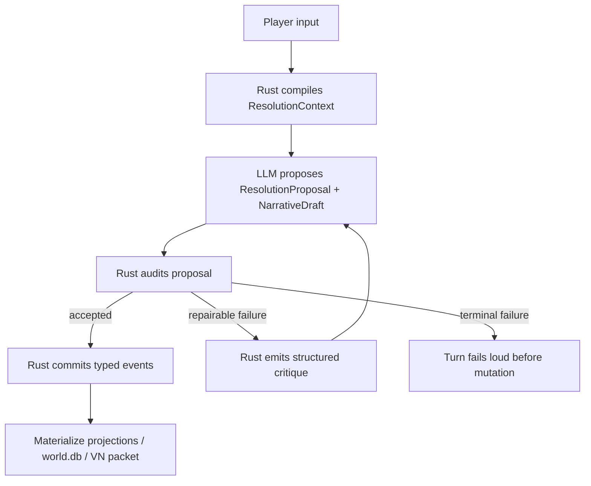

# LLM-Led, Rust-Audited Resolution

Last updated: 2026-04-30

This document defines the next simulation architecture for Singulari World.

The goal is not to replace the language model with a scripted game engine. The
goal is to keep the model's semantic intelligence while preventing its output
from becoming unbounded world truth.

In short:

```text
LLM proposes intelligent resolution.
Rust audits, records, and projects durable world state.
```

## Problem

The current runtime has a strong loop:

```text
player input -> pending turn -> WebGPT -> AgentTurnResponse -> Rust validation -> commit
```

It also has strong projection families:

- scene pressure
- body/resource state
- location graph
- world lore
- relationship graph
- belief graph
- process clock
- pattern debt
- player intent trace
- narrative style state

The remaining architectural tension is authority.

If Rust tries to become the main "GM brain", the simulator becomes a pile of
scripts. It will miss social nuance, indirect intent, dramatic timing, and
interesting partial failure. But if the LLM remains the only resolver, the world
can drift: invented resources, unearned access, hidden-truth leakage, stale
memory bias, or state changes without evidence.

The desired architecture is a hybrid:

- The LLM performs semantic interpretation and proposes rich outcomes.
- Rust enforces hard laws, evidence, visibility, causality, and persistence.

## Core Principle

Rust is not the narrator and not the GM brain.

Rust is the world constitution, ledger, and customs officer:

- What has already become canon?
- What does the player actually know?
- What resources, body constraints, and location gates exist?
- Which facts are hidden or adjudication-only?
- Which proposed deltas have evidence?
- Which changes can be rebuilt later from append-only events?
- Which visible text would leak hidden truth?

The LLM keeps the intelligent work:

- interpreting freeform intent
- understanding social implication
- proposing plausible partial success
- deciding what consequence is narratively interesting
- phrasing Korean VN prose
- making characters feel responsive rather than mechanical
- turning state pressure into scene-specific choices

## Authority Split

| Surface | LLM owns | Rust owns |
| --- | --- | --- |
| Player intent | Semantic interpretation, ambiguity handling, implied intent | Input envelope, selected slot, turn identity |
| Resolution | Candidate outcome, social nuance, interesting costs | Hard-law validation, gate checks, contradiction checks |
| World state | Proposed typed deltas with evidence | Canonical event write, materialization, repairability |
| Hidden truth | May use adjudication-only hints to shape outcome | Redaction, no visible leak, reveal-condition validation |
| Choices | Scene-specific wording and meaningful options | Slot contract, affordance grounding, forbidden shortcut checks |
| Memory | Relevance explanation and narrative use | Budgeting, source priority, anti-repetition, projection |
| Prose | Korean VN narration, rhythm, dialogue | Schema validation, visible-only packet projection |

## Target Pipeline



The important change is that the LLM response is treated as a proposal, not as
immediate world truth.

## Resolution Context

`ResolutionContext` is the turn-facing subset of `PromptContextPacket`. It
should be compact and mechanical enough for auditing, but rich enough for the
LLM to reason well.

Proposed fields:

```rust
struct ResolutionContext {
    world_id: String,
    turn_id: String,
    player_input: String,
    selected_choice: Option<SelectedChoice>,
    current_visible_scene: VisibleSceneSummary,
    known_facts: Vec<EvidenceBackedFact>,
    body_resource_state: BodyResourcePacket,
    location_graph: LocationGraphPacket,
    scene_pressure: ScenePressurePacket,
    affordance_graph: AffordanceGraphPacket,
    belief_graph: BeliefGraphPacket,
    world_process_clock: WorldProcessClockPacket,
    relationship_graph_summary: Value,
    private_adjudication_context: AgentPrivateAdjudicationContext,
    output_contract: AgentOutputContract,
}
```

This is not a new broad prompt dump. It is the minimal packet required to
resolve one player action.

## LLM Output Shape

The LLM should emit an explicit proposal before or alongside the visible scene.

```rust
struct ResolutionProposal {
    schema_version: String,
    world_id: String,
    turn_id: String,
    interpreted_intent: ActionIntent,
    outcome: ResolutionOutcome,
    gate_results: Vec<GateResult>,
    proposed_effects: Vec<ProposedEffect>,
    process_ticks: Vec<ProcessTickProposal>,
    state_deltas: ProposedStateDeltas,
    narrative_brief: NarrativeBrief,
    next_choice_plan: Vec<ChoicePlan>,
}
```

### Action Intent

```rust
struct ActionIntent {
    input_kind: ActionInputKind,
    summary: String,
    target_refs: Vec<String>,
    pressure_refs: Vec<String>,
    evidence_refs: Vec<String>,
    ambiguity: ActionAmbiguity,
}
```

The LLM may infer intent, but every target and pressure reference must point to
something in the resolution context or to visible current-turn text.

### Resolution Outcome

```rust
enum ResolutionOutcomeKind {
    Success,
    PartialSuccess,
    Blocked,
    CostlySuccess,
    Delayed,
    Escalated,
}
```

The outcome should explain what changed and why. It must not introduce a hidden
fact as visible truth.

### Gate Result

```rust
struct GateResult {
    gate_kind: GateKind,
    gate_ref: String,
    status: GateStatus,
    reason: String,
    evidence_refs: Vec<String>,
}
```

Example gate kinds:

- `body`
- `resource`
- `location`
- `social_permission`
- `knowledge`
- `time_pressure`
- `hidden_constraint`
- `world_law`

Gate statuses:

- `passed`
- `softened`
- `blocked`
- `cost_imposed`
- `unknown_needs_probe`

## Rust Audit Contract

Rust validates the proposal before any world mutation.

Minimum audit checks:

1. Target check: every referenced entity, location, pressure, resource, belief,
   or process exists in context or is created by an allowed same-turn event.
2. Visibility check: visible text, choice labels, and player-facing summaries do
   not contain hidden truth or adjudication-only details.
3. Evidence check: every durable state delta has evidence refs.
4. Gate check: proposed success does not bypass body/resource/location/social
   gates without a recorded cost or explanation.
5. Causality check: process ticks and pressure changes are caused by player
   action, time passage, or established world pressure.
6. Canon check: proposed facts do not contradict existing canon unless the delta
   is explicitly a belief, rumor, lie, or correction.
7. Choice check: ordinary slots are grounded in affordance ids; slot 6 remains
   freeform; slot 7 remains delegated judgment.
8. Repairability check: every committed projection can be rebuilt from
   append-only events.

Audit failure should not silently fallback to generic narration.

## Structured Repair Loop

When the proposal is close but invalid, Rust should return a narrow critique and
allow a bounded retry.

```rust
struct ResolutionCritique {
    schema_version: String,
    world_id: String,
    turn_id: String,
    failure_kind: ResolutionFailureKind,
    message: String,
    rejected_refs: Vec<String>,
    required_changes: Vec<String>,
    allowed_repair_scope: Vec<String>,
}
```

Repair examples:

- "This action used a tool the player does not have. Replace it with an
  improvised method or mark the attempt blocked."
- "This visible paragraph reveals an unrevealed hidden constraint. Rewrite the
  visible reason as observable hesitation."
- "This choice implies an unknown safe route. Ground it in the current location
  graph or present it as a risky probe."

Retry policy:

- one retry for schema or visibility repair
- one retry for gate/evidence repair
- terminal failure if the repaired proposal still mutates unsupported state

## Freeform Slot 6

Slot 6 is where the LLM's intelligence matters most.

The player can write a rich action that does not match the five ordinary slots.
Rust should not flatten it into a fixed enum too early. Instead:

1. LLM interprets the freeform input into `ActionIntent`.
2. Rust audits the intent against available gates.
3. LLM proposes a consequence that may be success, partial success, blocked,
   costly, delayed, or escalated.
4. Rust records the gate trace.

The durable addition should be:

```rust
struct FreeformGateTrace {
    turn_id: String,
    raw_input: String,
    interpreted_intent: ActionIntent,
    gate_results: Vec<GateResult>,
    final_outcome: ResolutionOutcomeKind,
}
```

This gives freeform actions memory without forcing every possible action into a
scripted command taxonomy.

## World Processes

World processes should not be pure prompt decoration.

They are moving pressures:

- rumor spread
- patrol movement
- weather shift
- wound worsening
- market close
- torch burn-down
- debt pressure
- relationship suspicion

The LLM may propose process ticks, but Rust must validate why the tick happened.

Valid tick causes:

- selected player action touches the process
- visible time passage occurred
- scene pressure escalated or resolved
- a process reached its next tick condition
- a hidden timer reveal condition was satisfied

Process ticks should write `world_process_events.jsonl`, then rebuild
`world_processes.json`.

## NPC and Actor Agency

The next quality jump after action resolution is actor agency.

Actors need more than relationship notes. They need local goals and moves.

Proposed event families:

```text
actor_goal_events.jsonl
actor_move_events.jsonl
```

An actor goal is not a full planner. It is a bounded pressure source:

```rust
struct ActorGoal {
    actor_ref: String,
    goal_id: String,
    visibility: Visibility,
    desire: String,
    fear_or_constraint: String,
    current_leverage: Vec<String>,
    pressure_refs: Vec<String>,
    evidence_refs: Vec<String>,
}
```

Actor moves can then create social pressure, relationship deltas, process ticks,
or scene events. The LLM proposes the human nuance; Rust verifies that the actor
exists, has evidence, and does not reveal hidden state incorrectly.

## Commit Shape

The current `AgentTurnResponse` can evolve without becoming a mega contract by
separating proposal families:

```text
AgentTurnResponse
  visible_scene
  resolution_proposal
  proposed_event_families
  next_choices
```

Rust should compile proposal families into existing event logs:

- `scene_pressure_events.jsonl`
- `body_resource_events.jsonl`
- `location_events.jsonl`
- `relationship_events.jsonl`
- `world_lore_events.jsonl`
- `belief_events.jsonl`
- `world_process_events.jsonl`
- `player_intent_events.jsonl`
- `pattern_debt_events.jsonl`

The LLM response remains creative and semantic. The committed store remains
typed and rebuildable.

## Implementation Phases

### Phase 1: Resolution Proposal Schema — implemented

Add the types and validator without changing runtime behavior.

Acceptance:

- [x] proposal parses from test fixtures
- [x] hidden details cannot appear in visible proposal fields
- [x] gate refs must point to context refs
- [x] missing evidence refs fail audit
- [x] ordinary choice plans must cite affordance ids
- [x] no world mutation yet

Implemented in `src/resolution.rs` as `ResolutionProposal`,
`ResolutionCritique`, and `audit_resolution_proposal`. It audits against the
compiled `PromptContextPacket`, so this phase keeps the LLM-led design while
making the Rust boundary concrete and testable.

### Phase 2: AgentTurnResponse Integration — implemented

Connect the proposal to the existing LLM response without making it immediate
world truth.

Acceptance:

- [x] `AgentTurnResponse` can carry optional `resolution_proposal`.
- [x] WebGPT prompt schema shows the proposal shape and grounding rules.
- [x] Existing response fixtures remain valid by omitting the optional proposal.
- [x] Commit path keeps backward compatibility for responses without a proposal.

### Phase 3: Commit-Time Resolution Audit — implemented

Audit the proposal before turn mutation when the LLM provides it.

Acceptance:

- [x] commit compiles the same `PromptContextPacket` used by WebGPT dispatch
- [x] provided proposals are audited before `advance_turn`
- [x] invalid proposal refs fail before world state advances
- [x] audit errors are surfaced as commit failures, not repaired silently

### Phase 4: Freeform Gate Trace — implemented

Record slot 6 interpretation and gate outcome.

Acceptance:

- [x] freeform input produces `FreeformGateTrace`
- [x] blocked/costly/partial outcomes are distinguishable through
  `ResolutionOutcomeKind`
- [x] trace is derived only from the audited `ResolutionProposal`
- [x] trace is stored inside `player_intent_events.jsonl` through the existing
  player-intent projection loop
- [x] trace can be rebuilt with the rest of `PlayerIntentTracePacket`

### Phase 5: Choice Grounding — implemented

Tie ordinary next choices to affordance ids.

Acceptance:

- [x] slots 1..5 each cite an affordance id or fail validation
- [x] choices cannot expose internal refs or copy forbidden shortcut text
- [x] slot 7 remains opaque delegated judgment

Implemented as the second half of the resolution audit. When an
`AgentTurnResponse` carries `resolution_proposal`, Rust now requires a complete
`next_choice_plan` for slots 1..7, verifies that ordinary slots cite the
compiled affordance id for the same slot, and audits player-visible
`next_choices` for leaked internal refs or forbidden shortcut text.

### Phase 6: Process Tick Validation — implemented

Promote process ticks from prompt-time hints to audited events.

Acceptance:

- [x] visible process ticks carry an explicit `ProcessTickCause`
- [x] hidden process ticks keep `adjudication_only` visibility
- [x] audited `ResolutionProposal.process_ticks` enter
  `world_process_events.jsonl`
- [x] process state rebuilds from event logs through the existing
  `WorldProcessClockPacket` materializer
- [x] VN/Codex View continues to consume safe process summaries from projection
  state

### Phase 7: Actor Goal Slice — implemented

Add a small actor-agency layer.

Acceptance:

- [x] important NPCs can hold bounded goals
- [x] actor moves produce typed pressure or relationship refs
- [x] hidden actor motives stay out of the player-visible projection
- [x] player can infer motives from visible behavior over time

Implemented in `src/actor_agency.rs` as `ActorAgencyPacket`,
`actor_goal_events.jsonl`, and `actor_move_events.jsonl`. Agent responses can
now provide `actor_goal_events` and `actor_move_events`; Rust validates that the
actor is known through the current relationship graph or same-turn entity
updates, requires evidence refs, writes append-only event logs, and materializes
only player-visible goals/moves into `actor_agency.json`.

## What To Avoid

- Do not hardcode a command parser that pretends to understand the world.
- Do not make Rust choose the most dramatic outcome from fixed tables.
- Do not let the LLM commit new canon without evidence.
- Do not treat hidden adjudication context as visible explanation.
- Do not add broad prompt sections when a typed gate or event would solve the
  problem.
- Do not silently repair invalid LLM proposals into generic safe narration.

## Success Criteria

The architecture is working when:

- freeform actions feel intelligent, not command-like
- player choices are scene-specific and physically/socially grounded
- partial success and cost become common, not exceptional
- world processes move even when the player avoids them
- NPC behavior has continuity without becoming over-scripted
- every durable state change has evidence and a rebuild path
- hidden truth shapes outcomes without leaking into visible prose
- WebGPT remains creatively powerful but cannot make unsupported world truth

## Summary

This architecture keeps the core advantage of an LLM: semantic judgment.

Rust should not replace that intelligence. Rust should make it durable,
auditable, player-visible only where appropriate, and repairable across long
play.

The target product is not a scripted text adventure.

It is:

```text
LLM GM intelligence
+ deterministic world ledger
+ typed projection memory
+ fail-loud visibility and causality audits
```
