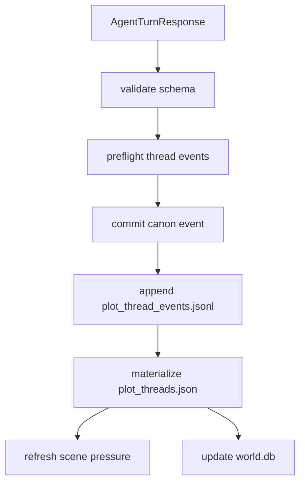

# Plot Thread Blueprint

Status: design draft

## Problem

The simulator records canon events and player knowledge, but it does not yet
have a durable model for open narrative problems.

Without a plot-thread layer, the engine can remember events but still lose the
shape of unresolved questions:

- What problem is currently open?
- Which thread is dormant but still relevant?
- Which clue belongs to which unresolved situation?
- Which relationship, lore entry, or pressure can resolve or complicate it?
- When should a thread close, fail, split, or become hidden?

## Goals

1. Track open narrative loops as first-class simulation state.
2. Connect threads to lore, relationships, extras, location, pressure, and
   player knowledge.
3. Give WebGPT a compact list of relevant unresolved problems each turn.
4. Distinguish player-visible questions from hidden engine-only threads.
5. Prevent generic quest-log prose while preserving causal continuity.
6. Make thread resolution explicit and evidence-backed.

## Non-Goals

- Do not turn the simulator into a quest checklist UI.
- Do not force every scene to advance every thread.
- Do not expose hidden threads or authorial plans.
- Do not create threads from style examples, UI labels, or generic genre tropes.
- Do not repair missing tension by inventing new threats without evidence.

## Proposed Surfaces

- file source: `plot_threads.json`
- append-only event source: `plot_thread_events.jsonl`
- DB projection: `plot_threads`, `plot_thread_events`
- revival projection: `memory_revival.active_plot_threads`
- player projection: Archive View "Open Threads"
- prompt section: `plot_thread_contract`

## Thread Model

```json
{
  "schema_version": "singulari.plot_thread.v1",
  "world_id": "stw_...",
  "thread_id": "thread:enter_town_before_gate_close",
  "title": "마을 문이 닫히기 전에 들어갈 수 있는가",
  "visibility": "player_visible",
  "status": "active",
  "thread_kind": "access",
  "urgency": "immediate",
  "summary": "해가 지고 문지기가 이름과 온 길을 요구한다.",
  "current_question": "신분을 밝히거나 우회하지 않으면 입장이 지연된다.",
  "stakes": [
    "outside after dark",
    "guard suspicion",
    "missing shelter"
  ],
  "related_lore_ids": ["lore:settlement:west_gate"],
  "related_relationship_edges": ["rel:char:gate_guard->char:protagonist"],
  "related_pressure_ids": ["pressure:turn_0001:gate_permission"],
  "related_entity_ids": ["char:gate_guard", "place:west_gate"],
  "resolution_conditions": [
    "identity_accepted",
    "social_cover_found",
    "alternate_entry_route_taken",
    "player_leaves_gate_area"
  ],
  "failure_conditions": [
    "gate_locked_before_entry",
    "guard_suspicion_reaches_alarm"
  ],
  "next_scene_hooks": [
    "guard asks one concrete question",
    "someone behind the protagonist reacts to the delay"
  ],
  "evidence_refs": [
    {
      "source": "canon_events.evt_000001",
      "field": "visible_summary"
    }
  ],
  "created_turn_id": "turn_0001",
  "last_changed_turn_id": "turn_0001"
}
```

## Thread Kinds

Use a closed enum.

| Kind | Meaning |
| --- | --- |
| `access` | entry, permission, route, locked place |
| `survival` | body, shelter, food, injury, exposure |
| `mystery` | unknown identity, clue, contradiction, missing fact |
| `relationship` | trust, debt, conflict, promise, betrayal |
| `resource` | money, tool, document, trade, scarcity |
| `threat` | pursuit, alarm, enemy, trap, disease, curse |
| `desire` | goal, longing, temptation, attachment |
| `moral_cost` | oath, sacrifice, collateral harm, guilt |
| `world_question` | visible gap about world rules or customs |

Thread kind is not genre. It is the kind of unresolved pressure the player can
act on.

## Status

| Status | Meaning |
| --- | --- |
| `active` | should be considered for the next turn |
| `dormant` | unresolved but not relevant unless touched |
| `blocked` | cannot advance until another condition changes |
| `resolved` | closed by canon event |
| `failed` | closed by missed condition or consequence |
| `split` | replaced by child threads |
| `merged` | absorbed into another thread |
| `hidden` | engine-only thread, not player-visible |
| `retired` | invalidated or superseded |

Hidden threads may guide adjudication, but player-facing projections must show
only counts or visible consequences.

## Thread Event

```json
{
  "schema_version": "singulari.plot_thread_event.v1",
  "world_id": "stw_...",
  "event_id": "thread_event_000004",
  "turn_id": "turn_0002",
  "thread_id": "thread:enter_town_before_gate_close",
  "change": "advanced",
  "summary": "The guard accepted a name but still asked for origin.",
  "status_after": "active",
  "urgency_after": "immediate",
  "related_pressure_delta": [
    {
      "pressure_kind": "social_permission",
      "change": "softened"
    }
  ],
  "evidence_refs": [
    {
      "source": "visible_scene.text_blocks[3]",
      "quote": "이름은 됐다. 온 길은?"
    }
  ],
  "created_at": "RFC3339"
}
```

Allowed changes:

- `opened`
- `advanced`
- `complicated`
- `softened`
- `blocked`
- `resolved`
- `failed`
- `split`
- `merged`
- `retired`

Events never rewrite earlier events.

## Opening Rules

A new thread can open only from structured evidence:

- seed premise
- committed canon event
- validated world lore update
- relationship event
- scene pressure event
- player-visible knowledge update
- hidden timer/secret, for hidden threads only

Do not open a thread because a genre usually has one.

## Revival Selection

Each pending turn receives:

| Bucket | Budget |
| --- | ---: |
| active visible threads | 3 |
| dormant visible threads touched by player input | 2 |
| hidden adjudication threads | 2 |

Ranking:

1. directly mentioned or acted on by player input
2. current location/entity match
3. immediate urgency
4. unresolved resolution/failure condition near trigger
5. connected to active scene pressure
6. connected to relationship edge with high intensity
7. recent turn activity

Do not include solved threads unless the player is asking about records or
Archive View.

## Choice and Scene Use

Threads do not generate choices directly. They provide context for pressure and
choice compilation.

A choice should usually touch at least one active thread by:

- advancing it
- investigating it
- avoiding it
- complicating it for a tradeoff
- closing it with cost

If no active thread is relevant, the turn can be exploratory. In that case the
scene should create pressure from location, body/resource state, or interaction,
not from a random plot injection.

## Validation

Before writing thread state:

1. Validate closed enum fields.
2. Validate every related id exists or is explicitly marked `external_pending`.
3. Validate visibility is no broader than its evidence.
4. Validate hidden thread summaries are not copied into player fields.
5. Validate resolution/failure conditions are concrete and testable.
6. Validate status transitions are legal.
7. Validate a thread has at least one source evidence ref.

No fallback prose parser creates or repairs threads.

## Commit Order



Thread events are preflighted before committing a turn. Materialization happens
after the canonical turn commit so event refs can point at committed ids.

## Implementation Plan

1. Add `PlotThread` and `PlotThreadEvent` structs.
2. Add closed enums for kind, status, urgency, and event change.
3. Add `plot_threads.json` materializer from append-only events.
4. Extend `AgentTurnResponse` with `plot_thread_events`.
5. Add validation and source-ref checks.
6. Add revival packet `active_plot_threads`.
7. Feed selected threads into scene pressure compilation.
8. Add world.db projection and Archive View rendering.
9. Add repair command to rebuild from event log.
10. Add tests for hidden redaction, status transitions, thread selection budget,
    and resolution/failure conditions.

## Acceptance Criteria

- Active unresolved problems survive across turns without becoming prose dumps.
- Player input can revive dormant threads by entity, location, or keyword match.
- Hidden threads never leak into VN text, Archive View, image prompts, or docs.
- Resolved/failed threads stop driving choices unless explicitly recalled.
- Scene pressure can cite thread ids as source refs.
- Rebuilding `plot_threads.json` from events produces the same active state.
