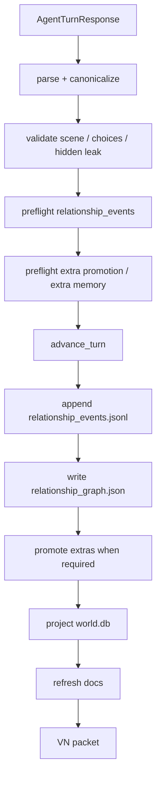

# Relationship Graph Blueprint

Status: design draft

## Problem

The current simulator records characters and relationship updates, but it does
not yet maintain a real relationship graph.

Current surfaces:

- `entities.json`: character records, voice anchors, history, string
  relationships.
- `entity_updates.jsonl`: append-only entity/relationship update projection.
- `extra_traces.jsonl`: one-off background contacts.
- `remembered_extras.json`: repeated or meaningful background people.
- `world.db.relationship_updates`: searchable relationship update log.
- `AgentRevivalPacket`: recent relationship updates and extra memory.

This is enough to remember that something happened. It is not enough to answer:

- How does one character currently feel about another?
- What changed after the last scene?
- Which relationship should affect dialogue, cooperation, refusal, suspicion,
  debt, protection, betrayal, or intimacy?
- Which extra should become a full character because relationship continuity now
  matters?
- How do relationship states affect adjudication gates and next choices?

## Goals

1. Make relationships a first-class simulation graph, not prose-only history.
2. Preserve evidence and source turns for every relationship change.
3. Let WebGPT propose relationship deltas only through structured fields.
4. Keep character voice, relationship stance, and scene dialogue connected.
5. Let relationship states affect adjudication and choice pressure.
6. Promote extras to characters only when relationship continuity needs it.
7. Keep hidden/private relationship facts out of player-visible surfaces.

## Non-Goals

- Do not infer relationships by scraping `visible_scene` prose.
- Do not turn every background contact into a full `CharacterRecord`.
- Do not use a single affection score as the whole relationship model.
- Do not make relationship state override hard world/lore constraints.
- Do not leak hidden motives into Archive View, VN text, image prompts, or
  player-visible relationship summaries.

## Proposed Surfaces

- file source: `relationship_graph.json`
- append-only event source: `relationship_events.jsonl`
- DB projection: `relationship_edges`, `relationship_events`,
  `relationship_conflicts`
- generated projection: `docs/relationships.md`
- revival projection: `memory_revival.active_relationship_graph`
- adjudication input: selected edges' `simulation_effect`

`relationship_updates.jsonl` can remain as the V1 compatibility projection. New
logic should use `relationship_events.jsonl` and `relationship_graph.json` as
the model source.

## Relationship Edge

```json
{
  "schema_version": "singulari.relationship_edge.v1",
  "world_id": "stw_...",
  "edge_id": "rel:char:protagonist->char:gate_guard",
  "source_entity_id": "char:protagonist",
  "target_entity_id": "char:gate_guard",
  "direction": "directed",
  "visibility": "player_visible",
  "authority": "canon_event",
  "confidence": "confirmed",
  "lifecycle": "active",
  "stance": "procedural_suspicion",
  "visible_summary": "문지기는 주인공을 절차상 의심 대상으로 본다.",
  "private_summary": null,
  "axes": {
    "trust": -1,
    "suspicion": 3,
    "debt": 0,
    "fear": 1,
    "affection": 0,
    "respect": 0,
    "authority": 2,
    "familiarity": 1,
    "obligation": 0,
    "hostility": 0
  },
  "simulation_effect": {
    "gates": ["social_permission", "knowledge"],
    "applies_when": ["asking_entry_permission", "withholding_identity"],
    "constraint": "guard_requires_identity_before_help",
    "severity": "soft_block"
  },
  "voice_effect": {
    "dialogue_distance": "formal_suspicious",
    "directness": "short_questions",
    "interruptions": "procedural"
  },
  "scope": {
    "location_ids": ["place:opening_location"],
    "scene_bound": false
  },
  "evidence_refs": [
    {
      "source": "visible_scene.text_blocks[4]",
      "quote": "이름, 온 길, 들고 들어갈 물건."
    }
  ],
  "first_seen_turn_id": "turn_0001",
  "last_changed_turn_id": "turn_0001",
  "source_event_ids": ["evt_000001"],
  "created_at": "RFC3339",
  "updated_at": "RFC3339"
}
```

## Axes

Use a compact signed range, default `0`, suggested range `-5..5`.

| Axis | Meaning |
| --- | --- |
| `trust` | belief that the target will act reliably or honestly |
| `suspicion` | active doubt, watchfulness, procedural distrust |
| `debt` | owed favor, rescue, payment, promise |
| `fear` | threat response or intimidation |
| `affection` | warmth, fondness, romantic or familial pull |
| `respect` | admiration, rank recognition, competence recognition |
| `authority` | source's perceived right to command or deny target |
| `familiarity` | shared history and comfort |
| `obligation` | duty, oath, social role, contract |
| `hostility` | desire to harm, block, expose, or punish |

Axis values are not player-facing numbers by default. Archive View should render
them as labels such as `wary`, `indebted`, `protective`, or `hostile`.

## Stance

`stance` is a short enum-like label derived from axes and latest event. It is
what the prose layer should usually consume.

Examples:

- `procedural_suspicion`
- `guarded_curiosity`
- `temporary_alliance`
- `quiet_obligation`
- `open_hostility`
- `protective_distance`
- `uneasy_debt`
- `mutual_recognition`
- `romantic_tension`
- `familial_care`

Do not let WebGPT create arbitrary stance labels without validation. Unknown
stances should be rejected or normalized to a known label.

## Visibility

| Visibility | Meaning |
| --- | --- |
| `player_visible` | The player can fairly know this relationship state |
| `inferred_visible` | Fair inference from visible behavior |
| `private` | True for hidden motive/adjudication only |
| `hidden` | Must never appear in player-visible surfaces |
| `retired` | No longer active |

Player-visible fields:

- `stance`
- `visible_summary`
- visible-safe `axes` labels
- `evidence_refs` pointing to visible sources

Private/hidden fields must not appear in VN text, Archive View, Codex View,
image prompts, or docs except as counts.

## Authority and Confidence

Relationship state has authority separate from confidence.

Authority order:

`seed > canon_event > repeated_interaction > structured_agent_update >
npc_claim > player_inference > system_projection`

Confidence:

- `confirmed`
- `inferred`
- `rumored`
- `disputed`
- `rejected`

If a lower-authority update conflicts with higher-authority state, it creates a
`relationship_conflict` record instead of overwriting the edge.

## Relationship Event

Append-only event:

```json
{
  "schema_version": "singulari.relationship_event.v1",
  "world_id": "stw_...",
  "event_id": "rel_event_...",
  "turn_id": "turn_0001",
  "source_event_id": "evt_000001",
  "source_entity_id": "char:protagonist",
  "target_entity_id": "char:gate_guard",
  "delta": {
    "suspicion": 1,
    "authority": 1,
    "familiarity": 1
  },
  "stance_after": "procedural_suspicion",
  "visible_summary": "문지기는 주인공을 절차상 의심 대상으로 본다.",
  "evidence_refs": [
    {
      "source": "visible_scene.text_blocks[4]",
      "quote": "이름, 온 길, 들고 들어갈 물건."
    }
  ],
  "created_at": "RFC3339"
}
```

Rules:

- Events never delete history.
- Edge state is materialized from events.
- Repair can rebuild `relationship_graph.json` from `relationship_events.jsonl`.
- No fallback prose scraper creates events.

## Agent Response Contract

Extend `AgentTurnResponse` with `relationship_events` or replace the existing
loose `relationship_updates` with a stricter shape.

```json
{
  "relationship_events": [
    {
      "source_entity_ref": "char:gate_guard",
      "target_entity_ref": "char:protagonist",
      "delta": {
        "suspicion": 1,
        "authority": 1,
        "familiarity": 1
      },
      "stance_after": "procedural_suspicion",
      "visible_summary": "문지기는 주인공을 절차상 의심 대상으로 본다.",
      "simulation_effect": {
        "gates": ["social_permission"],
        "applies_when": ["asking_entry_permission"],
        "constraint": "guard_requires_identity_before_help",
        "severity": "soft_block"
      },
      "voice_effect": {
        "dialogue_distance": "formal_suspicious",
        "directness": "short_questions"
      },
      "evidence_refs": [
        {
          "source": "visible_scene.text_blocks[4]",
          "quote": "이름, 온 길, 들고 들어갈 물건."
        }
      ]
    }
  ]
}
```

Conditional requirement:

- If the turn includes direct dialogue, aid, refusal, threat, injury, debt,
  rescue, betrayal, intimacy, command, bargain, or repeated recognition between
  two entities, `relationship_events` must include the relationship delta.
- If the interaction is a one-off background contact, use `extra_contacts`.
- If a background contact gains repeated recognition, named obligation, or
  relationship continuity, promote it toward a `CharacterRecord`.

## Extra Promotion

Relationship continuity determines whether an extra stays light or becomes a
character.

Promotion tiers:

1. `ExtraTrace`: one contact, no durable relation.
2. `RememberedExtra`: repeated or meaningful contact, still lightweight.
3. `CharacterRecord`: relationship continuity affects future dialogue,
   adjudication, or plot.

Promotion triggers:

- repeated direct interaction
- named relationship to protagonist or party member
- debt, promise, threat, injury, rescue, trade, protection, betrayal
- relationship axis magnitude crosses threshold, e.g. `abs(debt) >= 2`,
  `suspicion >= 3`, `trust >= 3`, `hostility >= 3`
- the character appears in active choices or scene focus

Promotion output:

- create or update `CharacterRecord`
- move remembered voice/contact notes into `voice_anchor`
- create relationship edge from existing traces/events
- leave provenance pointing back to `extra_traces`

## Validation

Preflight before turn mutation:

1. Entity refs resolve to known entity IDs, remembered extras, or promotable
   extras.
2. Delta keys are allowed axes and values are within range.
3. `stance_after` is allowed or normalizable.
4. `evidence_refs` point to allowed visible fields and quotes match normalized
   field text.
5. Player-visible relationship events contain no hidden secret text.
6. Simulation gates are known adjudication gates.
7. Voice effect values are known labels.
8. Lower-authority updates cannot overwrite higher-authority relationship
   state.
9. Promotion is explicit when an unknown extra becomes a graph node.
10. No partial writes: graph/event writes happen only after core turn preflight
    passes.

## Storage

### `relationship_graph.json`

```json
{
  "schema_version": "singulari.relationship_graph.v1",
  "world_id": "stw_...",
  "edges": []
}
```

### `relationship_events.jsonl`

Append-only events, repair source.

### `world.db`

```sql
CREATE TABLE relationship_edges (
  world_id TEXT NOT NULL,
  edge_id TEXT NOT NULL,
  source_entity_id TEXT NOT NULL,
  target_entity_id TEXT NOT NULL,
  direction TEXT NOT NULL,
  visibility TEXT NOT NULL,
  authority TEXT NOT NULL,
  confidence TEXT NOT NULL,
  lifecycle TEXT NOT NULL,
  stance TEXT NOT NULL,
  visible_summary TEXT NOT NULL,
  private_summary TEXT,
  axes_json TEXT NOT NULL,
  simulation_effect_json TEXT NOT NULL,
  voice_effect_json TEXT NOT NULL,
  scope_json TEXT NOT NULL,
  evidence_refs_json TEXT NOT NULL,
  first_seen_turn_id TEXT NOT NULL,
  last_changed_turn_id TEXT NOT NULL,
  source_event_ids_json TEXT NOT NULL,
  raw_json TEXT NOT NULL,
  updated_at TEXT NOT NULL,
  PRIMARY KEY(world_id, edge_id)
);

CREATE TABLE relationship_events (
  world_id TEXT NOT NULL,
  event_id TEXT NOT NULL,
  edge_id TEXT NOT NULL,
  turn_id TEXT NOT NULL,
  source_event_id TEXT NOT NULL,
  delta_json TEXT NOT NULL,
  stance_after TEXT NOT NULL,
  visible_summary TEXT NOT NULL,
  evidence_refs_json TEXT NOT NULL,
  raw_json TEXT NOT NULL,
  created_at TEXT NOT NULL,
  PRIMARY KEY(world_id, event_id)
);
```

Index both into `world_search_fts` as:

- `relationship_edges`
- `relationship_events`

## Revival Packet

Add:

```json
{
  "memory_revival": {
    "active_relationship_graph": {
      "schema_version": "singulari.active_relationship_graph.v1",
      "selection_policy": "current entities + query + recent changes + active choices",
      "edges": [],
      "recent_events": [],
      "simulation_effects": [],
      "voice_effects": [],
      "hidden_relationship_summary": {
        "count": 0,
        "policy": "count only; never expose hidden relationship contents"
      }
    }
  }
}
```

Selection:

- edges involving protagonist
- edges involving current scene entities
- edges involving active choice targets
- query-recalled edges/events
- recent changed edges
- hidden count only

## Dialogue and Prose Use

Relationship graph should affect prose through stance and voice effect, not raw
numbers.

Prompt rule:

```text
Use active_relationship_graph for dialogue distance, interruption, trust,
refusal, cooperation, and social risk. Do not reveal hidden relationship
contents. Do not mention numeric axes. If a relationship affects this turn,
show it through timing, word choice, silence, posture, help/refusal, or cost.
```

Examples:

- `procedural_suspicion`: short questions, demand evidence, watch hands.
- `quiet_obligation`: help is offered without warmth, cost is remembered.
- `protective_distance`: steps closer in danger, avoids possessive explanation.
- `open_hostility`: blocks movement, sharp address, no private exposition.

## Adjudication Use

Selected relationship edges can modify gates:

- `social_permission`: trust, authority, obligation, suspicion
- `knowledge`: familiarity, trust, deception risk
- `resource`: debt, obligation, trade relation
- `time`: whether someone delays or expedites the protagonist
- `risk_detection`: suspicion, hostility, fear
- `moral_cost`: debt, affection, obligation, betrayal

This should not be a numeric RPG formula. It is a structured pressure lane.

## Archive View

Add `relationships` section:

- visible graph summary
- grouped by source entity
- show stance labels, visible summary, last changed turn
- no numeric axes unless debug mode
- no hidden/private summary

## Docs Projection

Add `docs/relationships.md`:

- Current visible relationship graph
- Recent relationship changes
- Promoted extras and why they were promoted
- Hidden relationship counts only

`docs/entities.md` may link to relationship summaries, but it should not become
the graph source of truth.

## Commit Order



The graph must not write if core turn validation fails.

## Implementation Plan

1. Add relationship graph model types in `models.rs`.
2. Add `relationship_graph.rs` for load, validate, append, materialize, repair.
3. Extend `AgentTurnResponse` with `relationship_events`.
4. Add strict validation and entity/extra resolution.
5. Add `relationship_graph.json` and `relationship_events.jsonl` creation at
   world init.
6. Add DB tables and FTS projection.
7. Add `active_relationship_graph` to revival packet.
8. Connect selected `simulation_effects` to pending/adjudication context.
9. Add Archive View `relationships` section.
10. Add `docs/relationships.md`.
11. Add extra promotion path from relationship thresholds.
12. Add tests for direct relationship delta, hidden leak, unknown entity,
    extra promotion, DB projection, revival inclusion, and docs filtering.

## Acceptance Criteria

- Direct dialogue can create a relationship event with evidence refs.
- Repeated extra contact can promote to remembered extra or CharacterRecord.
- Relationship graph materializes current edge state from append-only events.
- Relationship state appears in `active_relationship_graph`.
- Relationship simulation effects can influence social/knowledge/risk gates.
- Dialogue prompt receives stance/voice effect, not raw numeric axes.
- Hidden relationship contents never appear in player-visible surfaces.
- Archive View shows visible relationship graph without debug numbers.
- `docs/relationships.md` regenerates from the graph.
- Repair can rebuild graph from `relationship_events.jsonl`.

