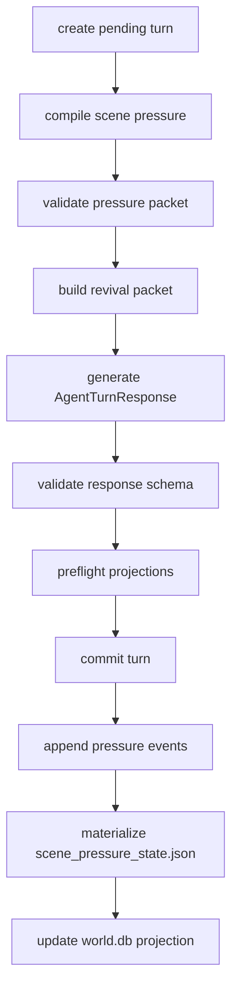

# Scene Pressure Blueprint

Status: design draft

## Problem

The simulator has world facts, entity records, relationship updates, hidden
timers, remembered extras, and player knowledge. Those surfaces explain what
exists, but they do not yet answer the most important turn-level question:

What is pressing the next scene forward right now?

Without a first-class pressure layer, WebGPT must infer urgency from scattered
context. That creates weak choices, over-exposition, repeated setup, and scenes
that feel like logs instead of simulation.

## Goals

1. Compile each pending turn into a small set of active pressures.
2. Connect world lore, relationships, extras, body/resource state, hidden timers,
   and open threads into one turn-driving packet.
3. Make choices emerge from pressure, not from generic menu templates.
4. Make paragraph rhythm react to pressure without letting style rules create
   new facts.
5. Keep hidden/private pressure adjudication-only unless the player can fairly
   observe it.
6. Persist pressure events so future turns can explain why a situation escalated,
   cooled, or transformed.

## Non-Goals

- Do not create a global drama meter.
- Do not let pressure override hard facts, lore constraints, or relationship
  authority.
- Do not infer pressure by scraping prose after the fact.
- Do not use pressure as a hidden guide toward an optimal route.
- Do not dump every possible pressure into each prompt.

## Proposed Surfaces

- file source: `scene_pressure_state.json`
- append-only event source: `scene_pressure_events.jsonl`
- DB projection: `scene_pressure_events`, `active_scene_pressures`
- revival projection: `memory_revival.active_scene_pressure`
- prompt section: `scene_pressure_contract`
- generated player projection: Archive View "Current Pressures"

The pressure state is a compiled projection. Its source of truth remains the
underlying evidence: lore entries, relationship edges, body/resource state,
hidden timers, open threads, player input, and recent canon events.

## Pressure Model

```json
{
  "schema_version": "singulari.scene_pressure.v1",
  "world_id": "stw_...",
  "turn_id": "turn_0004",
  "pressure_id": "pressure:turn_0004:gate_closing_suspicion",
  "kind": "social_permission",
  "visibility": "player_visible",
  "intensity": 3,
  "urgency": "immediate",
  "source_refs": [
    "lore:settlement:west_gate",
    "rel:char:gate_guard->char:protagonist",
    "thread:enter_town_before_gate_close"
  ],
  "observable_signals": [
    "the gate is being barred",
    "the guard asks for name and origin",
    "people behind the player are waiting"
  ],
  "adjudication_effect": {
    "gates": ["social_permission", "time_pressure"],
    "applies_when": ["entering_settlement", "refusing_identity"],
    "constraint": "delay_or_evasion_raises_suspicion",
    "severity": "soft_block"
  },
  "choice_effect": {
    "must_offer": ["comply", "observe", "negotiate"],
    "may_offer": ["deceive", "retreat"],
    "avoid": ["generic_wait"]
  },
  "prose_effect": {
    "paragraph_pressure": "tight",
    "sensory_focus": ["hands", "weather", "closing mechanism"],
    "dialogue_style": "short_procedural_questions"
  },
  "decay": {
    "mode": "turns",
    "remaining": 2,
    "cooldown_condition": "identity_accepted_or_player_leaves_gate"
  },
  "evidence_refs": [
    {
      "source": "world_lore:lore:settlement:west_gate",
      "field": "simulation_effect"
    }
  ]
}
```

## Pressure Kinds

Use a closed enum for V1.

| Kind | Meaning | Typical Source |
| --- | --- | --- |
| `body` | pain, fatigue, hunger, blood, exposure, disease | protagonist state |
| `resource` | money, food, tools, documents, trade goods | inventory/resource ledger |
| `time_pressure` | closing gates, patrol cycles, weather windows | lore, hidden timers |
| `social_permission` | entry, rank, trust, witnesses, taboo | lore, relationship graph |
| `threat` | pursuit, attack, trap, alarm, predator | hidden state, canon event |
| `knowledge` | uncertainty, clue, false assumption, missing fact | open threads, player knowledge |
| `environment` | darkness, rain, terrain, crowd, fire, noise | location graph, lore |
| `desire` | want, longing, attachment, temptation | character design, relationships |
| `moral_cost` | debt, oath, betrayal, sacrifice, collateral harm | lore, relationship graph |

The same source may create multiple pressures. A locked gate can be both
`time_pressure` and `social_permission`; an injured witness can be both `body`
and `moral_cost`.

## Intensity and Urgency

Intensity is a compact `0..5` value. It is not player-facing by default.

| Value | Meaning |
| ---: | --- |
| 0 | inactive |
| 1 | background texture |
| 2 | relevant constraint |
| 3 | active scene driver |
| 4 | dominant scene driver |
| 5 | immediate crisis |

Urgency:

- `ambient`: present, but not forcing action
- `soon`: should matter within several turns
- `immediate`: should affect this turn's choices
- `crisis`: must shape this turn's narration and adjudication

## Compiler Inputs

The compiler runs when a pending text turn is created or refreshed.

Inputs:

- current player input
- latest committed turn and current location
- selected `world_lore.simulation_effect`
- selected `relationship_graph.simulation_effect`
- active `plot_threads`
- protagonist body/resource state
- recent extra contacts and remembered extras
- visible player knowledge
- hidden timers and secrets, adjudication-only
- unresolved visual/reference asset state only when it affects scene visibility

The compiler must keep evidence refs for every pressure. If no source can be
identified, the pressure is rejected.

## Selection Budget

Each turn should receive a small pressure set.

| Bucket | Budget |
| --- | ---: |
| visible active pressures | 3 |
| hidden adjudication-only pressures | 2 |
| dormant near-future pressures | 2 |

Ranking:

1. player input directly touches it
2. current location or entity involvement
3. high urgency
4. unresolved thread dependency
5. relationship or extra continuity
6. recent canon event
7. hidden timer deadline

Do not pad the packet. Empty pressure slots are valid.

## Choice Contract

`next_choices` should be compiled from active pressure, not from a fixed menu.

Each visible choice should answer one of these:

- relieve a pressure
- investigate a pressure
- exploit a pressure
- avoid a pressure
- worsen one pressure to reduce another

Slot policy remains separate:

- slots `1..5`: presented choices
- slot `6`: inline freeform affordance
- slot `7`: delegated judgment when enabled

The pressure layer must not hardcode labels. It only provides the pressures,
constraints, and choice affordance hints.

## Prose Contract

Pressure controls rhythm, not content invention.

- `body` pressure should alter physical noticing and sentence friction.
- `time_pressure` should shorten decision space and reduce idle exposition.
- `social_permission` should affect gaze, witnesses, address, and hesitation.
- `threat` should affect occlusion, sound, and interruption.
- `knowledge` should preserve uncertainty rather than explaining hidden facts.
- `moral_cost` should make consequence visible without sermonizing.

The prose layer may use only player-visible pressure signals. Hidden pressures
may affect adjudication and omission, but not explicit narration.

## Event Log

Append-only pressure events explain how pressure changed.

```json
{
  "schema_version": "singulari.scene_pressure_event.v1",
  "world_id": "stw_...",
  "turn_id": "turn_0004",
  "event_id": "pressure_event_000012",
  "pressure_id": "pressure:gate_closing_suspicion",
  "change": "intensified",
  "from_intensity": 2,
  "to_intensity": 3,
  "reason": "player delayed while guard requested identity",
  "source_refs": ["rel_event_000007", "thread_event_000003"],
  "visibility": "player_visible",
  "created_at": "RFC3339"
}
```

Allowed changes:

- `created`
- `intensified`
- `softened`
- `transformed`
- `resolved`
- `expired`
- `suppressed_by_higher_authority`

## Validation

Before writing pressure state:

1. Validate closed enums.
2. Validate source refs exist.
3. Validate visibility does not exceed source visibility.
4. Validate hidden pressures have no player-facing observable signals.
5. Validate intensity `0..5`.
6. Validate `choice_effect` does not require unavailable slots.
7. Validate `prose_effect` contains style constraints only, not new facts.
8. Validate every pressure has at least one adjudication or choice effect.

Validation failure aborts the pressure projection. It does not fabricate a
fallback pressure.

## Commit Order



Pressure compilation happens before prompt construction. Pressure events from
the response are preflighted before the turn commit, then written after the
turn has a committed event id.

## Implementation Plan

1. Add `ScenePressure`, `ScenePressureEvent`, and enum types.
2. Add `compile_scene_pressure_for_pending_turn`.
3. Add validation with source-ref and visibility checks.
4. Add revival packet section `active_scene_pressure`.
5. Extend prompt contract with pressure usage rules.
6. Add optional `pressure_events` field to `AgentTurnResponse`.
7. Add projection writer for `scene_pressure_events.jsonl` and
   `scene_pressure_state.json`.
8. Add world.db tables and search indexing.
9. Render player-visible pressures in Archive View and console UI.
10. Add repair path that rebuilds state from events and source refs.

## Acceptance Criteria

- A pending turn receives at most the configured pressure budget.
- Every active pressure has evidence refs and closed enum values.
- Choices clearly respond to active pressures without fixed generic labels.
- Hidden pressure affects adjudication but never leaks into player-facing text.
- Pressure events can rebuild current pressure state.
- If pressure projection fails validation, the turn loop fails loud before
  committing partial state.
