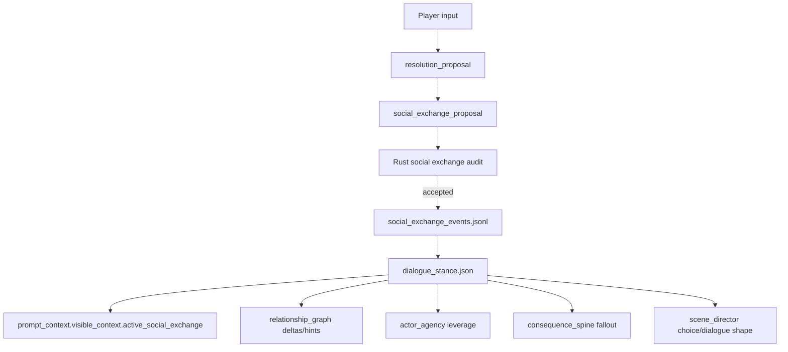

# Social Exchange / Dialogue Stance Blueprint

Status: implemented V1

Last updated: 2026-04-30

Implementation note: V1 materializes `src/social_exchange.rs`, optional
`AgentTurnResponse.social_exchange_proposal`, conservative derivation from
relationship/resolution/consequence signals, prompt context injection through
`active_social_exchange`, and world docs/DB/VN runtime debug projection.

This document defines the next social simulation layer after Relationship Graph,
Actor Agency, Scene Director, and Consequence Spine.

Resolution answers:

```text
What did the player try, and what happened?
```

Relationship Graph answers:

```text
What is the durable relationship state between entities?
```

Actor Agency answers:

```text
What local goal or move is an actor currently pursuing?
```

Consequence Spine answers:

```text
What durable fallout should return as future pressure?
```

Social Exchange answers:

```text
What did this conversation just exchange, withhold, promise, damage, or leave unresolved?
```

It is not a full dialogue manager and not a scripted conversation tree. It is a
small, evidence-backed contract for NPC stance, social commitments, unresolved
asks, and conversation leverage so dialogue does not reset every turn.

## Problem

The current runtime can make NPC behavior grounded:

- `relationship_graph` stores durable edges and relationship deltas
- `actor_agency` stores local actor goals and visible moves
- `consequence_spine` carries prior choices forward as pressure
- `resolution_proposal` audits gates, outcomes, and typed effects
- `scene_director` tracks dramatic function and repetition

This solves a lot of world drift, but long dialogue still has a specific risk:

- an NPC can sound plausible every turn, but forget the exact conversational
  posture from the previous exchange
- the player can ask a question and receive an evasive answer, but the evasion
  is not tracked as an unresolved social fact
- promises, conditions, refusals, debts, insults, and face-loss can be described
  in prose without becoming a reusable dialogue constraint
- the same question can be asked repeatedly because no layer records "already
  dodged" or "answered under condition"
- relationship state can be too broad for immediate dialogue behavior

The missing layer is a turn-to-turn social exchange ledger.

## Core Principle

The LLM writes socially nuanced dialogue.

Rust records the exchange contract:

```text
LLM proposes what was socially exchanged.
Rust audits evidence, visibility, commitments, unresolved asks, and stance.
```

The goal is not to make Rust intelligent. The goal is to give the LLM a compact
social memory that is too concrete to ignore:

- the guard is not just "suspicious"; he is currently testing identity
- the witness did not answer; she dodged the question about the sealed mark
- the merchant agreed only if paid before sunset
- the player lost face in front of the crowd
- an NPC now owes a small favor, but not trust

## Authority Split

| Surface | LLM owns | Rust owns |
| --- | --- | --- |
| Dialogue prose | Korean speech, silence, rhythm, subtext | No hidden leak, no impossible commitments |
| Stance | Why the stance feels natural in the scene | Stance enum, evidence, lifecycle |
| Exchange act | Social nuance of ask/refusal/offer/threat | Typed act record and source refs |
| Commitment | Natural wording of promise or condition | Due condition, visibility, payoff/violation state |
| Unresolved ask | How an NPC dodges or reframes | Durable unresolved question and repetition guard |
| Face/leverage | Scene-specific embarrassment, pressure, debt | Compact tracked leverage refs |
| Integration | How it shapes next dialogue | Prompt packet, relationship/actor/consequence hooks |

## Non-Goals

- Do not build a branching dialogue tree.
- Do not replace `relationship_graph`; stance is current conversational posture,
  not the whole relationship.
- Do not replace `actor_agency`; exchange records can create actor leverage but
  do not decide full NPC plans.
- Do not turn every line of dialogue into durable state.
- Do not infer hidden motives as visible stance.
- Do not store raw dialogue transcripts as the source of truth.
- Do not add affection/approval meters as the primary social model.

## Target Pipeline



V1 can start with an optional LLM proposal and a conservative derived fallback
from `relationship_updates`, `actor_move_events`, `resolution_proposal`, and
`consequence_proposal`.

## Proposed Surfaces

Append-only event source:

```text
social_exchange_events.jsonl
```

Materialized prompt/debug state:

```text
dialogue_stance.json
```

Prompt section:

```text
prompt_context.visible_context.active_social_exchange
```

World docs / DB projection:

```text
kind = social_exchange
title = 대화 태도와 교환
```

VN safe status row:

```text
대화: 조건이 걸린 대화
```

## Social Exchange Packet

```rust
struct SocialExchangePacket {
    schema_version: String,
    world_id: String,
    turn_id: String,
    active_stances: Vec<DialogueStance>,
    active_commitments: Vec<SocialCommitment>,
    unresolved_asks: Vec<UnresolvedSocialAsk>,
    recent_exchanges: Vec<SocialExchangeMemory>,
    leverage: Vec<ConversationLeverage>,
    compiler_policy: SocialExchangePolicy,
}
```

The packet is intentionally compact. It should fit into every WebGPT prompt
without becoming a transcript dump.

## Dialogue Stance

```rust
struct DialogueStance {
    stance_id: String,
    actor_ref: String,
    target_ref: String,
    stance: DialogueStanceKind,
    intensity: SocialIntensity,
    summary: String,
    player_visible_signal: String,
    source_refs: Vec<String>,
    relationship_refs: Vec<String>,
    consequence_refs: Vec<String>,
    opened_turn_id: String,
    last_changed_turn_id: String,
}
```

`actor_ref` is the speaking/social actor. `target_ref` can be `player`, another
character, a group, or a faction.

### Stance Kind

Use a small enum for V1.

```rust
enum DialogueStanceKind {
    NeutralProcedure,
    WaryTesting,
    Cooperative,
    GuardedHelpful,
    Offended,
    Evasive,
    Threatening,
    Bargaining,
    Indebted,
    Pressuring,
    Appeasing,
    Withholding,
}
```

Meanings:

- `neutral_procedure`: formal or procedural interaction without personal heat
- `wary_testing`: actor probes identity, truthfulness, eligibility, or intent
- `cooperative`: actor actively helps within known constraints
- `guarded_helpful`: actor helps but limits risk or information
- `offended`: actor responds from insult, face-loss, or boundary violation
- `evasive`: actor avoids a direct answer or redirects the question
- `threatening`: actor uses explicit pressure or implied harm
- `bargaining`: actor frames help/info as exchange
- `indebted`: actor acknowledges obligation or favor
- `pressuring`: actor pushes player toward a choice
- `appeasing`: actor lowers conflict to avoid escalation
- `withholding`: actor has something relevant but refuses to give it now

## Social Intensity

```rust
enum SocialIntensity {
    Trace,
    Low,
    Medium,
    High,
    Crisis,
}
```

Intensity decides prompt priority and whether the stance should feed pressure:

| Intensity | Meaning |
| --- | --- |
| `trace` | searchable context only |
| `low` | may color dialogue if relevant |
| `medium` | should shape next dialogue turn |
| `high` | must constrain response and choices |
| `crisis` | must shape immediate adjudication |

## Exchange Acts

An exchange act records what happened socially, not every sentence spoken.

```rust
enum SocialExchangeActKind {
    Ask,
    Answer,
    Evade,
    Refuse,
    Offer,
    Accept,
    CounterOffer,
    Threaten,
    Apologize,
    Insult,
    Promise,
    Demand,
    RevealConditionally,
    Withhold,
    Test,
    GrantPermission,
    RevokePermission,
}
```

Event record:

```rust
struct SocialExchangeEventRecord {
    schema_version: String,
    world_id: String,
    turn_id: String,
    event_id: String,
    actor_ref: String,
    target_ref: String,
    act_kind: SocialExchangeActKind,
    stance_after: DialogueStanceKind,
    intensity_after: SocialIntensity,
    summary: String,
    player_visible_signal: String,
    source_refs: Vec<String>,
    relationship_refs: Vec<String>,
    consequence_refs: Vec<String>,
    commitment_refs: Vec<String>,
    unresolved_ask_refs: Vec<String>,
    recorded_at: String,
}
```

The event should answer:

```text
What changed socially because of this exchange?
```

not:

```text
What did every character say?
```

## Commitments

Social commitments are conditions created by dialogue.

```rust
struct SocialCommitment {
    commitment_id: String,
    actor_ref: String,
    target_ref: String,
    kind: SocialCommitmentKind,
    status: SocialCommitmentStatus,
    summary: String,
    condition: String,
    due_window: SocialDueWindow,
    source_refs: Vec<String>,
    consequence_refs: Vec<String>,
}

enum SocialCommitmentKind {
    Promise,
    Debt,
    Demand,
    ConditionalPermission,
    Truce,
    Threat,
    Price,
}

enum SocialCommitmentStatus {
    Active,
    Fulfilled,
    Violated,
    Waived,
    Expired,
    Superseded,
}
```

Examples:

- "문지기는 이름과 출처를 말하면 들여보내겠다고 했다."
- "상인은 해질녘 전까지 값을 치르라는 조건을 걸었다."
- "증인은 공개된 자리에서는 말하지 않겠다고 선을 그었다."

## Unresolved Social Ask

Unresolved asks prevent repeated dialogue loops.

```rust
struct UnresolvedSocialAsk {
    ask_id: String,
    asked_by_ref: String,
    asked_to_ref: String,
    question_summary: String,
    current_status: AskStatus,
    last_response: String,
    allowed_next_moves: Vec<String>,
    blocked_repetitions: Vec<String>,
    source_refs: Vec<String>,
}

enum AskStatus {
    Open,
    Answered,
    Evaded,
    Refused,
    Conditional,
    Obsolete,
}
```

If the player asks "왜 문이 일찍 닫히죠?" and the guard replies only with "규정이다,"
the ask becomes:

```text
status = evaded
blocked_repetitions = ["same direct why-question without new leverage"]
allowed_next_moves = ["offer identity", "observe rule signs", "ask who ordered it"]
```

## Conversation Leverage

Leverage is immediate conversational handle, not durable relationship state.

```rust
struct ConversationLeverage {
    leverage_id: String,
    holder_ref: String,
    target_ref: String,
    leverage_kind: ConversationLeverageKind,
    summary: String,
    expires: SocialDueWindow,
    source_refs: Vec<String>,
}

enum ConversationLeverageKind {
    HasInformation,
    ControlsAccess,
    OwesFavor,
    CanEmbarrass,
    CanThreaten,
    NeedsHelp,
    HasWitnesses,
    HoldsResource,
}
```

This connects to choice design: a player with `has_information` should see a
different social option than a player with only `can_threaten`.

## LLM Output Shape

Add an optional field to `AgentTurnResponse` after V1 design approval:

```rust
struct AgentTurnResponse {
    // existing fields...
    social_exchange_proposal: Option<SocialExchangeProposal>,
}
```

Proposal:

```rust
struct SocialExchangeProposal {
    schema_version: String,
    world_id: String,
    turn_id: String,
    exchanges: Vec<SocialExchangeMutation>,
    commitments: Vec<SocialCommitmentMutation>,
    unresolved_asks: Vec<UnresolvedAskMutation>,
    leverage_updates: Vec<ConversationLeverageMutation>,
    paid_off_or_closed: Vec<SocialExchangeClosure>,
    ephemeral_social_notes: Vec<EphemeralSocialNote>,
}
```

The field is optional for compatibility. When supplied, it is audited before
any mutation.

## Rust Audit Contract

Audit rules:

1. `world_id` and `turn_id` must match prompt context.
2. Every actor/target ref must exist in visible prompt context, active
   relationship graph, entity update, or accepted current-turn creation.
3. Every exchange must have player-visible evidence refs.
4. Hidden/adjudication-only text cannot appear in visible stance summaries,
   signals, asks, commitments, or leverage.
5. A commitment must have a condition and a due window, or be explicitly
   `ephemeral_social_notes`.
6. A repeated unresolved ask cannot be reopened without new leverage or new
   evidence.
7. A high/crisis stance must create at least one integration hook:
   relationship delta, actor goal, consequence, scene pressure, or choice plan.
8. A stance change cannot contradict relationship graph unless it is marked as
   local/temporary and source-backed.
9. `withholding`, `evasive`, and `reveal_conditionally` cannot reveal the hidden
   answer in their visible summary.

Audit failure should be repairable through the existing WebGPT commit repair
loop.

## Derivation Without LLM Proposal

V1 can derive some social exchange records conservatively:

| Existing signal | Derived social exchange |
| --- | --- |
| `relationship_updates` with suspicion/trust/debt | stance update |
| `actor_goal_events` with visible social pressure | leverage update |
| `consequence_spine` social consequence | stance or commitment hint |
| `resolution_proposal.gate_results social_permission` | ask/refuse/test |
| `ResolutionOutcomeKind::Blocked` with social gate | refusal |
| `ResolutionOutcomeKind::CostlySuccess` with social cost | debt or offended stance |
| `next_choice_plan` grounded in social affordance | allowed next social move |

Derived records should prefer `required_followups` over invented commitments
when the source signal is ambiguous.

## Integration Points

### Relationship Graph

Social Exchange can create relationship update proposals, but only when the
exchange should outlive the conversation.

Examples:

- repeated helpfulness -> trust increase
- public insult -> hostility or respect change
- unpaid promise -> debt/obligation edge

Relationship Graph remains the durable relationship model. Social Exchange is
the current conversation state.

### Actor Agency

Stances and commitments become actor leverage:

```text
wary_testing -> actor goal: verify identity before helping
withholding -> actor goal: keep information until condition met
indebted -> actor goal: repay without exposing too much risk
```

### Consequence Spine

Some exchanges should become fallout:

```text
public insult -> social_debt / suspicion_raised
broken promise -> trust_shift / opportunity_lost
accepted bargain -> social_debt / conditional_permission
```

### Scene Director

Social Exchange can inform beat shape:

- `evade` -> `probe` or `complicate`
- `refuse` -> `cost` or `choice_pressure`
- `answer` -> `reveal`
- `promise` -> `transition` or `decompress`
- repeated unresolved ask -> avoid same-shaped dialogue loop

### Prompt Context

Inject only compact active state:

```text
active_stances
active_commitments
unresolved_asks
conversation_leverage
recent_exchanges
```

Do not inject full transcripts.

### VN UI

Safe player-facing status phrases:

- `대화가 조건에 걸려 있음`
- `상대가 아직 시험하는 중`
- `답변이 유보된 질문이 있음`
- `빚이나 약속이 대화에 남아 있음`
- `대화는 잠시 중립`

Do not show exact hidden motives or future route hints.

## Example

Player asks:

```text
왜 문이 일찍 닫히는지 묻는다.
```

Guard replies evasively:

```text
"규정이다. 이름과 온 길부터 말해."
```

Social exchange event:

```json
{
  "act_kind": "evade",
  "actor_ref": "char:gate_guard",
  "target_ref": "player",
  "stance_after": "wary_testing",
  "intensity_after": "medium",
  "summary": "문지기는 닫히는 이유를 답하지 않고 신원 확인으로 돌렸다.",
  "player_visible_signal": "질문은 밀렸고, 신원 확인이 먼저 요구된다.",
  "source_refs": ["visible_scene.text_blocks[2]"],
  "unresolved_ask_refs": ["ask:turn_0004:early_gate_close"]
}
```

Unresolved ask:

```json
{
  "question_summary": "왜 문이 평소보다 일찍 닫히는가?",
  "current_status": "evaded",
  "last_response": "규정이라는 말로 회피하고 신원 확인을 요구함",
  "allowed_next_moves": ["신원을 밝힌다", "명령권자를 묻는다", "문 주변 표식을 관찰한다"],
  "blocked_repetitions": ["같은 질문을 근거 없이 반복"]
}
```

Next turn, WebGPT should not produce five generic "ask again" options. It should
offer a new social angle or a non-dialogue probe.

## Implementation Phases

### Phase 1: Design Packet And Materialization

Add `social_exchange.rs`.

Acceptance:

- `SocialExchangePacket` exists and defaults empty
- `social_exchange_events.jsonl` appends typed records
- `dialogue_stance.json` rebuilds active stance/commitment/ask/leverage state
- world.db/docs projection lists active social exchange state

### Phase 2: Prompt And Revival Integration

Expose `active_social_exchange`.

Acceptance:

- prompt context includes compact active state
- revival includes the packet
- hidden/adjudication-only content is excluded
- empty packet is behavior-compatible

### Phase 3: Conservative Derivation

Derive social exchange hints from existing accepted outputs.

Acceptance:

- social permission blocks create refusal/test/evasion hints
- relationship deltas create stance hints
- consequence social fallout creates stance/leverage hints
- ambiguous cases create followups, not invented commitments

### Phase 4: Optional LLM Proposal

Add `AgentTurnResponse.social_exchange_proposal`.

Acceptance:

- omitted proposal remains compatible
- supplied proposal is audited before mutation
- actor refs and evidence refs must exist
- hidden motives cannot appear in visible fields

### Phase 5: Commitments And Unresolved Ask Audit

Make repeated dialogue loops visible to Rust.

Acceptance:

- an unresolved ask cannot be repeated with no new leverage
- a fulfilled/violated commitment changes state
- high/crisis stance requires downstream integration
- conditional answers record the condition

### Phase 6: Integration With Actor/Consequence/Scene

Feed exchange state back into other layers.

Acceptance:

- stance can create actor goal leverage
- broken or accepted commitments can create consequences
- unresolved asks can shape Scene Director beat recommendations
- bargaining/withholding can shape next choice affordances

### Phase 7: Browser E2E Tuning

Tune over real WebGPT play.

Metrics:

- repeated same-question rate
- unresolved ask payoff rate
- active commitment count
- stance churn per NPC
- social repair failures per turn
- player-visible confusion around why an NPC changed tone
- ratio of relationship updates to local stance updates

## What To Avoid

- Do not store full dialogue as state.
- Do not make every line a social event.
- Do not convert local politeness shifts into durable relationship changes.
- Do not infer secret motives into player-visible stance.
- Do not let stance override physical/resource/world-law gates.
- Do not produce a dialogue tree.
- Do not make "friendly/hostile" the whole social model.

## Minimal First Cut

The smallest useful implementation is:

1. `SocialExchangePacket`.
2. `social_exchange_events.jsonl` and `dialogue_stance.json`.
3. Conservative derivation from social permission gates, relationship deltas,
   actor moves, and consequence social fallout.
4. Prompt/revival/world-doc projection.
5. Optional `social_exchange_proposal` after the derived path is stable.

The first risk is not lack of expressive dialogue. WebGPT already has that. The
first risk is losing the exact social state that makes the next line of
dialogue feel earned.
