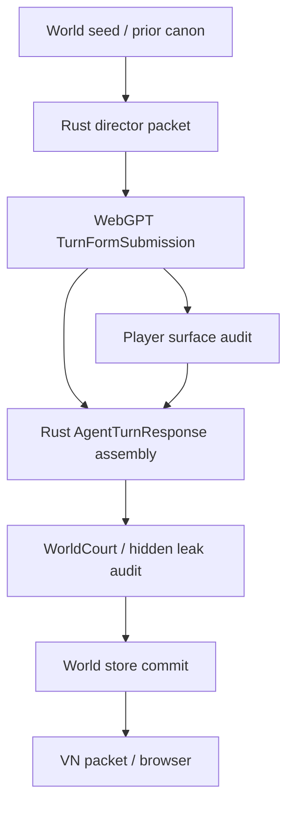

# VN Engine Player Surface Blueprint

Status: implementation contract for the WebGPT tool-form lane.

## Decision

`singulari-world` should present itself as a visual novel engine, not as a
player-visible simulator dashboard. The internal runtime may still keep world
state, hidden truth boundaries, DB projections, hooks, and audits, but the
player surface must read like a polished VN scene.

The product contract is:

```text
WebGPT writes the scene.
Rust directs, validates, canonicalizes, and commits it.
The player only sees the VN.
```

## Architecture



## Internal vs Player Surface

Internal fields may say things like:

- `outcome_kind=costly_success`
- `pressure:open_questions`
- `selected_slot=4`
- `scene_exit_progress`
- `concrete_delta`

Player-facing fields must never expose that language. They should render as
scene facts, action, dialogue, and consequences.

Examples:

| Bad player surface | Good player surface |
| --- | --- |
| `slot 4의 추가 접근은 성공하되 비용을 동반했다` | `그가 창끝을 조금 낮췄다. 지나가도 된다는 뜻은 아니었다.` |
| `압력 가늠` | `창끝이 가리키는 틈을 눈으로 따라간다.` |
| `기록 열기` | `품 안의 접힌 기록지를 꺼내 북문 표식을 맞춰 본다.` |
| `delayed 결과로 처리했다` | `대답은 오지 않았다. 대신 빗장 뒤에서 쇠가 한 번 울렸다.` |

## Turn Form Contract

`TurnFormSubmission` has two lanes:

1. Player lane
   - `narrative.text_blocks`
   - `next_choices[*].surface_text`
2. Director lane
   - `intent_summary`
   - `outcome_kind`
   - `outcome_summary`
   - `director_notes`
   - `pressure_movements`

The player lane is what the VN browser consumes. The director lane is for Rust
validation, DB projection, and repair evidence.

## Required Concrete Delta

Every committed turn must include a concrete player-visible delta. At least one
of these must be true:

- position changed
- named object appeared or changed state
- named actor appeared, spoke, blocked, yielded, or moved
- route opened, closed, or became inspectable
- visible evidence was acquired or transformed
- conflict escalated or softened in a concrete way
- the current scene moved toward an exit condition

Purely atmospheric changes do not count:

- a feeling of pressure
- a vague presence
- a texture, veil, haze, or resonance
- an unnamed sense that something might happen

## Player Surface Audit

Rust rejects a form when player-facing text contains simulator vocabulary or
debug/audit language. The MVP denylist is intentionally strict because the
current failure mode is system language leaking into the VN.

Rejected in player-visible prose and ordinary choices:

- `slot`
- `선택지`
- `판정`
- `처리했다`
- `delayed`
- `partial_success`
- `costly_success`
- `visible`
- `evidence`
- `surface`
- `audit`
- `contract`
- `메타`
- `플레이어`
- `턴`
- `압력`
- `가늠`

The runtime may keep these words in dispatch records and developer console
surfaces. They must not appear in `scene.text_blocks`, ordinary choice
surface text, or default VN status copy.

## Choice Rendering

Ordinary choices are full diegetic action sentences. The UI may keep the numeric
shortcut, but the text should be natural:

```text
1. 문지기의 창끝을 피해 북문 아래로 한 걸음 다가간다.
2. 봉인끈이 묶인 빗장 아래를 살핀다.
3. 순찰자에게 낮게 묻는다. 「여기서 누가 지나갔지?」
```

Slots 6 and 7 remain backend-owned. Slot 6 is freeform input. Slot 7 is
delegated judgment, but the browser should keep it visually separate from
ordinary scene actions.

## Scene Status

`scene.status` is a VN-facing short mood/result line. It must not be copied from
adjudication summaries when those summaries are audit/debug prose. Preferred
fallback order:

1. canonical event summary if it is player-safe,
2. first or last scene paragraph condensed by Rust,
3. a neutral line such as `장면이 다음 선택 앞에서 멈췄다`.

## Acceptance Checks

- Tool-form prompt asks for `director_notes.concrete_delta`.
- Form assembly rejects missing concrete delta.
- Form assembly rejects meta/debug vocabulary in player-facing fields.
- Ordinary choices can use `surface_text`; VN UI renders that as the primary
  label.
- VN status does not expose adjudication/debug summaries.
- Tests cover meta rejection, concrete delta rejection, and natural choice
  rendering.
