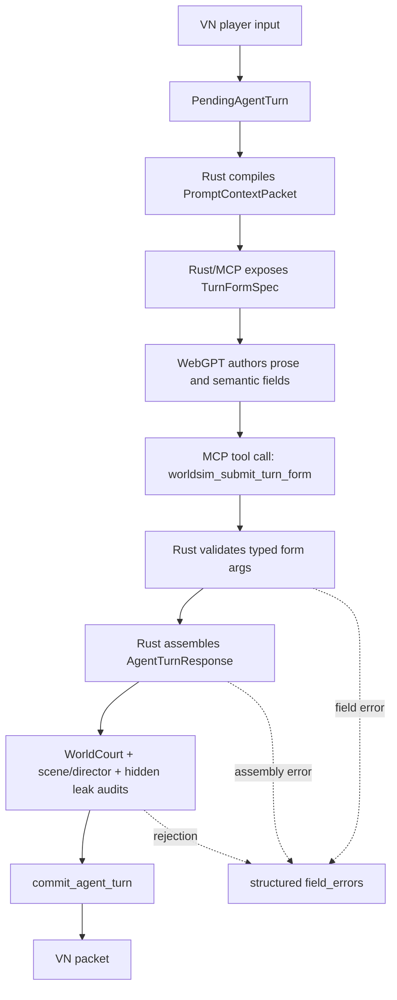

# WebGPT Tool Form Turn Blueprint

Last updated: 2026-05-01

This document defines the next migration after
`webgpt-turn-draft-assembly-blueprint.md`.

The draft assembler reduced the blast radius of asking WebGPT to emit a full
`AgentTurnResponse`, but it still depends on one brittle premise:

```text
WebGPT must print one exact JSON object into chat text.
```

That premise is wrong for live play. The text lane should use MCP tools as the
input boundary. WebGPT should fill a small turn form through a connector tool,
and Rust should assemble the canonical `AgentTurnResponse`.

The form is also the player-surface boundary. WebGPT may provide director
notes, but ordinary choice buttons and scene prose must read like diegetic VN
text. Rust now requires a concrete visible scene delta and rejects simulator
vocabulary before the turn can commit. The player-facing rules live in
[`vn-engine-player-surface-blueprint.md`](vn-engine-player-surface-blueprint.md).

## Problem

Current draft mode:

```text
PendingAgentTurn
  -> Rust prompt
  -> WebGPT chat answer containing WebgptTurnDraft JSON text
  -> strict extractor
  -> Rust draft assembler
  -> WorldCourt / commit
```

This is better than direct `AgentTurnResponse`, but no-bypass play still showed
structural failure modes:

- malformed or partial JSON can block play;
- enum spelling and field names are still model-authored;
- repair semantics must guess whether a parse/assembly/audit failure is
  retryable;
- health and operator UX become noisy because model-format failures look too
  much like durable runtime failures;
- prompt pressure grows as the model is asked to be writer, schema serializer,
  and runtime contract partner at once.

The root problem is not the exact schema. The root problem is using generated
chat text as the machine boundary.

## Target Architecture



New boundary:

```text
WebGPT writes content and semantic choices.
Rust owns schema, refs, slots, pacing, projection, and commit.
```

## Design Rule

The normal text lane must not ask WebGPT to print a JSON document.

WebGPT may only submit structured data through MCP tool arguments. The tool
schema is the form. The backend validates and assembles.

Tool-call arguments are still JSON internally, but the JSON is created by the
connector/tool runtime from typed fields. The runtime is no longer scraping a
chat answer and hoping it is one complete object.

## New Data Shapes

### `TurnFormSpec`

Rust emits this as a player-hidden, WebGPT-facing form spec.

```rust
pub struct TurnFormSpec {
    pub schema_version: String,
    pub world_id: String,
    pub turn_id: String,
    pub narrative_level: u8,
    pub narrative_budget: NarrativeBudgetSpec,
    pub input_summary: String,
    pub visible_context_summary: String,
    pub allowed_outcome_kinds: Vec<String>,
    pub allowed_ambiguity_values: Vec<String>,
    pub visible_evidence_options: Vec<FormRefOption>,
    pub pressure_options: Vec<FormRefOption>,
    pub choice_slots: Vec<TurnFormChoiceSlotSpec>,
    pub pacing_directive: Option<TurnFormPacingDirective>,
    pub prose_contract: String,
}
```

Rules:

- `TurnFormSpec` is not player-facing.
- Hidden/adjudication-only facts do not enter the spec.
- Ref options are allowed values, not free text.
- `choice_slots` only covers slots `1..=5`.
- Slot 6 and slot 7 remain Rust-owned fixed contracts.
- Pacing directives are explicit when the scene director detects repetition.

### `TurnFormSubmission`

WebGPT submits this through `worldsim_submit_turn_form`.

```rust
pub struct TurnFormSubmission {
    pub schema_version: String,
    pub world_id: String,
    pub turn_id: String,
    pub intent_summary: String,
    pub intent_ambiguity: IntentAmbiguity,
    pub outcome_kind: ResolutionOutcomeKind,
    pub outcome_summary: String,
    pub visible_text_blocks: Vec<String>,
    pub choice_intents: Vec<TurnFormChoiceSubmission>,
    pub pressure_movements: Vec<TurnFormPressureMovement>,
}
```

MVP intentionally omits broad optional event families. Plot, lore, location,
relationship, body/resource, hook, and scene pressure projections can be added
only after the form path is stable.

### Choice Submission

```rust
pub struct TurnFormChoiceSubmission {
    pub slot: u8,
    pub tag_hint: String,
    pub intent: String,
}
```

Rules:

- Slot must be `1..=5`.
- `tag_hint` is UI wording only.
- `intent` must be player-visible and action-shaped.
- Rust maps each slot to the current affordance or forced pacing slot.
- Rust appends slot 6 freeform and slot 7 delegated judgment.

### Pressure Movement

```rust
pub struct TurnFormPressureMovement {
    pub pressure_id: String,
    pub change: ScenePressureChange,
    pub summary: String,
    pub evidence_refs: Vec<String>,
}
```

Rules:

- `pressure_id` must be one of the form's pressure options.
- `evidence_refs` must be selected from visible evidence options.
- Unknown pressure refs are field errors, not freeform hints.

## MCP Tools

### `worldsim_next_turn_form`

Read-only trusted-local tool.

Input:

```rust
pub struct WorldsimNextTurnFormParams {
    pub store_root: Option<String>,
    pub world_id: Option<String>,
}
```

Output:

```rust
pub struct WorldsimNextTurnFormResponse {
    pub schema_version: String,
    pub pending_turn_id: String,
    pub form: TurnFormSpec,
    pub submit_tool: String,
    pub instructions: Vec<String>,
}
```

Behavior:

- Loads the pending turn.
- Compiles prompt context.
- Builds `TurnFormSpec`.
- Returns only the player-visible and allowed-authoring surface.
- Does not commit or mutate world state.

### `worldsim_submit_turn_form`

Trusted-local write tool.

Input:

```rust
pub struct WorldsimSubmitTurnFormParams {
    pub store_root: Option<String>,
    pub world_id: Option<String>,
    pub submission: TurnFormSubmission,
}
```

Output on success:

```rust
pub struct WorldsimSubmitTurnFormResponse {
    pub schema_version: String,
    pub status: String, // "committed"
    pub committed_turn_id: String,
    pub packet: VnPacket,
}
```

Output on rejection:

```rust
pub struct TurnFormRejection {
    pub schema_version: String,
    pub status: String, // "field_errors" | "audit_rejected"
    pub world_id: String,
    pub turn_id: String,
    pub field_errors: Vec<TurnFormFieldError>,
    pub retryable: bool,
}
```

Field error shape:

```rust
pub struct TurnFormFieldError {
    pub field_path: String,
    pub message: String,
    pub allowed_values: Vec<String>,
}
```

Behavior:

1. Validate identity and pending turn.
2. Validate typed form fields.
3. Assemble `AgentTurnResponse`.
4. Run existing validators unchanged.
5. Commit through `commit_agent_turn`.
6. Return the VN packet or structured field errors.

## WebGPT Host Worker Flow

Implemented tool-form mode:

```text
host-worker
  -> claim TextTurn job
  -> compile PromptContextPacket + TurnFormSpec
  -> call WebGPT MCP tool webgpt_turn_form
  -> webgpt_turn_form returns structured form_submission
  -> Rust validates fields and assembles AgentTurnResponse
  -> existing WorldCourt / commit path runs unchanged
```

The host-worker no longer treats `answer_markdown` as the commit source in
`tool-form` mode. `answer_markdown` is retained as operator evidence, while
`webgpt_turn_form.form_submission` is written to the response artifact and is
the only object passed to the Rust form assembler.

Dispatch record additions:

```rust
pub struct WebGptDispatchRecord {
    pub output_mode: String, // "tool_form"
    pub form_spec_path: Option<String>,
    pub tool_result_path: Option<String>,
    pub field_errors_path: Option<String>,
    pub status: String,
}
```

Status rules:

| Failure | Status |
| --- | --- |
| `webgpt_turn_form` returns no `form_submission` | `failed_retryable` |
| form validation returns field errors | `failed_retryable` |
| WorldCourt rejects visible content | `failed_retryable` unless max retries exceeded |
| world.db or commit journal write fails | `commit_failed` / terminal |
| committed turn already exists | `completed` after idempotent recovery |

## Prompt Contract

Tool-form prompt should be short and imperative:

```text
You are the Singulari World narrative author.
Do not author AgentTurnResponse.
Fill the provided TurnFormSubmission shape only.
Write Korean VN prose in visible_text_blocks.
Use only form-provided enum values and refs.
Do not write slot 6 or slot 7.
Do not invent hidden facts.
```

The prompt may include a tiny explanation of the fields, but the form schema is
the contract. Do not paste a large Rust schema guide into chat.

## Assembler Contract

The form assembler should reuse the current draft assembler concepts, but it
must no longer parse generated text.

Responsibilities:

- identity validation;
- evidence/ref allowlist validation;
- pressure obligation coverage;
- scene director hard pacing break;
- choice slot construction;
- fixed freeform/delegated choices;
- `ResolutionProposal` construction;
- `NarrativeScene` construction;
- existing `AgentTurnResponse` validation and commit.

Non-responsibilities:

- writing replacement prose;
- inventing choices when the form omits required user-facing intent;
- interpreting hidden facts into visible text;
- silently accepting unknown enum aliases.

## Pacing Contract

The form spec must expose pacing pressure directly.

When scene director reports:

- `transition_pressure=high`,
- repeated choice shape above threshold,
- repeated transition events,
- or repeated probe turns,

the form spec should include:

```rust
pub struct TurnFormPacingDirective {
    pub mode: String, // "force_scene_break"
    pub forbidden_choice_tags: Vec<String>,
    pub required_choice_axis: String,
    pub scene_question: String,
}
```

Example:

```json
{
  "mode": "force_scene_break",
  "forbidden_choice_tags": ["관찰", "살핌", "기록", "흐름", "움직임"],
  "required_choice_axis": "Move from object inspection to speech, responsibility, or social action.",
  "scene_question": "문고리에서 시선을 떼고, 누가 먼저 말하게 만들 것인가?"
}
```

The backend enforces this after submission. If all choice intents still orbit
the forbidden object/inspection shape, the tool returns field errors.

## Security Boundary

Tool-form mode does not loosen hidden-leak policy.

- The form spec contains no hidden/adjudication-only facts.
- Submission text is treated as untrusted model output.
- Hidden leak audit still runs before commit.
- The connector tool cannot commit arbitrary `AgentTurnResponse`.
- Direct `worldsim_commit_agent_turn` remains trusted-local/operator-only.
- ChatGPT app/play profile must not expose hidden pending turn context.

## Migration Plan

### Phase 0: Keep Current Safety Patches

Keep the current draft-mode hardening:

- generated JSON/assembly/audit failures are retryable;
- DB lane is separate from aggregate projection health;
- scene director can force pacing-break choices.

These patches remain fallback protection while tool-form mode soaks.

### Phase 1: Add Form Types and Offline Assembler

Add:

- `TurnFormSpec`;
- `TurnFormSubmission`;
- `TurnFormFieldError`;
- `assemble_agent_turn_response_from_form`.

Tests:

- valid form assembles into `AgentTurnResponse`;
- invalid enum returns field error;
- unknown ref returns field error;
- slot 6/7 submissions are rejected;
- hidden text is rejected before commit;
- forced pacing directive rejects repeated `관찰/살핌/기록` shape.

### Phase 2: MCP Tool Surface

Add tools:

- `worldsim_next_turn_form`;
- `worldsim_submit_turn_form`.

Tests:

- next form is read-only and redacted;
- submit form commits a pending turn;
- submit form returns field errors without mutating state;
- failed submit leaves pending turn retryable;
- committed result includes VN packet.

### Phase 3: Host Worker Tool-Form Mode

Add:

```text
--webgpt-output-mode tool-form|draft|agent-response
```

In `tool-form` mode, the worker calls `webgpt_turn_form`, records its full tool
result, writes only `form_submission` to the response artifact, and ignores any
broader assistant prose for commit purposes.

Tests:

- missing `form_submission` => retryable failure;
- field errors => retryable failure;
- successful submit => completed job;
- durable commit I/O failure => terminal commit failure.

### Phase 4: Make Tool-Form Default

`tool-form` is the CLI default. Keep it default after:

- full CI passes;
- one fresh 5-turn no-bypass run passes;
- one fresh 30-turn no-bypass run can continue without parse failures;
- no DB indicator false alarm occurs during retryable field errors.

Keep `draft` as fallback for one release. Remove `agent_response` from normal
runtime once tool-form soak passes.

## Acceptance Criteria

Implementation is complete when:

- WebGPT text lane no longer requires WebGPT to author `AgentTurnResponse`;
- malformed prose around the tool call cannot create a partial commit;
- field-level rejection is retryable and does not degrade `world_db`;
- forced pacing directives are enforced by backend validation;
- VN runtime status distinguishes text job failure, projection health, and
  database health;
- `cargo fmt --all -- --check` passes;
- `cargo check --locked` passes;
- `cargo test --locked` passes;
- `cargo clippy --locked --all-targets -- -D warnings` passes;
- `cargo build --locked --release` passes;
- fresh clone docs explain tool-form mode as the normal text lane.

## Non-Goals

- Do not make Rust write narrative prose.
- Do not let WebGPT commit arbitrary internal response structs.
- Do not expose hidden pending-turn context through player profile tools.
- Do not remove WorldCourt or hidden-leak audits.
- Do not mask form failures as successful turns.
- Do not spend automatic extra WebGPT calls indefinitely; retry budget stays
  bounded and observable.

## Implementation Surfaces

Implemented surfaces:

- `src/webgpt_turn_form.rs` for form types, validation, and assembler;
- `src/runtime/webgpt.rs` for `tool-form` dispatch mode;
- `src/runtime/webgpt/prompt.rs` for the form prompt;
- `src/mcp_server.rs` for MCP tools;
- `docs/host-worker.md` and this blueprint for operator docs.

The current `runtime/webgpt/draft.rs` should become fallback/legacy once
`webgpt_turn_form.rs` is stable.
