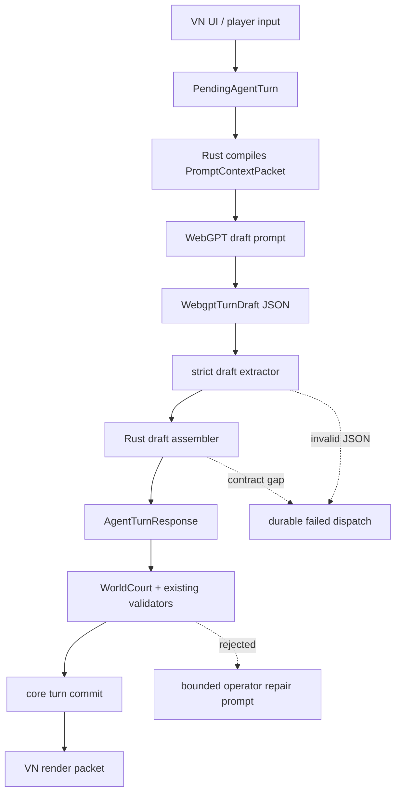

# WebGPT Turn Draft Assembly Blueprint

Last updated: 2026-05-01

This document defines the concrete migration from direct
`AgentTurnResponse` generation to a smaller WebGPT-authored draft plus a
Rust-owned contract assembler.

The purpose is not to make Rust write story content. WebGPT remains the
author of Korean VN prose, scene-specific choice wording, visible summaries,
and semantic resolution judgment. Rust owns the envelope, refs, slots,
schema defaults, audit boundaries, and commit-ready `AgentTurnResponse`
construction.

## Problem

The current text lane asks WebGPT to return one full `AgentTurnResponse`:

```text
PromptContextPacket
  -> WebGPT
  -> AgentTurnResponse JSON
  -> extractor
  -> normalization
  -> WorldCourt / commit
```

This makes the model author both narrative content and internal runtime
contracts. In live no-bypass VN testing, that shape produced failures such as:

- malformed top-level JSON with a premature closing brace,
- partial extraction of only the first balanced object,
- shortened or aliased refs such as `char:anchor`,
- generic refs such as `player_input` used as gate or effect targets,
- missing movement/no-op records for pre-turn pressure obligations,
- slot/source affordance shorthand mismatches.

The underlying issue is that `AgentTurnResponse` is an internal commit type.
It includes prose, choices, typed events, refs, enum domains, validation
signals, and persistence contracts. A language model can draft the semantic
content, but it should not be the sole authority for the internal envelope.

## Target Shape



The important boundary:

```text
WebGPT writes content.
Rust assembles contracts.
```

## Authority Split

| Surface | WebGPT owns | Rust owns |
| --- | --- | --- |
| Visible prose | `visible_text_blocks`, dialogue, sensory rhythm, Korean VN style | `NarrativeScene` wrapper, schema version, hidden-leak audit |
| Tone notes | Human-readable style notes for the turn | Field shape and default empty array |
| Intent/resolution | Semantic interpretation, visible outcome summary, interesting partial cost | input kind mapping, enum normalization, evidence/ref legality |
| Scene pressure | Suggested movement summary and visible reason | required pressure obligation coverage, pressure ids, no-op fallback policy |
| Choices | slot 1..5 label/intent wording | slot count, slot 6/7 fixed contract, affordance grounding refs |
| Events | Optional summaries for visible plot/location/pressure changes | event ids, allowed kinds, canonical refs, projection write paths |
| Commit | none | full `AgentTurnResponse`, WorldCourt, append-only records, VN packet |

Rust must not invent player-facing facts, prose paragraphs, dialogue,
character motives, or new visible events. When WebGPT omits necessary content,
the turn fails loud or requests bounded repair. Rust may only fill mechanical
contract fields and deterministic defaults.

## Draft Schema

Initial MVP schema:

```rust
pub const WEBGPT_TURN_DRAFT_SCHEMA_VERSION: &str = "singulari.webgpt_turn_draft.v1";

pub struct WebgptTurnDraft {
    pub schema_version: String,
    pub world_id: String,
    pub turn_id: String,
    pub interpreted_intent: WebgptDraftIntent,
    pub outcome: WebgptDraftOutcome,
    pub visible_scene: WebgptDraftScene,
    pub choices: Vec<WebgptDraftChoice>,
    pub pressure_movements: Vec<WebgptDraftPressureMovement>,
    pub optional_events: WebgptDraftOptionalEvents,
}
```

### Intent

```rust
pub struct WebgptDraftIntent {
    pub summary: String,
    pub target_hints: Vec<String>,
    pub pressure_hints: Vec<String>,
    pub evidence_hints: Vec<String>,
    pub ambiguity: String,
}
```

Hints are not commit refs. They are model-authored references to visible
semantics. The assembler maps them to canonical refs only when they match the
compiled prompt context. Unmapped hints stay in audit notes or fail if required.

### Outcome

```rust
pub struct WebgptDraftOutcome {
    pub kind: String,
    pub summary: String,
    pub evidence_hints: Vec<String>,
}
```

The `kind` string is still model-provided, but Rust maps it into
`ResolutionOutcomeKind`. Unknown values fail before commit instead of being
silently accepted.

### Visible Scene

```rust
pub struct WebgptDraftScene {
    pub text_blocks: Vec<String>,
    pub tone_notes: Vec<String>,
}
```

Rules:

- `text_blocks` must be non-empty Korean VN prose.
- WebGPT owns every sentence in `text_blocks`.
- Rust wraps this into `NarrativeScene`.
- Rust may reject hidden leaks, empty prose, or non-player-visible content.
- Rust must not synthesize replacement prose.

### Choices

```rust
pub struct WebgptDraftChoice {
    pub slot: u8,
    pub label: String,
    pub intent: String,
    pub tag_hint: Option<String>,
}
```

Rules:

- WebGPT may only draft slots `1..=5`.
- Rust ignores or rejects draft slots `6` and `7`.
- Rust creates slot 6 as freeform.
- Rust creates slot 7 as delegated judgment with hidden preview contract.
- Rust assigns slot 1..5 `grounding_ref` from
  `pre_turn_simulation.available_affordances[slot]`.
- If WebGPT omits a slot 1..5 label/intent, Rust may use the existing
  affordance action contract as a mechanical fallback only if it is already
  player-visible in prompt context. It must mark the response with an
  assembler warning.

### Pressure Movements

```rust
pub struct WebgptDraftPressureMovement {
    pub pressure_id: String,
    pub change: String,
    pub summary: String,
    pub evidence_hints: Vec<String>,
}
```

Rules:

- `pressure_id` must exist in `pre_turn_simulation.pressure_obligations`,
  `available_affordances[*].pressure_refs`, or active scene pressure.
- Every required pressure obligation must be moved or explicitly no-op'd.
- If the draft mentions a required pressure in intent but omits movement,
  Rust may add a mechanical `pressure_noop_reasons` entry. The reason text
  must be generic and non-narrative.
- Rust must not invent a pressure summary.

### Optional Events

MVP keeps optional events narrow:

```rust
pub struct WebgptDraftOptionalEvents {
    pub plot_thread_summaries: Vec<WebgptDraftEventSummary>,
    pub location_summaries: Vec<WebgptDraftEventSummary>,
    pub scene_pressure_summaries: Vec<WebgptDraftEventSummary>,
}
```

The assembler may convert these to typed events only when:

- the event id/ref exists or is explicitly allowed by the current family,
- the change kind maps to an allowed enum,
- evidence hints map to visible refs,
- the event does not create hidden or adjudication-only visible truth.

Otherwise the summary remains advisory and does not become durable state.

## Assembler Contract

New module target:

```text
src/runtime/webgpt/draft.rs
src/runtime/webgpt/assembler.rs
```

Primary API:

```rust
pub fn parse_webgpt_turn_draft(raw: &str) -> Result<WebgptTurnDraft>;

pub fn assemble_agent_turn_response(
    pending: &PendingAgentTurn,
    prompt_context: &PromptContextPacket,
    draft: WebgptTurnDraft,
) -> Result<AgentTurnResponse>;
```

Assembler steps:

1. Validate `schema_version`, `world_id`, and `turn_id`.
2. Build a `ReferenceIndex` from `PromptContextPacket`.
3. Canonicalize draft hints through the index.
4. Build `ResolutionProposal`:
   - `input_kind` from `response_contract.interpreted_intent_input_kind`,
   - intent and outcome summaries from draft,
   - refs only from the canonical index,
   - required pressure coverage from pre-turn obligations.
5. Build `NarrativeScene` from draft text blocks and tone notes.
6. Build `next_choices`:
   - slots 1..5 from draft wording plus affordance grounding,
   - slot 6 fixed freeform,
   - slot 7 fixed delegated judgment.
7. Convert optional event summaries only when validation is deterministic.
8. Run existing normalizers only as compatibility shims.
9. Run WorldCourt and existing commit validation unchanged.

The assembler may produce `AssemblerWarning` records for non-terminal
mechanical fallbacks. These warnings are operator-facing only and must not
appear in the VN player surface.

## Reference Index

The draft assembler needs one canonical index rather than scattered string
heuristics.

```rust
pub struct ReferenceIndex {
    canonical_refs: BTreeSet<String>,
    aliases: HashMap<String, String>,
    refs_by_domain: HashMap<RefDomain, BTreeSet<String>>,
}
```

Sources:

- `current_turn`
- `player_input` as evidence-only
- `pre_turn_simulation.available_affordances[*].affordance_id`
- `pre_turn_simulation.pressure_obligations[*].pressure_id`
- visible context entity refs
- active scene pressure ids
- active hook ledger refs that pass hidden-ref validation
- body/resource/location/relationship/belief refs exposed in prompt context

Rules:

- `player_input` can map only to evidence refs.
- gate refs and effect target refs must match their domain.
- aliases are allowed only when unique.
- denylist hidden-ref checks remain as MVP guard, but the target state is
  allowed-prefix validation by domain.

## Prompt Contract

The WebGPT prompt should stop asking for `AgentTurnResponse` directly.

It should say:

```text
Return one WebgptTurnDraft JSON object.
Do not include schema wrappers for AgentTurnResponse.
Do not invent grounding refs.
Do not write slot 6 or slot 7.
Write only player-visible prose and scene-specific wording.
Use hint strings from allowed_reference_atoms when helpful, but the host will
canonicalize refs.
```

The prompt should still include:

- narrative turn packet,
- allowed reference atoms,
- available affordances,
- pressure obligations,
- hidden visibility boundary,
- Korean VN prose contract.

But the output should be smaller and less brittle.

## Failure Behavior

| Failure | Behavior |
| --- | --- |
| malformed JSON | durable failed dispatch; no partial extraction |
| complete draft missing `visible_scene.text_blocks` | failed terminal or bounded repair prompt |
| draft uses unknown world/turn id | failed terminal |
| draft omits slot 1..5 wording | mechanical affordance fallback with warning, or fail if no player-visible fallback exists |
| draft invents ref | reject or keep as non-durable hint; never commit as ref |
| pressure obligation uncovered | assembler adds generic no-op only when draft mentions pressure; otherwise fail |
| hidden/adjudication-only leak | fail before commit |
| WorldCourt rejects assembled response | no world mutation; operator repair prompt |

Partial JSON must never be stored as `*-agent-response.json`.

## Migration Plan

### Phase 0: Stop False Success

Already required before draft migration:

- strict extractor accepts only complete response-shaped JSON,
- malformed/partial output becomes durable failed dispatch,
- no extra WebGPT repair call is made automatically during cooldown-sensitive
  testing.

### Phase 1: Draft Types and Offline Fixtures

Add:

- `WebgptTurnDraft` types,
- strict draft extractor,
- `ReferenceIndex`,
- `assemble_agent_turn_response`.

Tests:

- malformed draft is rejected without partial extraction,
- visible prose passes through unchanged,
- slot 6/7 are host-created,
- slot 1..5 grounding comes from `available_affordances`,
- `player_input` is evidence-only,
- `char:anchor` alias maps only when unique,
- pressure obligations are moved/no-op'd deterministically.

Use saved WebGPT answer artifacts as offline fixtures so no WebGPT quota is
spent while developing this phase.

### Phase 2: Dual-Path Adapter

Add a runtime flag:

```text
SINGULARI_WORLD_WEBGPT_OUTPUT_MODE=draft|agent_response
```

Default can remain `agent_response` for one commit if needed, but no-bypass
soak should use `draft`.

Both paths must write dispatch records with the same job ledger lifecycle.

### Phase 3: Draft Mode Default

Switch the default text lane to draft mode when:

- full CI passes,
- fixture replay passes,
- at least one fresh 5-turn no-bypass run passes,
- no WebGPT response-shaped contract failures occur in draft mode.

### Phase 4: Retire Direct AgentTurnResponse Prompt

Remove direct response generation after:

- 30-turn no-bypass VN run passes,
- projection health exposes adapter warnings,
- repair prompt understands draft failures,
- docs and README describe draft mode as the normal runtime.

## Acceptance Criteria

Implementation is not complete until:

- `cargo fmt --all -- --check` passes,
- `cargo check --locked` passes,
- `cargo test --locked` passes,
- `cargo clippy --locked --all-targets -- -D warnings` passes,
- `cargo build --locked --release` passes,
- offline fixture replay covers the known malformed-brace response,
- a fresh VN run advances at least 5 turns without WebGPT repair,
- a fresh VN run can attempt 30 turns without partial JSON success,
- dispatch records clearly distinguish malformed output, draft assembly
  failure, WorldCourt rejection, and successful commit.

## Non-Goals

- Do not make Rust write VN prose.
- Do not add scripted GM fallback narration.
- Do not loosen WorldCourt to accept invented refs.
- Do not hide adapter warnings from operator health.
- Do not automatically spend extra WebGPT calls to repair every malformed
  response during cooldown-sensitive tests.
