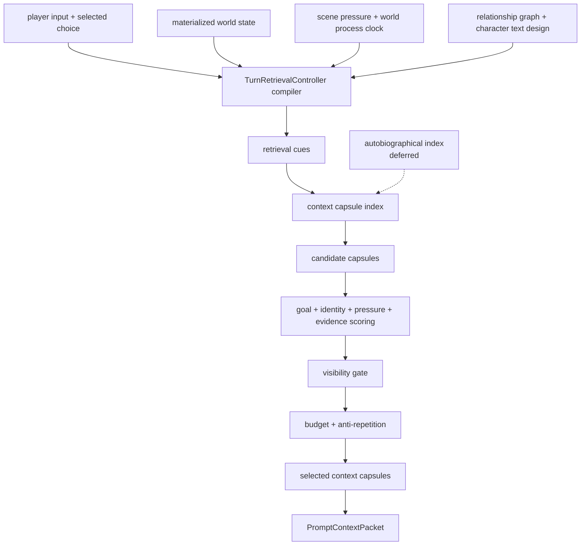

# Working Self Memory Blueprint

Status: design draft

## Research Anchor

This blueprint adapts the Self-Memory System idea for a fictional world
simulator. In Conway's account, autobiographical memory and the self constrain
each other: long-term autobiographical knowledge shapes what the self can be,
while the working self uses active goals and self-images to control access to
memory.

For Singulari World, this is not a claim about consciousness. The code-facing
name should avoid metaphysical weight: use `TurnRetrievalController` for the
implementation. "Working Self" remains only the research anchor and design
analogy.

It is a practical retrieval architecture:

```text
current goals + current role stance + current pressures
  -> construct retrieval cues
  -> select context capsules
  -> reconstruct only the memory needed for this turn
```

The design goal is to stop treating memory as a flat store and start treating
revival as a goal-directed reconstruction process.

## Problem

`ContextCapsule` solves prompt bloat by making memory transport lazy. But a
capsule selector still needs to know *why* a memory matters right now.

Flat semantic similarity is not enough:

- a semantically similar event may be irrelevant to the current objective
- an old relationship may matter only if it constrains the current scene
- a style correction should shape prose, not create world content
- hidden knowledge may matter to adjudication but must not shape visible prose
- a player action may express intent even when its wording has no keyword match

The missing layer is a local turn retrieval controller: a typed, deterministic
model of current goals, role stance, and coherence constraints.

## Verdict

Add a `TurnRetrievalController` layer after the first Context Capsule selector
works. Do not implement this before capsule index/body storage and basic
capsule selection are stable.

It should:

- compile active goals from player input, selected choice, scene pressure, plot
  threads, world processes, and body/resource gates
- compile active role constraints from protagonist/player-visible stance,
  character text design, relationship edges, and recent canon
- generate retrieval cues for capsule selection
- balance narrative coherence against source correspondence
- keep visible, inferred, private, and hidden memory lanes separate

It should not:

- become a new source of canon
- invent protagonist backstory or psychological traits
- store real user preferences
- override explicit player input
- let "identity" language seed genre tropes or fixed personality templates

## Meta-Critique Adjustment

The research term "working self" is useful, but it is dangerous as a code-level
concept. It can invite hidden protagonist personality modeling and quietly
restore the same hard-coded openings this project has been removing.

Therefore:

- Document title may keep "Working Self Memory" as the research link.
- Code types should use `TurnRetrievalController`, not
  `SimulationWorkingSelf`.
- `identity_stance` becomes `role_stance` in schemas.
- Role stance means how the world currently treats an entity, not what the
  entity "is like" inside.
- `autobiographical_index` is deferred until capsule selection proves useful.

Accepted role stance:

```text
The gate officials currently treat the protagonist as an unidentified outsider.
```

Rejected personality inference:

```text
The protagonist is cautious, observant, and distrustful.
```

## Core Concepts

### 1. Autobiographical Knowledge Hierarchy

Human autobiographical memory is often modeled hierarchically. Singulari World
can use the same shape without anthropomorphizing:

| SMS-like level | World simulator equivalent | Storage |
| --- | --- | --- |
| lifetime period | chapter / arc / region phase | chapter summaries, plot threads |
| general event | recurring situation or relationship pattern | relationship graph, pattern debt, world processes |
| event-specific knowledge | exact scene detail | canon events, turn log, context capsules |

This hierarchy gives retrieval more structure than "embedding nearest
neighbor".

### 2. Turn Retrieval Controller

The turn retrieval controller is the active controller for retrieval. In this
simulator it is a per-turn packet, not a persistent personality.

It answers:

1. What is the current objective?
2. What role/social constraints are currently active?
3. What scene pressures must shape action?
4. Which old memories can change the outcome now?
5. Which old memories would only add stale color?

### 3. Coherence vs Correspondence

Memory reconstruction has two competing needs:

- **coherence**: keep the story, character stance, and player intent continuous
- **correspondence**: stay faithful to recorded facts and visibility gates

Singulari rule:

```text
correspondence wins over coherence when they conflict.
```

If coherence wants a dramatic callback but evidence does not support it, the
callback is rejected or downgraded to style/pressure only.

## Proposed Surfaces

```text
turn_retrieval_controller.json
turn_retrieval_events.jsonl
context_capsules/capsule_index.json
context_capsules/*/*.json
```

`turn_retrieval_controller.json` is materialized per pending turn or latest
turn. It is not canon. It is a retrieval controller snapshot.

`turn_retrieval_events.jsonl` records why retrieval goals changed.

Implemented surface:

```text
autobiographical_index.json
```

`autobiographical_index.json` groups existing memories into arc/general-event
layers for efficient capsule selection. It is compiled deterministically from
chapter summaries, active plot threads, relationship graph state, world process
clock state, and context capsule refs.

## Turn Retrieval Controller Packet

```json
{
  "schema_version": "singulari.turn_retrieval_controller.v1",
  "world_id": "stw_...",
  "turn_id": "turn_0012",
  "active_goals": [
    {
      "goal_id": "goal:turn_0012:avoid_detection",
      "source": "selected_choice",
      "summary": "Avoid drawing attention while moving through the gate area.",
      "priority": "high",
      "visibility": "player_visible"
    }
  ],
  "active_role_stance": [
    {
      "stance_id": "role:protagonist:outsider",
      "subject_id": "char:protagonist",
      "summary": "The protagonist is treated as an unknown outsider in this place.",
      "source_refs": ["canon_event:turn_0001"],
      "visibility": "player_visible"
    }
  ],
  "coherence_constraints": [
    "Do not make the protagonist suddenly know local customs without evidence.",
    "Maintain the current guarded social distance."
  ],
  "correspondence_constraints": [
    "Visible prose may only use player-visible or inferred-visible facts.",
    "Hidden adjudication may affect outcomes but not appear as explanation."
  ],
  "retrieval_cues": [
    {
      "cue": "gate authority",
      "reason": "current location and social pressure",
      "target_kinds": ["relationship_graph", "world_lore", "location_graph"]
    }
  ],
  "retrieval_policy": {
    "coherence_weight": 0.35,
    "correspondence_weight": 0.65,
    "max_capsules": 8
  }
}
```

## Event Shape

```json
{
  "schema_version": "singulari.working_self_event.v1",
  "world_id": "stw_...",
  "turn_id": "turn_0012",
  "event_id": "turn_retrieval_event:turn_0012:00",
  "event_kind": "goal_activated",
  "source_ref": "selected_choice:2",
  "summary": "The player chose a cautious observation path.",
  "retrieval_effect": {
    "boost_triggers": ["observation", "local signs", "prior visible clues"],
    "suppress_triggers": ["unrelated backstory", "generic genre exposition"]
  },
  "recorded_at": "2026-04-29T09:10:00Z"
}
```

## Autobiographical Index

`autobiographical_index.json` is a grouping layer built from existing state.

```json
{
  "schema_version": "singulari.autobiographical_index.v1",
  "world_id": "stw_...",
  "periods": [
    {
      "period_id": "period:opening_gate",
      "label": "Opening gate sequence",
      "turn_range": ["turn_0000", "turn_0005"],
      "dominant_goals": ["enter safely", "understand local authority"],
      "capsule_refs": [
        "location:gate",
        "relationship:porter->protagonist",
        "plot_thread:missing_token"
      ]
    }
  ],
  "general_events": [
    {
      "event_cluster_id": "general_event:authority_friction",
      "pattern": "Local authority tests protagonist legitimacy.",
      "capsule_refs": [
        "relationship:porter->protagonist",
        "world_lore:gate_custom"
      ]
    }
  ]
}
```

This gives the selector a middle layer between raw turn logs and high-level
chapter summaries.

## Retrieval Pipeline



## Scoring Model

Final capsule score should combine four dimensions:

```text
score =
  goal_relevance
  + role_relevance
  + scene_pressure_relevance
  + correspondence_support
  - stale_repetition_penalty
  - seed_leakage_risk
```

Reason labels must be stable:

- `current_goal_match`
- `role_stance_match`
- `scene_pressure_source`
- `active_process_source`
- `autobiographical_period_match`
- `general_event_cluster_match`
- `event_specific_evidence_match`
- `repeated_without_effect`
- `visibility_blocked`
- `seed_leakage_risk`

## Integration With Context Capsules

`ContextCapsule` remains the transport layer.

`TurnRetrievalController` becomes the selector brain after capsule selection is
stable.

```text
ContextCapsule = what can be loaded
TurnRetrievalController = why this turn needs it
PromptContextBudgetReport = what was actually loaded and why
```

The capsule blueprint should eventually replace direct scoring from raw player
input with cue scoring from `TurnRetrievalController`.

## Integration With Existing Blueprints

| Existing surface | Turn retrieval role |
| --- | --- |
| `plot_threads` | contributes active goals and unresolved hooks |
| `scene_pressure` | contributes urgency and action constraints |
| `relationship_graph` | contributes role/social stance |
| `character_text_design` | contributes voice/role continuity, not global prose style |
| `body_resource_state` | contributes physical feasibility goals |
| `location_graph` | contributes spatial affordances |
| `world_process_clock` | contributes active external pressures |
| `player_intent_trace` | contributes short-term goal inference |
| `pattern_debt` | suppresses repetitive reconstruction patterns |
| `narrative_style_state` | contributes prose correction pressure only |
| `context_capsules` | provides loadable knowledge units |

## Prompt Context Shape

Eventually `PromptContextPacket` should include:

```json
{
  "turn_retrieval_controller": {
    "active_goals": [],
    "active_role_stance": [],
    "retrieval_cues": [],
    "coherence_constraints": [],
    "correspondence_constraints": []
  },
  "selected_context_capsules": [],
  "budget_report": {}
}
```

The visible prose section may see only visible/inferred retrieval-controller
material.
The adjudication section may see private/hidden goals and constraints.

## Guardrails

1. No backstory invention from role stance.
2. No psychological diagnosis language in player-visible text.
3. No "the protagonist feels X because role model says X" exposition.
4. No hidden retrieval-controller constraints in image prompts.
5. No permanent user preference derived from in-world player behavior.
6. No fallback personality template when evidence is absent.
7. No coherence override of canonical evidence.

## Implementation Plan

### P0: Blueprint

Create this document and link it from the system map and context capsule
blueprint.

### P1: Wait For Capsule Gate

Do not start implementation until `ContextCapsule` P1-P4 exist:

- capsule types
- deterministic builder
- basic selector
- prompt context integration

The first capsule selector may use direct player input, active pressure, and
plot threads. The turn retrieval controller is the second-stage selector brain,
not the first feature.

### P2: Types

Add:

```text
src/turn_retrieval_controller.rs
turn_retrieval_controller.json
turn_retrieval_events.jsonl
```

Types:

- `TurnRetrievalControllerPacket`
- `TurnRetrievalGoal`
- `TurnRetrievalRoleStance`
- `TurnRetrievalCue`
- `TurnRetrievalConstraint`
- `TurnRetrievalEventRecord`

### P3: Deterministic Compiler

Compile the turn retrieval controller from existing typed packets:

1. player input and selected choice
2. active plot threads
3. scene pressure
4. relationship graph
5. body/resource state
6. location graph
7. world process clock
8. player intent trace

No WebGPT call. No prose interpretation beyond typed response fields.

### P4: Capsule Selector Integration

Use `TurnRetrievalController.retrieval_cues` as a scoring input after direct
capsule scoring is already covered by tests.

### P5: Prompt Context Integration

Add visible and adjudication retrieval-controller sections to
`PromptContextPacket`.

### P6: Audit

Add `turn_retrieval_events.jsonl` and world.db indexing. The audit should
explain why a goal/cue existed and which capsules it selected.

### P7: Tests

Required tests:

- active goal from selected choice boosts matching capsule
- role stance does not create new protagonist backstory or temperament
- hidden retrieval cue is blocked from visible prose and image prompt
- stale semantic match loses to current goal match
- correspondence conflict beats coherence pressure

### P8: Autobiographical Index Builder

Implemented as `src/autobiographical_index.rs` and projected into prompt
context plus `world.db` search/audit tables.

Build periods and general-event clusters from:

- chapter summaries
- plot threads
- repeated scene pressures
- relationship/event clusters
- world process phases

## Acceptance Criteria

- Retrieval decisions are explainable by active goals, role stance, pressure,
  or evidence.
- Semantically similar but goal-irrelevant capsules are rejected.
- Turn retrieval controller packet contains no new canon.
- Prompt context can show why a memory was revived without dumping all memory.
- Hidden/private retrieval cues never enter visible prose or image prompts.
- Tests prove goal-directed recall beats flat keyword/embedding recall.

## Open Questions

- Should the protagonist get a persistent `role_stance` packet, or should V1
  keep role stance purely per-turn?
- Should major NPCs get their own retrieval-controller packets, or should
  relationship graph + character text design remain enough for V1?
- How aggressively should chapter summaries shape autobiographical periods?
- Should user-facing Codex View expose the autobiographical hierarchy, or only
  use it internally for retrieval?
