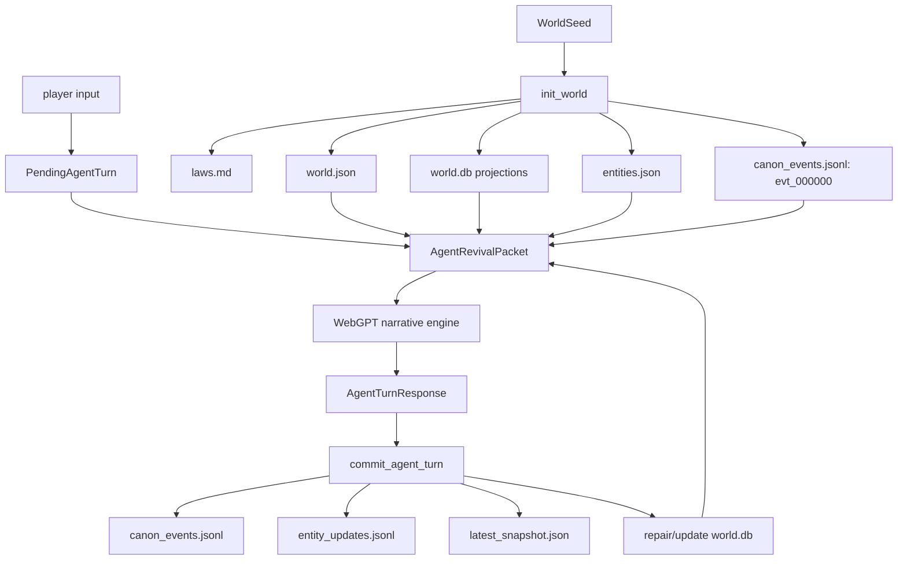
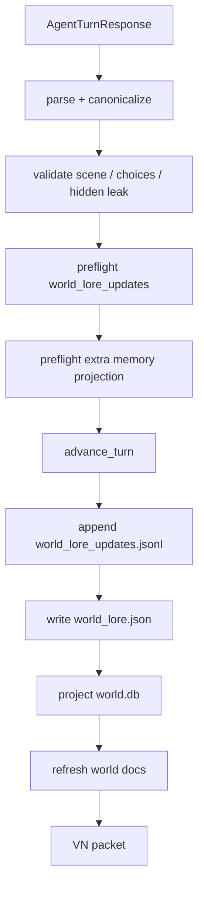

# World Lore Blueprint

Status: design draft

## Problem

The simulator already records world state, but "worldbuilding" is still spread
across seed premise, canon events, entity updates, generated docs, and world.db
projections. That is enough for continuity, but not enough for a living world
simulation.

The missing layer is a structured lore surface that can answer:

- What is true about this world beyond the immediate scene?
- Which truths are player-visible, inferred, disputed, or hidden?
- Which cultural, material, political, and environmental rules should constrain
  future turns?
- Which facts may WebGPT use as content, and which are only style or UI context?
- How does a generated lore detail become canon without becoming prompt drift?

## Goals

1. Make worldbuilding a first-class data model, not prose hidden inside narration.
2. Keep lore seedless: style contracts and examples cannot create lore.
3. Let WebGPT propose lore only through structured fields, not through leaked
   narration.
4. Promote lore with validation, visibility, provenance, and conflict handling.
5. Feed each turn with compact, relevant lore from world.db and the world store.
6. Keep player-visible Archive View useful without exposing hidden truth.

## Non-Goals

- Do not preserve compatibility with existing test worlds.
- Do not make `docs/world_bible.md` the source of truth.
- Do not let WebGPT freely invent religions, empires, magic systems, or history
  because a genre usually contains them.
- Do not add a fallback prose parser that scrapes lore from visible_scene.

## Current State

### Files

- `world.json`: seed-derived world record and laws.
- `laws.md`: readable projection of core law flags.
- `canon_events.jsonl`: append-only player-visible and internal event log.
- `entities.json`: current character/place/faction/item/concept records.
- `entity_updates.jsonl`: append-only entity/relationship update projection.
- `hidden_state.json`: hidden secrets and timers.
- `player_knowledge.json`: player-visible open threads.
- `docs/world_bible.md`: generated projection of seed premise and laws.
- `world.db`: queryable projection for Archive View, recall, and validation.

### Runtime Flow



### Gap

`world_facts` currently stores seed premise facts and the anchor invariant. It
does not model deeper worldbuilding domains such as settlements, social order,
economy, faith, technology, customs, danger model, language register, or taboos.

## Proposed Model

Add a per-world lore/model layer. The file names keep `world_lore` because the
surface is player-readable, but the entry shape must behave like a world model:
it can constrain future adjudication, not merely decorate prose.

- file source: `world_lore.json`
- append-only event source: `world_lore_updates.jsonl`
- DB projection: `world_lore_entries`, `world_lore_relations`,
  `world_lore_conflicts`
- generated player-visible projection: `docs/world_bible.md`
- revival projection: `memory_revival.active_world_lore`
- adjudication input: selected entries' `simulation_effect`

### Lore Entry

```json
{
  "schema_version": "singulari.world_lore_entry.v1",
  "world_id": "stw_...",
  "lore_id": "lore:settlement:gate_village",
  "domain": "settlements",
  "name": "서쪽 비탈의 검문문",
  "summary": "저녁이면 빗장을 일찍 거는 변경 마을 입구.",
  "details": [
    "문지기는 이름, 온 길, 소지품을 확인한다.",
    "닫히는 시간에는 통행이 곧 사회적 허가 문제가 된다."
  ],
  "mechanical_axis": ["social_permission", "time_pressure"],
  "simulation_effect": {
    "gates": ["social_permission", "time"],
    "applies_when": ["entering_settlement_after_gate_closing"],
    "constraint": "entry_requires_identity_or_social_cover",
    "severity": "soft_block"
  },
  "scope": {
    "applies_to": ["place:opening_location"],
    "not_global_until_repeated": true
  },
  "visibility": "player_visible",
  "confidence": "confirmed",
  "authority": "canon_event",
  "lifecycle": "active",
  "source_turn_id": "turn_0001",
  "source_event_id": "evt_000001",
  "introduced_by": "agent_response",
  "evidence_refs": [
    {
      "source": "visible_scene.text_blocks[4]",
      "quote": "문 닫을 시간이다. 이름, 온 길, 들고 들어갈 물건."
    }
  ],
  "tags": ["checkpoint", "settlement_gate", "social_permission"],
  "created_at": "RFC3339",
  "updated_at": "RFC3339"
}
```

### Domains

The first version should use a closed enum. Do not allow free-form domains.

| Domain | Purpose | Example |
| --- | --- | --- |
| `geography` | terrain, climate, routes, boundaries | mountain pass, coast road |
| `settlements` | towns, gates, neighborhoods, ruins | border village, market ward |
| `social_order` | class, law, authority, permissions | gate toll, guild hierarchy |
| `economy` | money, labor, scarcity, trade | salt tax, winter grain price |
| `faith_and_myth` | public belief, rites, sacred fears | river oath, funeral custom |
| `technology_level` | tools, weapons, infrastructure | wet matchlocks absent, oil lamps |
| `danger_model` | known threats and survival logic | wolves, patrols, hunger, fever |
| `customs` | etiquette, taboos, hospitality | name before entry |
| `language_register` | titles, insults, politeness, dialect | guard speech, noble address |
| `known_unknowns` | explicit gaps that constrain invention | unknown ruler, unknown calendar |

### Mechanical Axis

`domain` is for worldbuilding taxonomy. `mechanical_axis` is for simulation
pressure. A lore entry may have multiple axes.

| Axis | Meaning |
| --- | --- |
| `body` | hunger, fatigue, injury, exposure, disease |
| `resource` | money, food, tools, documents, trade goods |
| `time_pressure` | deadlines, closing gates, patrol cycles, weather windows |
| `social_permission` | entry, trust, status, taboos, witnesses |
| `knowledge` | what the protagonist can fairly know or infer |
| `risk_detection` | stealth, pursuit, suspicion, alarms |
| `environment` | terrain, weather, darkness, temperature |
| `moral_cost` | oath, debt, betrayal, sacrifice |

Adjudication should consume `mechanical_axis` and `simulation_effect` as
constraints. Prose may consume the same entry only after the visibility gate.

### Visibility

| Visibility | Meaning | Can Appear In VN Text? | Can Guide Adjudication? |
| --- | --- | --- | --- |
| `player_visible` | Confirmed to the player | yes | yes |
| `inferred_visible` | Fair inference from visible facts | cautious yes | yes |
| `unconfirmed` | Hypothesis, not canon | no as fact | weakly |
| `hidden` | Hidden truth | no | yes |
| `retired` | Superseded/invalid | no | no |

Hidden entries must not appear in `docs/world_bible.md`, Archive View, VN text,
image prompts, or search snippets. They may appear only as counts or opaque
adjudication constraints.

### Confidence

| Confidence | Meaning |
| --- | --- |
| `confirmed` | Committed from canon event, seed, or validated structured update |
| `inferred` | Deterministic inference from confirmed facts |
| `rumored` | In-world claim by a character or document |
| `disputed` | Conflicts with another visible or hidden entry |
| `rejected` | Proposed by agent but failed validation |

### Authority

`authority` decides conflict ordering. It is separate from visibility and
confidence.

| Authority | Meaning |
| --- | --- |
| `seed` | Directly from `WorldSeed` / `world.json` |
| `canon_event` | Directly established by committed canon event |
| `repeated_observation` | Same pattern confirmed across multiple turns |
| `structured_agent_update` | Validated `world_lore_updates` proposal |
| `npc_claim` | A character/document says it in-world |
| `player_inference` | Fair player-visible inference, not direct canon |
| `system_projection` | Derived convenience projection; weakest authority |

Conflict order:

`seed > canon_event > repeated_observation > structured_agent_update >
npc_claim > player_inference > system_projection`

Do not silently overwrite a higher-authority entry with lower-authority lore.

### Scope and Lifecycle

Lore must not overgeneralize from one scene.

```json
{
  "scope": {
    "applies_to": ["place:opening_location"],
    "not_global_until_repeated": true,
    "expires_when": []
  },
  "lifecycle": "active"
}
```

Lifecycle values:

| Lifecycle | Meaning |
| --- | --- |
| `active` | Usable in prompts/adjudication |
| `localized` | True only inside scope |
| `overgeneralized` | Retained for audit, not used as a broad rule |
| `superseded` | Replaced by newer lore |
| `contradicted` | Conflicts with stronger evidence |
| `retired` | Removed from active simulation |

### Known Unknowns

Known unknowns are not blanks to fill. They are playable constraints.

```json
{
  "question": "이 마을의 통행 권한은 누가 결정하는가?",
  "why_it_matters": "밤 입장과 숙박 가능성을 제한한다.",
  "allowed_probe_actions": ["ask_guard", "read_gate_mark", "observe_queue"],
  "blocked_assumptions": ["영주가 있다", "통행증 제도가 있다"],
  "resolved_by": []
}
```

## Agent Response Contract

Extend `AgentTurnResponse` with a structured lore proposal field:

```json
{
  "world_lore_updates": [
    {
      "domain": "social_order",
      "name": "검문문 출입 절차",
      "summary": "마을 문지기는 닫는 시간에 이름, 온 길, 소지품을 묻는다.",
      "details": [
        "통행은 단순 이동이 아니라 허가와 의심의 문제로 처리된다."
      ],
      "mechanical_axis": ["social_permission", "time_pressure"],
      "simulation_effect": {
        "gates": ["social_permission", "time"],
        "applies_when": ["entering_settlement_after_gate_closing"],
        "constraint": "entry_requires_identity_or_social_cover",
        "severity": "soft_block"
      },
      "scope": {
        "applies_to": ["place:opening_location"],
        "not_global_until_repeated": true
      },
      "visibility": "player_visible",
      "confidence": "confirmed",
      "authority": "structured_agent_update",
      "evidence_refs": [
        {
          "source": "visible_scene.text_blocks[4]",
          "quote": "문 닫을 시간이다. 이름, 온 길, 들고 들어갈 물건."
        }
      ],
      "source_scope": "current_turn"
    }
  ]
}
```

Rules:

- `world_lore_updates` is optional but preferred when a scene establishes a
  repeatable world rule.
- It must cite current-turn visible evidence through `evidence_refs`.
- It must not introduce lore only because of genre expectations.
- It must not duplicate an existing lore entry; it should update by name/domain
  when the same concept recurs.
- It must not contain style contract terms, UI labels, schema examples, or
  authorial analysis.
- If the turn establishes any repeatable rule about place, permission, danger,
  custom, resource, institution, environment, or procedure,
  `world_lore_updates` must include at least one entry.
- Hidden lore must use `hidden_state_delta`, not `world_lore_updates`, unless
  the field later gains a private visibility lane with strict validation.

## Validation

`commit_agent_turn` should preflight lore before mutating world state.

Validation stages:

1. Schema: domain, mechanical_axis, visibility, confidence, authority, summary,
   evidence_refs, scope, and lifecycle are present.
2. Boundary: no hidden secret text in player-visible lore.
3. Evidence: every `evidence_refs[].source` must point to an allowed
   current-turn visible field, and `quote` must be present in that field after
   normalized whitespace comparison.
4. Seed leakage: reject lore containing style-contract vocabulary as content.
5. Domain gate: only allowed domains.
6. Mechanical gate: `simulation_effect.gates` must be a subset of known
   adjudication gates.
7. Scope gate: single-scene observations default to `localized` or
   `not_global_until_repeated=true`.
8. Authority gate: lower-authority lore cannot overwrite higher-authority lore.
9. Conflict check: if same domain/name has incompatible object, mark
   `disputed` or reject; do not silently overwrite.
10. Projection write: only after the rest of turn commit is known to be valid.

No fallback parser should infer lore from prose. If WebGPT omits
`world_lore_updates`, the turn still commits, but no new lore entry is created.

## Storage

### `world_lore.json`

Current compact state by `lore_id`.

```json
{
  "schema_version": "singulari.world_lore_index.v1",
  "world_id": "stw_...",
  "entries": []
}
```

### `world_lore_updates.jsonl`

Append-only source events.

```json
{
  "schema_version": "singulari.world_lore_update.v1",
  "world_id": "stw_...",
  "update_id": "lore_update_...",
  "turn_id": "turn_0001",
  "lore_id": "lore:social_order:gate_entry_protocol",
  "operation": "upsert",
  "entry_after": {},
  "source_event_id": "evt_000001",
  "created_at": "RFC3339"
}
```

### `world.db`

Add tables:

```sql
CREATE TABLE world_lore_entries (
  world_id TEXT NOT NULL,
  lore_id TEXT NOT NULL,
  domain TEXT NOT NULL,
  mechanical_axis_json TEXT NOT NULL,
  name TEXT NOT NULL,
  summary TEXT NOT NULL,
  details_json TEXT NOT NULL,
  simulation_effect_json TEXT NOT NULL,
  scope_json TEXT NOT NULL,
  visibility TEXT NOT NULL,
  confidence TEXT NOT NULL,
  authority TEXT NOT NULL,
  lifecycle TEXT NOT NULL,
  source_turn_id TEXT NOT NULL,
  source_event_id TEXT,
  evidence_refs_json TEXT NOT NULL,
  tags_json TEXT NOT NULL,
  raw_json TEXT NOT NULL,
  updated_at TEXT NOT NULL,
  PRIMARY KEY(world_id, lore_id)
);

CREATE TABLE world_lore_conflicts (
  world_id TEXT NOT NULL,
  conflict_id TEXT NOT NULL,
  lore_id TEXT NOT NULL,
  conflicting_lore_id TEXT,
  reason TEXT NOT NULL,
  status TEXT NOT NULL,
  created_at TEXT NOT NULL,
  PRIMARY KEY(world_id, conflict_id)
);
```

Index `world_lore_entries` into `world_search_fts` with source type
`world_lore`.

`world_lore_entries` is both a recall table and an adjudication input table. The
runtime should query by location/entity/current player input, then pass relevant
`simulation_effect` entries into the pending turn context.

## Revival Packet

Add:

```json
{
  "memory_revival": {
    "active_world_lore": {
      "schema_version": "singulari.active_world_lore.v1",
      "selection_policy": "current turn query + location + open threads + recent lore",
      "entries": [],
      "known_unknowns": [],
      "simulation_effects": [],
      "hidden_lore_summary": {
        "count": 0,
        "policy": "count only; never expose hidden lore contents"
      }
    }
  }
}
```

Selection should be compact:

- current location lore
- current visible entities' related lore
- top query recall lore hits
- recent confirmed lore
- known unknowns relevant to current player input
- simulation effects relevant to active gates
- hidden count only

## Archive View

Add an `almanac` section backed by `world_lore_entries`:

- grouped by domain
- only `player_visible` and `inferred_visible`
- show confidence labels
- include source turn/event
- hide hidden details entirely

`docs/world_bible.md` should become a generated projection of:

- seed premise and laws
- visible lore by domain
- known unknowns
- hidden counts only

## Prompt Contract

The WebGPT prompt should include:

```text
World lore rules:
- Use active_world_lore as content source only when entries are player_visible
  or inferred_visible.
- Treat known_unknowns as constraints. Do not fill them by genre intuition.
- If this turn establishes a repeatable world rule, propose it in
  world_lore_updates with evidence_refs.
- If this turn establishes any repeatable rule about permission, danger,
  custom, resource, institution, environment, or procedure, world_lore_updates
  is required.
- Do not smuggle lore into visible_scene without also proposing a structured
  lore update when the detail should persist.
- If a detail is only mood, style, or metaphor, do not make it lore.
- Use simulation_effect as adjudication pressure. Do not treat it as prose
  flavor only.
```

## Commit Order



Important: lore preflight happens before `advance_turn`, but lore writes happen
after the core turn is valid. No half-committed lore.

## Example

Turn establishes that a gate guard demands name, route, and belongings before
entry.

Result:

- `visible_scene`: dramatic prose.
- `canon_event`: "주인공은 문지기에게 이름과 온 길, 소지품을 요구받았다."
- `world_lore_updates`: social rule for gate entry.
- `world_lore.json`: upsert lore entry.
- `world.db`: searchable `world_lore` row.
- `active_world_lore.simulation_effects`: social permission/time gate pressure.
- next prompt: active lore says late entry is permission-bound.

Future turn near another gate may reuse the social rule, but cannot invent a
whole empire or border war unless canon establishes it.

## Implementation Plan

1. Add lore model types in `models.rs`.
2. Add `world_lore.rs` for load, validate, upsert, append, and redaction.
3. Extend `AgentTurnResponse` with `world_lore_updates`.
4. Preflight lore in `commit_agent_turn` before state mutation.
5. Persist `world_lore.json` and `world_lore_updates.jsonl`.
6. Project lore into `world.db` and FTS.
7. Add adjudication query helpers for relevant `simulation_effect` entries.
8. Add Archive View `almanac` domain grouping.
9. Add `active_world_lore` to `AgentRevivalPacket`.
10. Regenerate `docs/world_bible.md` from visible lore.
11. Add tests for hidden leak, seed leakage, authority conflict, scope
    localization, simulation effect selection, DB projection, revival packet
    inclusion, and Archive View filtering.

## Acceptance Criteria

- A world can start with empty lore beyond seed facts.
- A turn can add a visible social/custom/geography lore entry with evidence.
- Lore without `evidence_refs` is rejected before turn mutation.
- Hidden text cannot enter player-visible lore.
- Style contract vocabulary cannot become lore content.
- A single-scene rule is localized unless repeated evidence promotes it.
- Lower-authority lore cannot overwrite seed/canon lore.
- Relevant `simulation_effect` entries appear in pending-turn context.
- Lore appears in `world_lore.json`, `world_lore_updates.jsonl`, `world.db`,
  Archive View, and `active_world_lore`.
- `docs/world_bible.md` displays visible lore by domain.
- WebGPT prompt says known unknowns are constraints, not blanks to fill.
